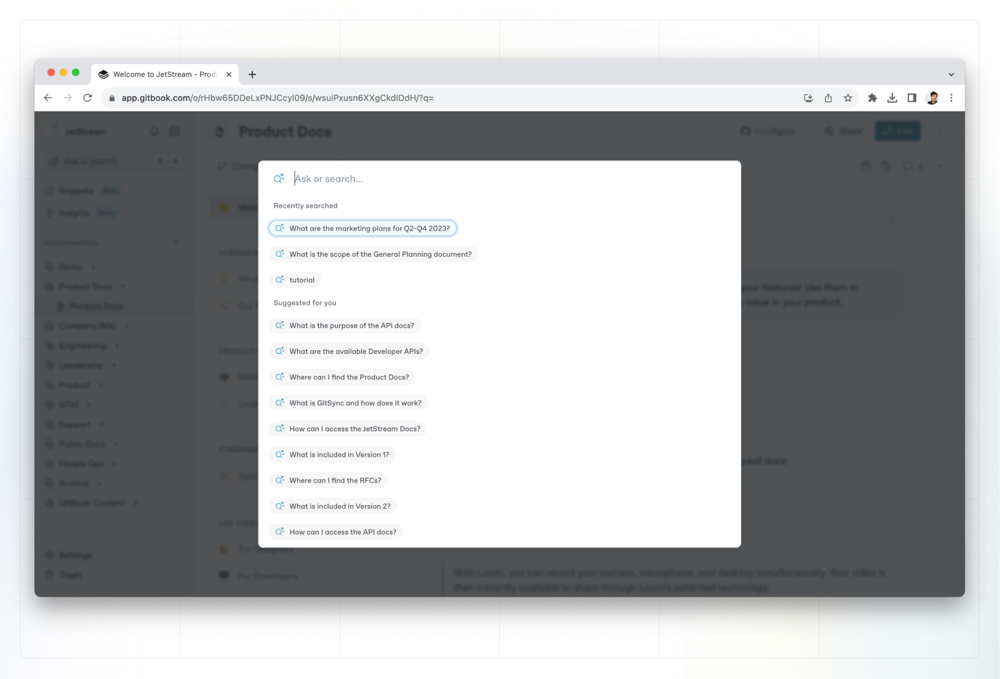

# GitBook AI



Simply tell GitBook AI what you want, or ask it a question. It’ll use AI to scan your documentation and give you a simple, semantic answer — with clickable references if you want to dive deeper.

### Which GitBook plans include GitBook AI?

GitBook AI is available to users on the **Pro or Enterprise plans**. If you have a Free or Plus account, you’ll need to upgrade to use GitBook AI search. [Visit our pricing page](https://www.gitbook.com/pricing) to learn more.

### How do I enable GitBook AI?

#### For published content

You can enable GitBook AI for any published space or collection in that space’s or collection’s [customization settings](../../published-documentation/customization/space-customization.md).&#x20;

Click the **Customize** button, then open to the **Configure** tab and toggle the **Enable** **GitBook AI semantic search** setting on.

#### For internal content

You can also enable GitBook AI for your organization’s internal content, allowing you to ask questions and get semantic answers about your internal knowledge base.&#x20;

Head to the **Organization settings** page and, in the **General** tab, toggle the **Enable GitBook AI semantic search** setting on.

### How do I use GitBook AI? 

Once GitBook AI is enabled, simply type a question into the search bar. GitBook AI will take a few seconds to scan your documentation and summarize the results.

#### Using GitBook AI in published documentation

Let’s give it a try right here in our own public documentation! Firstly, open the search palette by clicking **Ask or search…** in the top-right corner of the page, or by press **⌘ + K** on a Mac or **Ctrl + K** on a PC.

Then simply type your question and press `Enter`. You’ll see a number of suggested questions that you might like to ask.

For this example, in our own docs, you can try: “What makes change requests a powerful GitBook feature?” After a few seconds, you’ll get an answer from GitBook AI.

As well as a summarized answer, below you’ll also see an expandable section that shows the sources that GitBook AI used to create its answer, plus related questions you can click as a follow-up.


**Note:** GitBook AI does not work across individual published spaces in different collections. **Multi-space search is&#x20;**_**only**_**&#x20;available when viewing published** [**GitBook spaces**](../editor/content-structure/what-is-a-space.md) **that live inside of a** [**published collection**](../../collaboration/share/share-a-collection.md)**.**&#x20;


#### Using GitBook AI in internal documentation

If GitBook AI is enabled for internal content, you’ll be able to do the same thing when logged into the GitBook app: open the quick find command palette, type a question and receive a semantic answer.

<figure><figcaption>
Ask a question with GitBook AI.
</figcaption></figure>

#### Integrating GitBook AI with your product

With our API, you can embed GitBook AI into your product or website! This opens up lots of possibilities, including in-app helpers and website chat bots that can respond to questions based on the content in your documentation.

Head to [our developer documentation](https://developer.gitbook.com/gitbook-api/reference/search#get-ai-search-results-from-all-spaces-for-the-currently-authenticated-user) to find out more.

#### How long does it take for GitBook AI to index changes?

When someone makes a change to your content — such as a merged [change request](../../collaboration/change-requests.md) or a new [knowledge snippet](../../snippets/snippets-beta.md) from Slack) it can take **up to one hour** for GitBook to index the changes to and reflect them in AI search results.

#### How does GitBook AI handle my data?

We pass your content to OpenAI to index and process data. OpenAI **does not** use this content for service improvements (including model training). You can find out more about how OpenAI handles data [here](https://openai.com/blog/introducing-chatgpt-and-whisper-apis#developer-focus).

#### How do I prevent hallucinations with GitBook AI search?

If you’re seeing GitBook produce answers that are incorrect, the best method for correcting this is write explicit content around the topic so the AI does not have to guess.
