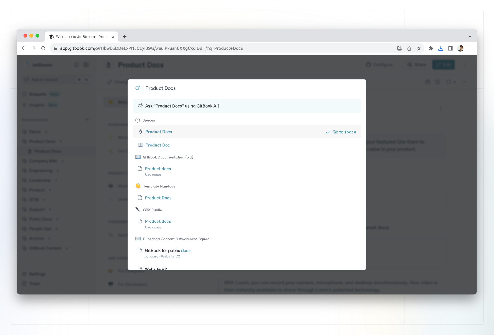

# Search & Quick find

GitBook’s quick find palette lets you search for content across all your organizations, and jump between them fast.


**Permissions**

All [member roles](../../account-management/member-management/roles.md) can use the **quick find**, but members will only be able to search the internal content they have permission to access.‌


### How to use quick find

**​**You can open the quick find palette by pressing **⌘ + K** on Mac or **Ctrl + K** on PC.

<figure><figcaption>
The quick find palette
</figcaption></figure>

### Search results 

Results from the space you’re currently in appear at the top, followed by results from other spaces from the organization you’re currently working in — **as well as other organizations** you are a member of.

When you select a search result from an organization, you’ll switch to browsing that organization. To go back, use quick find to select a document in the organization you were in before, or use [the organization switcher](../editor/navigation.md#the-sidebar) in the sidebar.


We do not currently support the ability to prioritize certain content in quick find results.


### ​Team permissions 

**Quick find** is compliant with your team’s permission settings, meaning that users will only be able to search the content they have permission to access.‌


**Note:** Multiple space search is _only_ available when viewing a published [GitBook space](../editor/content-structure/what-is-a-space.md) that lives inside of a [published collection](../../collaboration/share/share-a-collection.md). It is not available across individual published spaces in different collections.&#x20;


<figure><figcaption>
Search all content in a space
</figcaption></figure>

### Content Indexing 

We index your content by grouping it into sections. Sections are denoted using [H1, H2 or H3 Headings](../blocks/heading.md), with the content that follows them forming part a section.

Each result shows the first three lines of information below the section header. If your section is too big,  your keyword match may not appear in the preview — but don’t worry, quick find still found a match!
