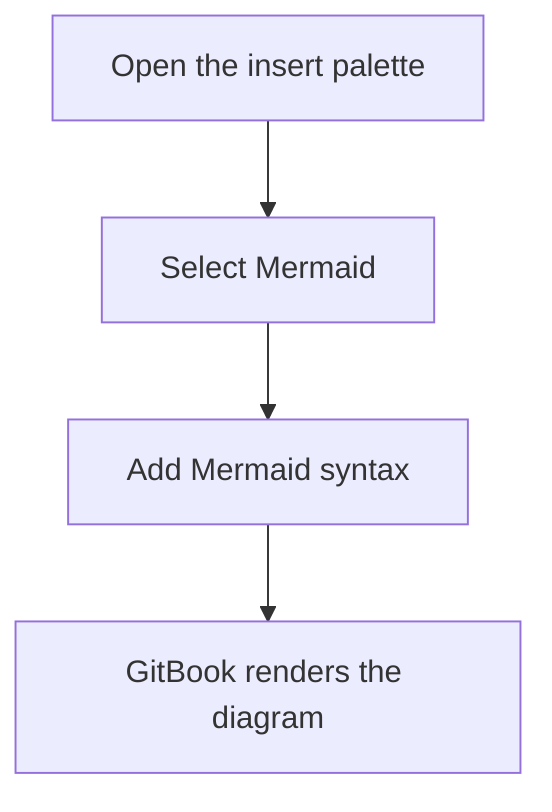

# Mermaid blocks

Mermaid blocks let you create diagrams using the [Mermaid](https://mermaid.ai/) syntax.

Use them when you want to show flows, sequences, states, or relationships in a format that's easy to update.

### Add a Mermaid block

1. Place your cursor on an empty line and type `/`.
2. Click **Mermaid** in the insert menu.
3. Enter or paste your Mermaid syntax. GitBook renders the diagram automatically.

You can also click the **+** to the left of any line in the editor and click **Mermaid**.

### Example



### Representation in Markdown

````markdown

````

GitBook renders code blocks with the `mermaid` language identifier as native Mermaid blocks.<br>
