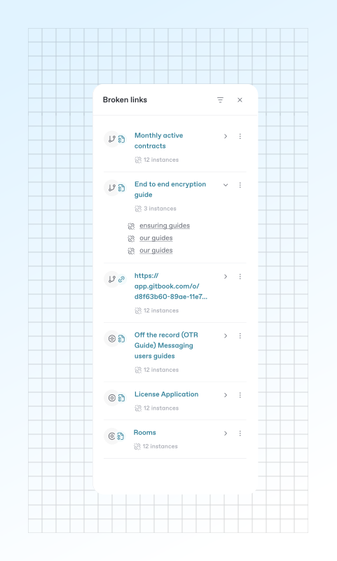

# Broken links



<figure><figcaption>
The Broken Links panel.
</figcaption></figure>

You can add different [types of links](formatting/inline.md#links) to your pages in GitBook. If someone has broken a [relative link](formatting/inline.md#relative-links) while making a change request by updating it or changing its location, you’ll see a notification letting you know there’s something to fix.


Broken link detection currently works only for relative links to other GitBook content in your organization. It will not detect broken links to external URLs.


To view broken links, click the broken link symbol in the [space sub-nav](../resources/gitbook-ui.md#space-header-and-sub-navigation) when inside a change request.

### Fix a broken link

If GitBook finds a broken link, you’ll see a notification in this section with a link to the page that includes the broken link. Then, simply replace or update the link with a valid one.

As you view your broken links, you can also set the scope and filter of broken links inside of the sidebar:

#### Scope: Current change request

This will find newly broken links within the scope of the current change request you are working in.

#### Scope: Current space

This will find broken links within the scope of the current space you are in.

#### Filter by: Broken links

Show any broken or missing links in the space or change request you are in.

#### Filter by: Internal links

This filter is useful for making sure your published docs don’t link to internal content within your GitBook organization. It’ll show any links to internal, unpublished content that readers of your published content won’t have access to (i.e. links that start `app.gitbook.com/o/<organizationID>/…`). You can fix them by replacing the links with the URL of the published GitBook page.

