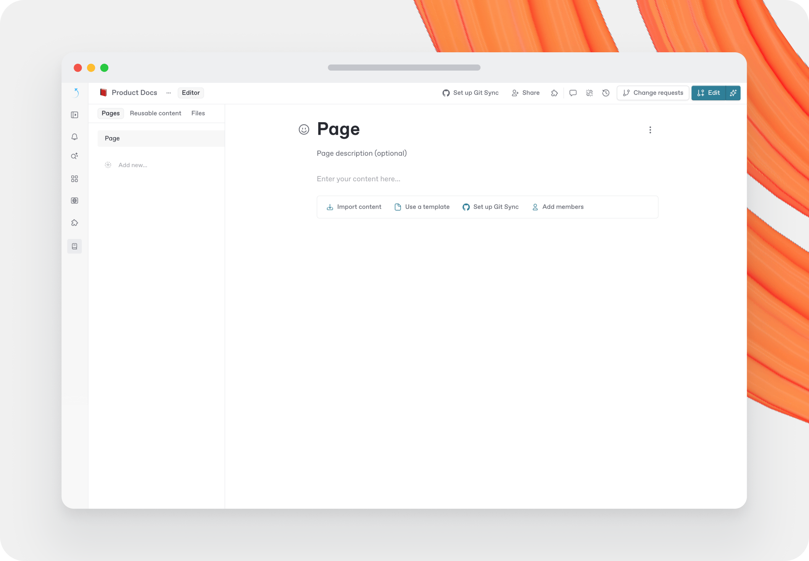

# Pages

A page is the place where you can add, edit and embed content. Pages always live inside a section, allowing you to group related content for the topics or areas you're covering.

When you publish your site, each section appears in your site's navigation, and the pages inside it all appear under that section.

### Table of contents

Create as many pages as you need in a section. They're all visible on the left sidebar of your screen in your section's table of contents. The table of contents appears in the same place on your published site, unless [you choose to hide it](./#page-options).


**Section landing page**

The first page in your table of contents is always your section's landing page, even if it's hidden from the table of contents.


### Create a new page

1. Enter live edit mode or open a change request.
2. Click **Add new...** at the bottom of your table of contents.
3. Click **Page**.

Or hover between pages in the table of contents and click the **+** icon that appears.

<figure><figcaption><p>An empty page in GitBook. You can see it listed in the table of contents on the left-hand side.</p></figcaption></figure>

### New page option missing


If live edits are disabled for your section, create or edit a change request. In a change request, the **New page** button — which creates pages, page groups, and links — is available in the table of contents.

You might also lack the permissions to edit a page.


### Organizing your content

There are three ways to organize your content in the table of contents:

#### Pages

A page has a title, an optional description, and an area where you can write and add any kind of content.

Nest pages by dragging and dropping a page below another in the table of contents. Doing this creates a **subpage**.

If you add subpages to an empty parent page, GitBook automatically generates a 'contents' page with links to all the subpages in the published version of your docs.


**Tip:** There's no limit to page nesting, but avoid more than three levels to keep your navigation simple.


When you change the title of a page, the page's slug (the part at the very end of the URL, such as `/hello-world`) also changes — unless you've manually set the page's slug previously.

To change the title, link title, or slug of a page:

1. Open the page's **Action menu** <picture><source srcset="../../../.gitbook/assets/25_01_10_actions_icon_dark.svg" media="(prefers-color-scheme: dark)"></picture>.
2. Click **Edit title & slug**.

#### Page link title

To give your page a longer SEO-friendly title while keeping a shorter title for your navigation entry and links, define a link title.

1. Open the page's **Action menu** <picture><source srcset="../../../.gitbook/assets/25_01_10_actions_icon_dark.svg" media="(prefers-color-scheme: dark)"></picture>.
2. Click **Edit title & slug**.
3. In the **Edit page** dialog, enable and define a link title for that page.

If you're using Git Sync, set the page link title in `SUMMARY.md` on the page link:

```markdown
# Table of contents

* [Page main title](page.md "Page link title")
```


**Note:** Page link titles appear in the table of contents, the pagination buttons at the bottom of each page, and any relative links you add to that page.


Page link titles are optional — if you don't add one, the page uses its standard title.

#### Page groups

Page groups bring related pages together within a section's table of contents.


Page groups organize **pages** within a single section. To organize the **sections** of your site, use groups instead.


Create a page group by clicking **Add new...** > **Group** at the bottom of your table of contents.

Page groups live only at the **top level** of the table of contents — you can't nest page groups inside each other.

To change the title and slug of a page group:

1. Click the **Action menu** icon <picture><source srcset="../../../.gitbook/assets/25_01_10_actions_icon_dark.svg" media="(prefers-color-scheme: dark)"></picture> next to the group title in the table of contents.
2. Click **Rename**.

#### External links

Add links to your table of contents to take people directly to the linked content.

Create an external link by clicking **Add new...** > **External link** at the bottom of your table of contents.

### Page icons and emojis

To improve visibility for readers when skimming your table of contents, add an optional icon or emoji to individual pages. The icon or emoji appears in the table of contents, and next to the title at the top of the page.

To add an icon or emoji, click the **Add icon** button when hovering the page title, or the emoji button to the left of the title.

### Page options

In the **Page options** menu, customize the look and feel of a selected page within a section and control its visibility.

#### Layout

Open the **Page options** <picture><source srcset="../../../.gitbook/assets/25_01_10_options_icon_dark.svg" media="(prefers-color-scheme: dark)"></picture> menu or change a page's cover by hovering over the page title. The buttons appear just above the page title.

In the **Page options** side panel, choose how each page displays to visitors of your **published** content. There are three layout presets to choose from, or you can create a custom layout.

Each layout preset toggles the following parts of the page on or off:

* Page title
* Page description
* Table of contents
* Page outline
* Next/previous links
* Page metadata
* Tags

Tag a page with one or more tags from **Library** → **Tags**. Turn on **Show tags on page** to display them in the page header. Or pick one tag as the page's primary tag, which GitBook can show next to the page in the table of contents. Learn more in Tags.

Set your page's global width from this menu, too. Choosing **Wide** gives blocks such as tables, cards, and code blocks more space on the published page. Use this for eye-catching landing pages.

#### Visibility

Choose which pages to show or hide in your published documentation, and whether each page appears in your site's search and in search engines.

To hide a page or group of pages from your site's table of contents:

1. Open the page's **Action menu** <picture><source srcset="../../../.gitbook/assets/25_01_10_actions_icon_dark.svg" media="(prefers-color-scheme: dark)"></picture>.
2. Toggle **Hide page**.

Hidden pages are only hidden from the published table of contents. They remain available through the site's MCP server and in `llms-full.txt`.

If you're using Git Sync, hidden pages include the following front matter in the Markdown file:

<pre class="language-markdown" data-title="page.md"><code class="lang-markdown">---
hidden: true
<strong>---
</strong></code></pre>


Hiding **Page title** or **Page description** only hides the page header in published content. It doesn't remove headings inside the page body. Learn more about heading levels in Headings.


#### Metadata (SEO)

Use **Page options → Metadata** to control how search engines understand relationships between similar pages (for example: documentation versions or content variants).

* **Canonical URL**: the preferred (authoritative) URL for this page. Search engines treat it as the 'source of truth'. Use it when multiple URLs show the same content.
* **Alternate URLs**: other URLs for the same content in another variant. For example, another version or language. They help search engines group variants instead of treating them as duplicates.

Both fields support selecting another GitBook page (recommended) or entering an external URL.


A common pattern for versioned docs is to set older pages to be canonical to the latest equivalent page (for example, `1.0` → `2.0`), and then list older versions as alternates on the latest page.


### Page covers

Set a page cover for each page of your documentation. When you click the **Page cover** <picture><source srcset="../../../.gitbook/assets/25_01_10_image_icon_dark.svg" media="(prefers-color-scheme: dark)"></picture> option, GitBook adds a default cover immediately. From here, you can:

* **Change the cover image**
  1. Hover over the page cover and click **Change cover**.
  2. Choose or upload an image. The ideal size is 1990x480 pixels.
* **Reposition the cover image**
  1. Hover over the page cover and open the **Action menu** <picture><source srcset="../../../.gitbook/assets/25_01_10_actions_icon_dark.svg" media="(prefers-color-scheme: dark)"></picture>.
  2. Click **Reposition**.
  3. Drag the image into place and click **Save**.
* **Remove the cover image**
  1. Hover over the page cover and open the **Action menu** <picture><source srcset="../../../.gitbook/assets/25_01_10_actions_icon_dark.svg" media="(prefers-color-scheme: dark)"></picture>.
  2. Click **Remove**.
*   **Full width and hero width**

    Change the style of your page cover to span the full width of your screen or just the width of your content.

    1. Hover over the page cover and open the **Action menu** <picture><source srcset="../../../.gitbook/assets/25_01_10_actions_icon_dark.svg" media="(prefers-color-scheme: dark)"></picture>.
    2. Click your preferred option.
