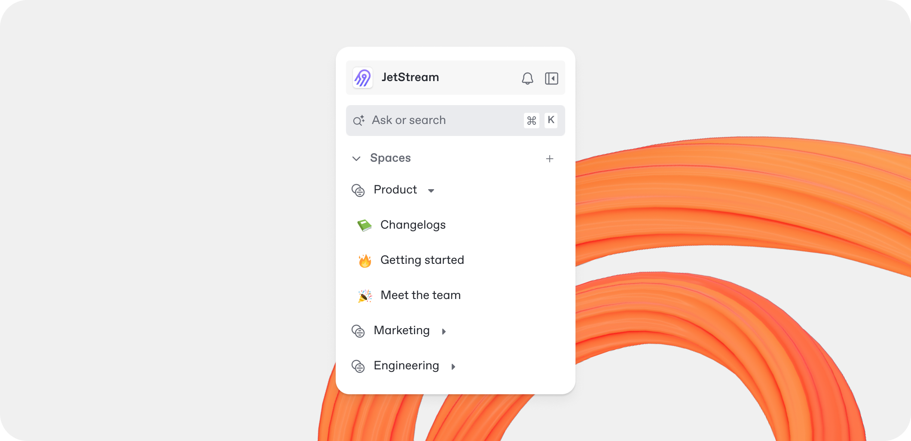

# Sections

A section is a part of your site where you work on a set of related pages. Sections let you write content, organize pages, add integrations, and more. Every section belongs to a site, and you can organize related sections into groups.


The GitBook API represents sections as `space` objects. This has no impact on API integrations or Git Sync.


<figure><figcaption></figcaption></figure>

### Create a section

1. In your site, click **Add…**.
2. Click **New section**.

Create a section at the top level of your site or inside a group. New sections start as **drafts**: part of your site and editable by your team, but not visible to visitors until you publish them.

Edit a section's name by hovering over the name in the section header.

### Publish a draft section

1. Open the section's **Action menu** <picture><source srcset="../../.gitbook/assets/25_01_10_actions_icon_dark.svg" media="(prefers-color-scheme: dark)"></picture>.
2. Click **Publish**.

Or publish several drafts at once from the structure editor.

To preview how drafts look on your site, switch the site preview between **Live** and **Live + Drafts**.

### Duplicate a section

1. Open the section's **Action menu** <picture><source srcset="../../.gitbook/assets/25_01_10_actions_icon_dark.svg" media="(prefers-color-scheme: dark)"></picture>.
2. Click **Duplicate**.

Duplicating a section creates a copy of the source section in the same location (site or group).


Duplicating a section copies the content in the source section. It doesn't copy revisions or version history.


### Move or reorder a section

The content tree in the sidebar is read-only. To move a section into or out of a group, or to reorder sections:

1. Open the **structure editor**.
2. Drag the section to its new position.

Changes reflect back in the sidebar — and on your published site — immediately.

### Delete a section

1. Open the section's **Action menu** <picture><source srcset="../../.gitbook/assets/25_01_10_actions_icon_dark.svg" media="(prefers-color-scheme: dark)"></picture>.
2. Click **Delete**.


**Restore deleted sections from the Trash for up to 7 days.** After that, GitBook deletes them permanently.

