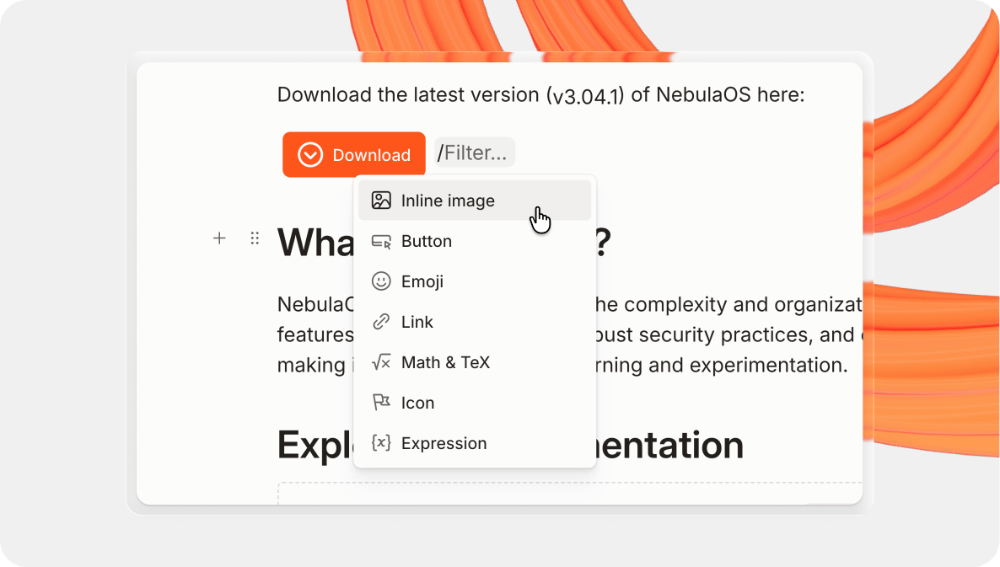

# Inline content

<figure><figcaption><p>Add inline elements to your content.</p></figcaption></figure>

The inline palette lets you quickly add extra content to your text block without moving your hands away from the keyboard. Simply hit `/` on any text block to open the inline palette. The forward slash will be replaced by the content you choose to insert.

## Annotations

With annotations, you can add extra context to your words without breaking the reader’s train of thought. You can use them to explain the meaning of a word, insert extra information, and more. Readers can hover over the annotated text to show the annotation above the text.

### Create an annotation

To create an annotation, select the text you would like to annotate and click the **Annotate** option in the context menu. Once you’ve written your annotation, click outside of it to continue writing in the text block.

### Markdown representation

You can write content as [Markdown footnotes](https://www.markdownguide.org/extended-syntax/#footnotes) to add them as annotations in GitBook. Footnote indicators should appear immediately after the word you wish to annotate; they should not appear after punctuation marks or other symbols.

```markdown
Here's a simple footnote[^1], and here's a longer one[^bignote].

[^1]: This is the first footnote.

[^bignote]: Here's one with multiple paragraphs and code.

    Indent paragraphs to include them in the footnote.

    `{ my code }`

    Add as many paragraphs as you like.
```

## Images

Inline images will sit alongside your text on the page.

By default, images are set to their original size with a maximum width of 300px. You can change the size by clicking the image to open the formatting palette, then choosing one of the three options:

1. **Inline size:** The image is proportionally sized to the font — great for icons and badges.
2. **Original size:** The image will remain inline at its original size, with a maximum width of 300 pixels.
3. **Convert to block:** This turns an inline image into a [image block](../blocks/insert-images.md), which is as wide as your content.


[Image blocks](../blocks/insert-images.md) offer more options, including more sizes and the ability to add a caption — but will not appear inline with your text.


### Representation in Markdown


```markdown
Here is an inline image: 
```


## Emojis

You can add emojis by hitting `/` to open the inline palette. Alternatively, type `:` and a list of emojis will pop up directly in line — you can start typing the name of an emoji to narrow down the selection.

### Representation in Markdown


```markdown
:house:
:car:
:dog:
```


## Links

You can insert three different types of links:

* [Relative links](inline.md#relative-links)
* [Absolute links](inline.md#absolute-links)
* [Email address `mailto` links](inline.md#email-address-mailto-links)

### Relative links

Relative links point to [pages](../content-structure/page/) and headings in the same space. Use them when you want GitBook to keep the link up to date if the target page is renamed or moved.

Here’s how to insert a relative link:

1. Click somewhere in your paragraph where you want to insert the link, or select some text.
2. Hit / to open the inline palette and choose Link, click the **Link** button in the context menu, or hit **⌘ + K**.
3. Start typing the title of the page you want to link to.
4. Select the page from the drop-down search results.
5. Hit `Enter`.

GitBook keeps these links working when the target page moves or its slug changes. GitBook also creates an automatic redirect from the old URL to the new one. Learn more in [Site redirects](../../publishing-documentation/site-redirects.md#about-automatic-redirects).

#### Markdown examples

```markdown
[Link to another page in this space](../content-structure/page.md)
[Link to a section on this page](#math--tex)
[Link to a section in another page in this space](../content-structure/page.md#page-options)
```

### Absolute links

Absolute links are full URLs that you can copy and paste into your content. Use them when you want to link outside the current space.

To insert an absolute link:

1. Click somewhere in your paragraph where you want to insert the link, or select some text.
2. Hit / to open the inline palette and choose Link, click the **Link** button in the context menu, or hit **⌘ + K**.
3. Paste the URL you want to link to.
4. Hit `Enter`.

#### Cross-space links

If you want to link to a page in another space, use that page’s internal GitBook URL:

```markdown
[Link text](https://app.gitbook.com/s/SPACE_ID/PAGE_PATH)
```

You can also insert a cross-space link through the editor:

1. Click somewhere in your paragraph where you want to insert the link, or select some text.
2. Hit / to open the inline palette and choose Link, click the **Link** button in the context menu, or hit **⌘ + K**.
3. Start typing the title of the page you want to link to.
4. Select the other space in the link picker, then select the page from the search results.
5. Hit `Enter`.

#### Markdown examples

```markdown
[GitBook blog](https://www.gitbook.com/blog)
[Page in another space](https://app.gitbook.com/s/SPACE_ID/PAGE_PATH)
```


**Why don't external links open in a new tab?**

When you add a link to an external site in your docs, it will open in the same tab.

GitBook follows this [W3C-recommended behavior](https://www.w3.org/TR/WCAG20-TECHS/G200.html) to support [accessibility](https://it.wisc.edu/learn/make-it-accessible/websites-and-web-applications/when-to-open-links-in-a-new-tab/) and ensure a consistent, inclusive experience for your readers.


### Email address mailto links

Email address `mailto` links are useful when you want your visitors to click on a link that will open up their default email client and fill in the `To` field with the email address of your link, so they can write an email to send.

Here’s how to insert an email address `mailto` link:

1. Click somewhere in your paragraph where you want to insert the link, or select some text.
2. Hit / to open the inline palette and choose Link, click the **Link** button in the context menu, or hit **⌘ + K**.
3. Paste or type `mailto:something@address.com`, replacing `something@address.com` with the email address you would like to use.
4. Hit `Enter`.

### Representation in Markdown

```markdown
[This is a relative link to another page in this space](../content-structure/page.md)
[This is a relative link to a section on this page](#math--tex)
[This is a cross-space link](https://app.gitbook.com/s/SPACE_ID/PAGE_PATH)
[This is an absolute link](https://www.gitbook.com/blog)
[This is a link](mailto:support@gitbook.com) to our support email address
```

## Math & TeX

Using this option, you can create an inline math formula in your content, like this: $$f(x) = x * e^{2 pi i \xi x}$$. We use the [KaTeX](https://katex.org/docs/supported.html) library to render formulas.


You can also insert [a block-level math formula](../blocks/math-and-tex.md) by opening the command palette in an empty block and choosing the second Math & TeX option.


### Representation in Markdown

```markdown
# Math and TeX block

$$f(x) = x * e^{2 pi i \xi x}$$
```

## Buttons

Buttons are a great way to highlight calls to action or add a search or Ask AI bar to your docs. You can use them to send readers somewhere, or help them find answers.

### Button actions

Buttons can do more than link to a URL. You can also turn a button into a search or ask GitBook Assistant bar — right from the page. These actions work on published pages, too — as you can see from the examples belo

You can configure the following actions:

#### **Add a link button**

Send readers to another page or an external URL:<a href="../../ai-and-search/gitbook-ai-assistant.md" class="button primary" data-icon="gitbook-assistant">Learn more about Assistant</a>

#### **Add a search bar**

Open search with an optional preset query: <button type="button" class="button primary" data-action="search" data-icon="magnifying-glass">Search...</button>

#### **Add a Ask AI/GitBook Assistant bar**

Open [GitBook Assistant](../../ai-and-search/gitbook-ai-assistant.md) with an optional preset prompt: <button type="button" class="button primary" data-action="ask" data-icon="gitbook-assistant">Ask a question...</button>

#### **Add a disabled button**

Show a button that’s intentionally inactive:<a class="button primary">Inactive button</a>

### Create and configure a button

1. Type `/` and choose **Button**.
2. Click the button to open the **Label** menu.
3. Choose an action, then set the label and style.
4. Optional: add a preset search query or Assistant prompt.

### Styles

Link and inactive buttons have both primary and secondary styles. Here are a couple of examples:

<a href="https://app.gitbook.com/join" class="button primary">Sign up to GitBook</a> <a href="inline.md#annotations" class="button secondary">Go to top</a>

### Representation in Markdown

```markdown
<a href="https://app.gitbook.com" class="button primary">GitBook</a>
```

## Icons

Icons allow you to add extra visual indications to your site. You can add them inline to paragraphs, inside a card, or anywhere else you need to add some flair. They will use the visual style defined in your [customization settings](../../docs-site/customization/icons-colors-and-themes.md).

<i class="fa-facebook">:facebook:</i> <i class="fa-github">:github:</i> <i class="fa-x-twitter">:x-twitter:</i> <i class="fa-instagram">:instagram:</i>

Visit [Font Awesome](https://fontawesome.com/) to explore the different icons available.

### Representation in Markdown

```markdown
<i class="fa-github">:github:</i>
```

## Expressions

Expressions allow you to dynamically display content defined in a [variable](../variables-and-expressions.md). Expressions can be inserted from the `/` menu. Once inserted, clicking on the expression will bring up the expression editor, allowing you to reference and [conditionally format](https://developer.mozilla.org/en-US/docs/Web/JavaScript/Reference/Operators/Conditional_operator) your variable.
