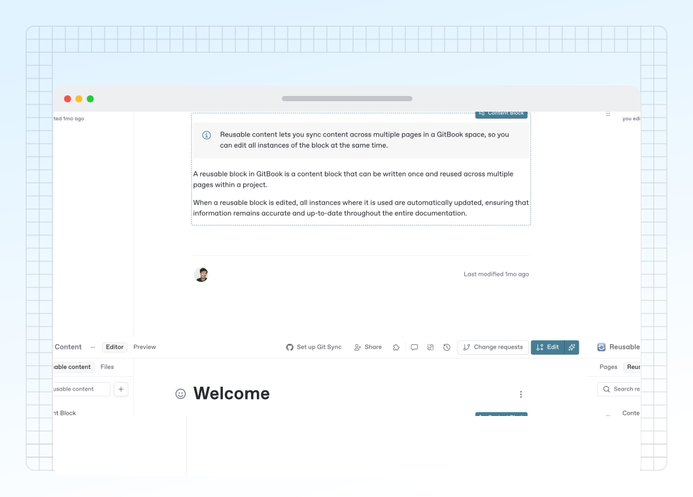

# Reusable content



Reusable content lets you sync content across multiple pages in a GitBook space, so you can edit all instances of the block at the same time.

<figure><figcaption><p>Create reusable content within a space.</p></figcaption></figure>

### **Create reusable content**

To create reusable content, [select one or more blocks](blocks/#selecting-blocks-and-interacting-with-selected-blocks), then open the **Actions menu** <picture><source srcset="../.gitbook/assets/actions_icon_dark.svg" media="(prefers-color-scheme: dark)"></picture> and choose **Turn into reusable content**. You can also give your block a name to make it easier to find and reuse later.

Alternatively, you can select one or more blocks and then hit **Cmd + C** to open a prompt asking if you want to create reusable content.


Reusable content is currently scoped to a single space. We are working on an improvement to allow access to reusable content across your entire organization. Duplicating a space will not duplicate its reusable content.


### **Insert reusable content**

You can insert reusable content as you would with any other block. Hit `/` on an empty line to open the **Insert palette** and search for your content by its name or simply searching for “reusable”. Alternatively, click the `+` on the left of any block or empty line.&#x20;

You will also find the reusable content panel in the pages sidebar, where you can find a list of previously created content blocks in your current space.

### **Edit reusable content**

Reusable content is like any other content — you can edit any instance directly if [live edits](../collaboration/live-edits.md) are enabled, or through [a change request](../collaboration/change-requests.md) if not. Any changes you make will be synced everywhere the content is used.

If you’re making changes inside a change request, the content will be synced to all other instances once that change request is merged.

### **Detach reusable content**

You can detach reusable content by opening the **Actions menu** <picture><source srcset="../.gitbook/assets/actions_icon_dark.svg" media="(prefers-color-scheme: dark)"></picture> and selecting **Detach**. Detaching will convert the content back to regular blocks.

Once detached, any changes you make to the block(s) will not be reflected across the other instances, and changes you make in those instances will not be reflected in the detached block(s). All other instances of the reusable content remain synced together.

### Delete reusable content

You can delete reusable content from your space entirely, if you wish. Find the reusable content in the page’s table of contents, then open the **Actions menu** <picture><source srcset="../.gitbook/assets/actions_icon_dark.svg" media="(prefers-color-scheme: dark)"></picture> next to the content you’d like to delete, and select **Delete**.

Deleting reusable content will **delete it from all pages it is used in**. This action cannot be undone.

### Syncing with GitHub & GitLab

Reusable content is fully supported when syncing to GitHub & GitLab. Your reusable content will be exported to a dedicated `includes` folder, each content being a separate Markdown file.

Your content is then referenced in your other pages using the `include` directive.

#### Example

```markdown



```
