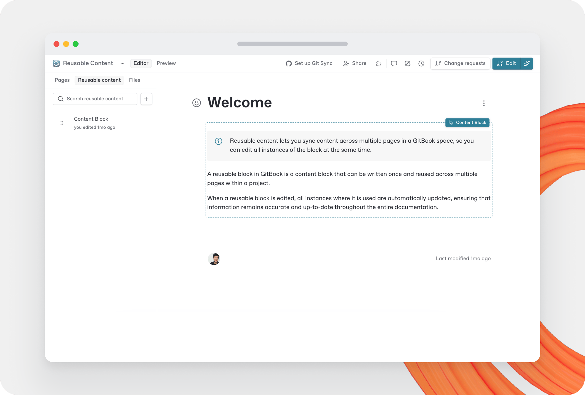

# Reusable content



Reusable content lets you sync content across multiple pages and sections, so you can edit all instances of the block at the same time.

<figure><figcaption><p>Create reusable content within a section.</p></figcaption></figure>

## Fundamentals

Reusable content works just like any other content—you can modify it via change requests, include it in review workflows, and it will render correctly on any published site.

While reusable content can be referenced across multiple sections, it belongs to a single _parent section_.

### The "parent section" concept

The parent section is the section that owns the reusable content. It's the only place where that content can be edited.

Even though updates to reusable content will appear instantly in all instances, all changes must originate from the parent section—either as a direct edit or through a change request.

Sections support both editorial workflows and security. Because GitBook enforces permission-based editing, reusable content can only be changed from its parent section. This ensures that editing rights are respected, even when the content is reused across the organization.

### Known limitations

#### Integrations

Blocks provided by integrations are not supported in reusable content. This is because integrations in GitBook are installed per section, and limiting access ensures that third-party integrations only have the permissions you grant. Referencing reusable content across sections would break this security boundary.

#### Search

Currently, reusable content only appears in search results within its parent section. We're actively working to remove this limitation so that reusable content shows up in search results wherever it's referenced.

## In the app

### **Create reusable content**

To create reusable content, select one or more blocks, then open the **Actions menu** <picture><source srcset="../.gitbook/assets/25_01_10_actions_icon_dark.svg" media="(prefers-color-scheme: dark)"></picture> , select **Turn into**, and choose **Reusable content**. You can also give your block a name to make it easier to find and reuse later.

Alternatively, you can select one or more blocks and then hit **Cmd + C** to open a prompt asking if you want to create reusable content.

### **Insert reusable content**

You can insert reusable content as you would with any other block. Press `/` on an empty line to open the **Insert palette**. You can also click the `+` beside any block or empty line.

The reusable content panel in the pages sidebar lists previously created content blocks in your current section.

To insert reusable content from the current section or another section you can access:

1. Open the reusable-content picker from the **Insert palette** or `+` menu.
2. Use the section selector at the top to select the source section.
3. Search for the reusable block by name, then select it to insert it.

Inserting content from another section doesn't transfer ownership. Only the parent section can edit the reusable content. Updates from that parent section continue to sync to every instance.

### **Edit reusable content**

Reusable content is like any other content — you can edit any instance directly if live edits are enabled, or through a change request if not. Any changes you make will be synced everywhere the content is used.

If you’re making changes inside a change request, the content will be synced to all other instances once that change request is merged.

### **Detach reusable content**

You can detach reusable content by opening the **Actions menu** <picture><source srcset="../.gitbook/assets/25_01_10_actions_icon_dark.svg" media="(prefers-color-scheme: dark)"></picture> and selecting **Detach**. Detaching will convert the content back to regular blocks.

Once detached, any changes you make to the block(s) will not be reflected across the other instances, and changes you make in those instances will not be reflected in the detached block(s). All other instances of the reusable content remain synced together.

### Delete reusable content

You can delete reusable content from your section entirely, if you wish. Find the reusable content in the page's table of contents, then open the **Actions menu** <picture><source srcset="../.gitbook/assets/25_01_10_actions_icon_dark.svg" media="(prefers-color-scheme: dark)"></picture> next to the content you'd like to delete, and select **Delete**.

Deleting reusable content will **delete it from all pages it is used in**. This action cannot be undone.

## Syncing with GitHub & GitLab

Reusable content is fully supported when syncing to GitHub & GitLab. Your reusable content will be exported to a dedicated `includes` folder, each content being a separate Markdown file.

Your content is then referenced in your other pages using the `includes` directive.


When syncing, the `.gitbook/includes` directory is created in the root of each synced section (which may not be the root of the whole repository). If your `.gitbook/includes` folder or its files appear in your section's table of contents, you may need to hide them manually from the TOC.


#### Example


If you're writing on the GitHub side, ensure the path to the include is relative to the file containing the reference (not the root of the repository).


```markdown

```
