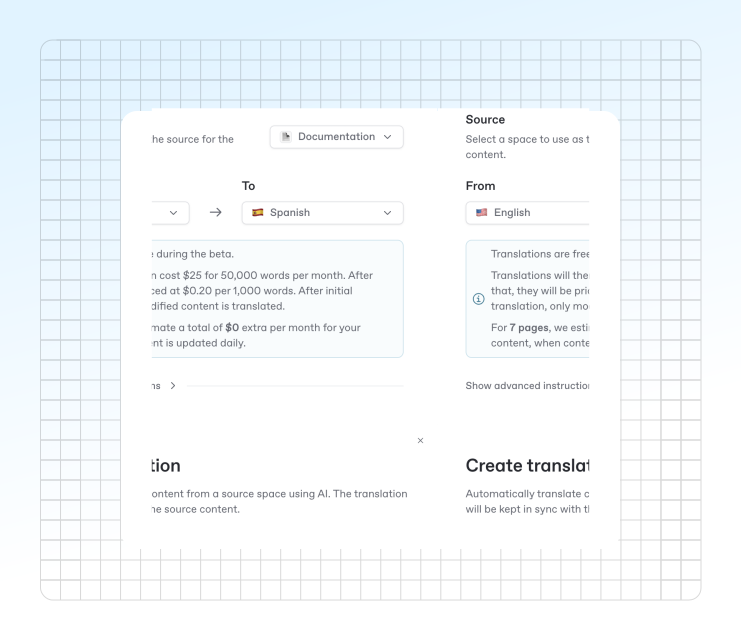

# Auto translations


Auto translations are currently in Beta. Let us know if you have any feedback or encounter any issues.


Auto translations make it easy to keep your documentation up-to-date in multiple languages, with minimal manual effort. You can create a space as a translation of another, and let AI handle the rest.

<figure><figcaption></figcaption></figure>

## How auto translations work

* **Create a translation space:** Set up a new space as a translation of an existing one. Choose your source space and target language.
* **Automatic sync:** When you update the source content, only the changed pages are re-translated. The translation workflow runs automatically, so your translated space always reflects the latest updates.
* **Continuous updates:** Every time you make changes to the source space, the translation workflow re-runs for just the updated content.

## Set up an auto translation

To translate a space to a new language, start by creating a new [space](content-structure/space.md#create-a-space) in your organization. From the modal that appears, click “Translation” from the quick actions menu.

From the modal that appears, you’ll need to choose a:

* Source
* Source language
* Target langauge

These options will be used to translate your space into a duplicated, but translated space in your organization. You’ll also see a quick overview on the cost of translating your space.

From here, you’ll be able to add it as a [variant](../publishing-documentation/site-structure/variants.md) to an existing docs site to add the translated version to your docs.

## Advanced configuration

* **Custom AI instructions:** Add advanced instructions to guide the AI on tone of voice, style, or other preferences. This helps ensure your translations match your brand or audience.
* **Glossary support:** Define a glossary to control how specific terms are translated. This keeps terminology consistent across all supported languages.

## Pricing

Auto-translations are free during the alpha period. During the public beta and after, pricing will be:

* $25 for up to 50,000 words
* $0.20 per additional 1,000 words

## FAQ

Why use auto-translations?

* **Effortless multilingual docs:** Reach a global audience without manual translation work.
* **Smart updates:** Only changed pages are re-translated, saving time and resources.
* **Full control:** Customize translations with advanced instructions and glossary management.

Can I edit the translation?

You currently can't edit translations.

As translations are done as a pure transformation of the source content, we can't reconcile potential edits made on the translation result with a new translation.

To workaround it, we recommend the following flow:

* Use the glossary to define specific translations that you want the AI to use
* Use the custom instructions to iterate on the output

If you need help getting started or want to learn more about configuring auto-translations, contact our support.
