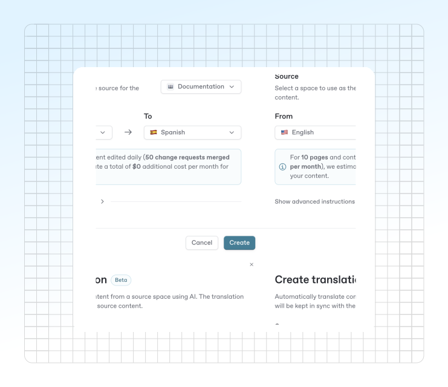

# Translations


Auto translations are currently in Beta. Let us know if you have any feedback or encounter any issues.


Auto translations make it easy to keep your documentation up-to-date in multiple languages, with minimal manual effort. You can create a space as a translation of another, and let AI handle the rest.

<figure><figcaption></figcaption></figure>

## How translations work

* **Create a translation space:** Set up a new space as a translation of an existing one. Choose your source space and target language.
* **Continuous updates:** Every time you make changes to the source content, the translation workflow only runs for the **pages that have been changed**.
* **Automatic sync:** After changes are merged, the translation workflow **runs automatically** and syncs with it’s source, so your translated space always reflects the latest updates.

## Set up an auto translation

To translate a space to a new language, start by creating a new [space](content-structure/space.md#create-a-space) in your organization. From the modal that appears, click “Translation” from the quick actions menu.

From the modal that appears, you’ll need to choose a:

* Source
* Source language
* Target language

These options will be used to translate your space into a duplicated, translated space in your organization. You’ll also see a quick overview on the cost of translating your space.

### Advanced configuration

* **Custom AI instructions:** Add advanced instructions to guide the AI on tone of voice, style, or other preferences. This helps ensure your translations match your brand or audience.
* **Glossary support:** Define a glossary to control how specific terms are translated. This keeps terminology consistent across all supported languages.


Adding custom instructions to your translation workflow can be helpful, but is limited in certain cases.&#x20;

Custom instructions cannot be used to create new elements on a translated space, add extra text, or change the structure of the source content.


## Add a translation to a variant

After creating a translation, you’ll be able to add it to published docs site as a [variant](../publishing-documentation/site-structure/variants.md). This will allow users to toggle between languages in the upper left corner when viewing your main docs site.

Head to your site settings, under the structure tab to set up a new variant for any translations you have.

## Pricing

Translations are a paying **monthly** add-on:

* $25 for up to 50,000 translated words
* $0.20 per additional 1,000 words

Each month includes 50,000 words of translation for $25. After that, every additional 1,000 words costs $0.20. Your 50,000-word allowance resets at the start of each month.

In your first translation, every word will count towards your bill. After that, only new or updated words are charged. For example, if you edit your docs later, only the new words in the changed text will count towards your word limit — you won’t be re-billed for the entire document.

## FAQ

Why use auto-translations?

* **Effortless multilingual docs:** Reach a global audience without manual translation work.
* **Smart updates:** Only changed pages are re-translated, saving time and resources.
* **Full control:** Customize translations with advanced instructions and glossary management.

Can I edit the translation?

You currently can't edit translations.

As translations are done as a pure transformation of the source content, we can't reconcile potential edits made on the translation result with a new translation.

To workaround it, we recommend the following flow:

* Use the glossary to define specific translations that you want the AI to use
* Use the custom instructions to iterate on the output

How many translations do I need to create?

You should only create **one translation workflow per language** of any given source content. Creating multiple workflows will accrue extra, duplicated costs in your organization.

What are some current limitations?

* Translations do not localize UI elements in your variant automatically. Head to your site’s customization settings to [localize the interface](../publishing-documentation/customization/extra-configuration.md#localize-user-interface) for a [specific variant](../publishing-documentation/customization/#customizing-sites-with-multiple-sections).
  * This includes user-input customizations, such as announcement banners.
* Translations cannot add extra content to the page - like a hint or a banner noting that a page was translated by AI. Consider adding an extra page in the translated space to note this, or the [announcement banner](../publishing-documentation/customization/layout-and-structure.md#announcement-premium-and-ultimate) in your site variant.

If you need help getting started or want to learn more about configuring auto-translations, [contact our support team](https://gitbook.com/docs/help-center/further-help/how-do-i-contact-support).
