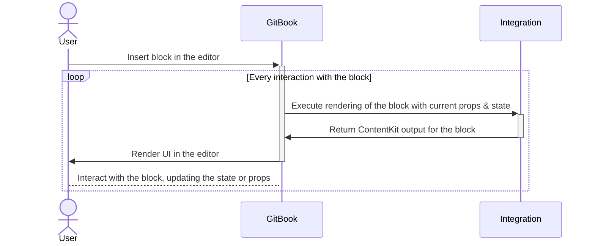

# Integration concepts

Throughout the developer platform and its documentation, you'll encounter the following terms.

| Term | Description | Where to find it |
|---|---|---|
| `organizationId` | A unique identifier for an organization. | In the URL of any space (`https://app.gitbook.com/o/<organizationId>/s/<spaceId>`), or via **Copy org ID** in organization settings. |
| `spaceId` | A unique identifier for a space. | In the URL of any space (`https://app.gitbook.com/o/<organizationId>/s/<spaceId>`), or via **Copy space ID** in the dropdown at the top-right of a space. |
| `userId` | A unique identifier for a user. | From the "Get current user" API endpoint, or via **Copy user ID** in organization settings. |
| `gitbook-manifest.yaml` | A required file in every integration, containing the metadata used to publish and develop it. Generated automatically by `gitbook new`. | See the [Manifest reference](manifest-reference.md). |
| `.gitbook-dev.yaml` | A required file for local development, generated automatically by `gitbook dev`. | See [Build your first integration](getting-started/build-your-first-integration.md). |

### How integrations are rendered in GitBook

Rendering of custom blocks is controlled by the integration's code, and executed on GitBook's backend:

