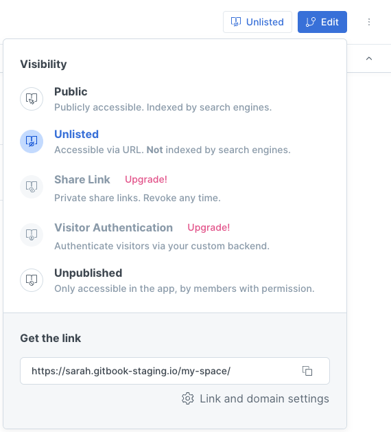
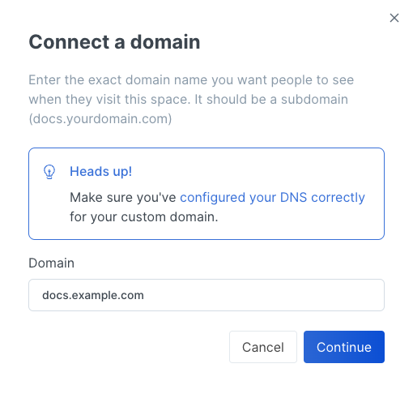
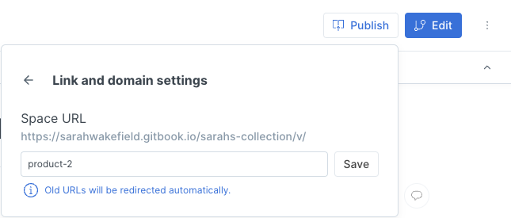
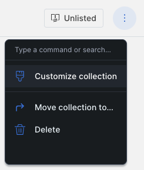
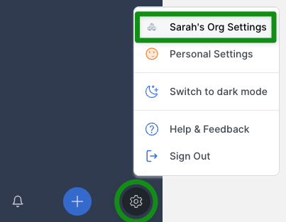
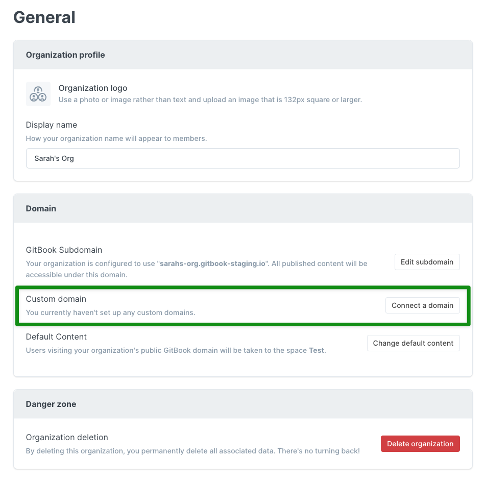
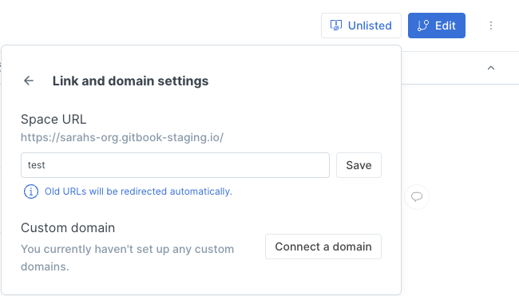
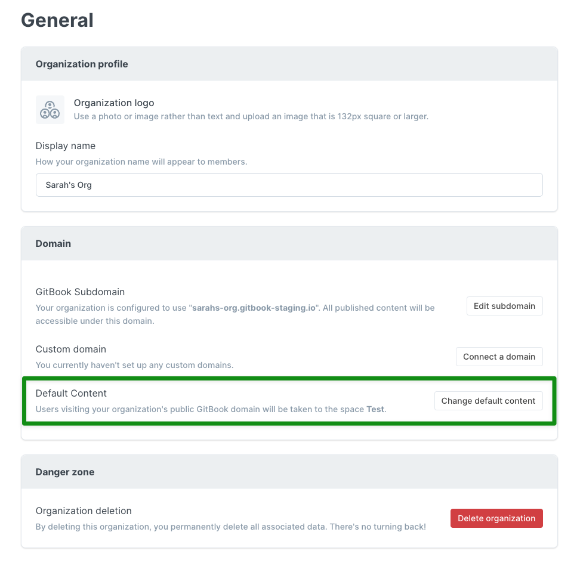

# Set the custom domain in GitBook


This is **step 3** of a 3-step process for setting up a custom domain. Make sure to follow the steps in the correct order!

1. [Choose a subdomain](choose-a-subdomain.md)
2. [Configure DNS](dns-configuration.md)
3. Set the custom domain in GitBook (you are here)


Your custom domain can be set for:

* [A space](custom-domain-setup-on-gitbook.md#space-level-custom-domains)
* [A collection](custom-domain-setup-on-gitbook.md#collection-level-custom-domains)
* [An organization](custom-domain-setup-on-gitbook.md#organization-level-custom-domains)

## Space-level custom domains

You'll find the options for setting a custom domain for your space within **the visibility menu**, near the top-right corner. First, your space needs to be published. Any setting other than unpublished will work — **Public**, **Unlisted**, **Share Link**, or **Visitor Authentication**. (Depending on the plan you have chosen, it might be that only _some_ of these publishing options are available to you.)

Once you have published your space using one of those options, the button will no longer say Publish, but will instead state the current publish setting. In this example, the space is published as **Unlisted**:

To set your custom domain, click on the **Link and domain settings** link at the bottom of the menu. This will give you some more options. Next, click the **Connect a domain** button:

This will open up a window where you can enter your custom domain, then click the **Continue** button:

Assuming that you enter a subdomain for which DNS has been [properly configured](dns-configuration.md), it should just take a few moments for the connection to be made and for your space to be accessible using your own subdomain! 🎉

If you ever change your mind, you can go back into the **Link and domain settings** to edit or remove the custom domain.

## Collection-level custom domains


**Important note:** your custom domain will be used as-is for the default space in the collection. Other spaces in the collection will have a URL in this format: `[yourcustomdomain]/v/[spaceURL]`.


Custom domains are set in exactly the same way for collections as they are for individual spaces, so please [review the description and screenshots above](custom-domain-setup-on-gitbook.md#space-level-custom-domains)! Instead of going to an individual space, go to your collection, and you'll see the same options. Add your custom domain via the visibility menu > Link and domain settings > Connect a domain.

### Setting a space URL for each space in the collection

You can customize the space URL in **the visibility menu** for **each** space. The space URL will form the final part of the custom domain for all but the default space. Open the menu, click on **Link and domain settings** at the bottom, and then you'll see the following:

You can replace what's there (in this case, `product-2`) with anything you choose (so long as it's unique within the collection), and then click the **Save** button.

### Choosing the default space for the collection

You can choose the default space in the collection from the "Customize collection" settings. You can access these settings from the icon with three dots in the top-right corner of the collection page:

On the settings page that this opens up, scroll down a little to the **Collection publish mode** section. In here, you'll see a dropdown list of spaces within the collection. Select the one that you'd like to be the default.

## Organization-level custom domains


Before you'll be able to set a custom domain for your organization, **at least one space owned by the organization will need to be published**. If all of the spaces are unpublished, you won't see the Domain section on your organization settings page.


You'll find the options for setting a custom domain for your organization within the organization settings page. To get there, use the cog icon near the bottom-left corner of the page, and click on the **\[Org Name] Settings** link. It will look something like this:

On the next page, in the **Domain** section, next to **Custom Domain**, click the **Connect a domain** button.

This will open up a window where you can enter your custom domain, then click the **Continue** button:

Assuming that you enter a subdomain for which DNS has been [properly configured](dns-configuration.md), it should just take a few moments for the connection to be made and for your space to be accessible using your own subdomain! 🎉

If you ever change your mind, you can go back into the organization \*\*\*\* settings page to edit or remove the custom domain.

### URLs for each space within the organization


**Important note:** your custom domain _won't_ be used exactly as-is for _any_ spaces in the organization. Instead, it will redirect to your default content (more on that under the next heading) and each space within the organization will have a custom domain in this format: `[custom domain]/[spaceURL]`.


You can customize the space URL, which will form the final part of the custom domain, in **the visibility menu** for **each** space. Open the menu, click on **Link and domain settings** at the bottom, and then you'll see the following:

You can replace what's there (in this case, `test`) with anything you choose (so long as it's unique within the organization), and then click the Save button.

### Choosing the default content for the organization

You can choose the default content for the organization from the organization settings page. This is accessible using the cog icon near the bottom-left corner and clicking on the settings for your organization. In the **Domain** section, click the **Change default content** button:

Select the space or collection you'd like to make the default content from the dropdown list, and click the **Save** button.

Now, when someone tries to access your custom domain as-is (e.g. `docs.example.com`), they will be redirected to your default content (e.g. `docs.example.com/spaceURL`). 🎉
