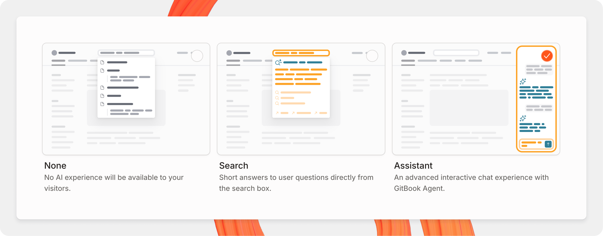

# AI Search

Help your users find the information they need faster with powerful knowledge discovery tools for your published content

### Choose your site’s search experience

GitBook sites offer different search experiences depending on what you want for your users:

* **Keyword search** – A standard search experience based on keywords. Automatically enabled on all sites.
* **GitBook AI search** – Users get short answers to questions directly from the search box. Available on Premium and Ultimate site plans.
* **GitBook Assistant** – Users get an advanced, interactive chat experience with GitBook’s AI agent. Available on Ultimate site plans. Head to [GitBook Assistant](../ai-and-search/gitbook-ai-assistant.md) to learn more.

AI Search is available on Premium and Ultimate site plans. GitBook Assistant is available on Ultimate site plans.

To choose your site’s search experience, open **Customize**, under **Tools** in the site sidebar, and click **AI Assistant**. Here you can choose your preferred experience.

<figure><figcaption>
Choose the search experience you want in your published docs
</figcaption></figure>


When GitBook Assistant is enabled, AI search is disabled. Standard keyword searches will always provide the results in the search bar no matter which experience you choose.


## Searching published documentation

**​**Users can open the **Ask or search…** bar by pressing <kbd>⌘</kbd> + <kbd>K</kbd> on Mac or <kbd>Ctrl</kbd> + <kbd>K</kbd> on PC.

Your users can search for keywords within your docs site and jump quickly to specific pages or page sections across your entire site.

If your docs site has multiple [sections](site-structure/site-sections.md), the search results will contain pages from all of these sections so that you users can jump straight to the page they need.

## GitBook AI search



GitBook AI search offers basic AI-powered answers in the **Search and find…** bar of your site. It’s trained on the content of your docs site, but cannot pull in information from external sources.

### Using GitBook AI search

If you have enabled GitBook AI search from your site’s settings page, your users can access it by asking a question directly in the **Ask or search…** bar at the top of the page.

They can open this by clicking it directly, or by pressing <kbd>⌘</kbd> + <kbd>K</kbd> on a Mac or <kbd>Ctrl</kbd> + <kbd>K</kbd> on a PC.

As well as a summarized answer, below your users will also see an expandable section that shows the sources that GitBook AI used to create its answer, plus related questions you can click as a follow-up.


GitBook AI does not work across individual published sections on different [docs sites](publish-a-docs-site/).

Multi-section search is only available when viewing published [sections](site-structure/site-sections.md) that live within the same site.


* Press <kbd>⌘</kbd> + <kbd>I</kbd> on Mac or <kbd>Ctrl</kbd> + <kbd>I</kbd> on PC
* Click the **GitBook Assistant**  button next to the **Ask or search…** bar
* Type a question into the **Ask or search…** bar and choose the ‘Ask…’ option at the top of the menu.
