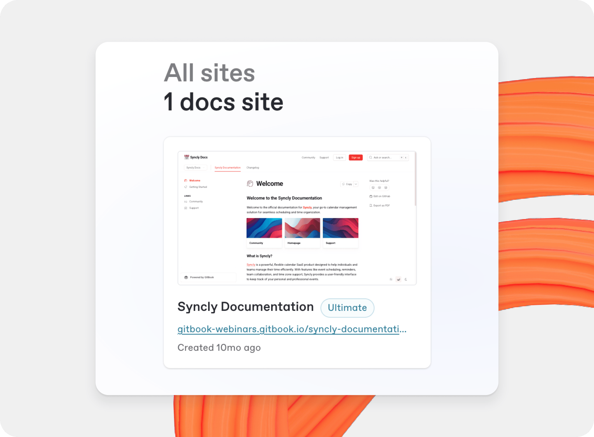

# Publish a docs site

When you finish writing, editing, or importing your content, publish it for your selected audience.

A docs site's content lives in its [sections](../site-structure/). The structure you edit is the structure visitors get. New sections start as drafts, so you control what appears on your published site.

<figure><figcaption>
Your organization Home.
</figcaption></figure>

### Create a docs site

To create a docs site:

1. From your organization **Home**, click the **+** icon next to **Sites**.
2. Enter a name that visitors will recognize.
3. Click **Create**.
4. Select a starting point: a documentation template, an import, an OpenAPI specification, a blank section, or Git Sync.

For a complete setup walkthrough, see the [Quickstart](../../getting-started/quickstart.md).


You can manage site permissions in **Settings** → **Members**. This lets you control who can view or edit each site independently of organization settings. See [Roles](../../collaboration/member-management/roles.md) for details.


### Publish a docs site

To publish your site:

1. From your organization **Home**, open your site.
2. Click **Publish** in the site header.

Sites are public by default. Change your site's visibility in **Settings** → **Audience**. See [Site settings](../site-settings.md).

Choose one of these audience options:

<table data-view="cards"><thead><tr><th></th><th></th><th></th><th data-hidden data-card-cover data-type="image">Cover image</th><th data-hidden data-card-target data-type="content-ref"></th><th data-hidden data-type="image">Cover image (dark)</th><th data-hidden data-type="image">Cover image (dark)</th><th data-hidden data-card-cover-dark data-type="image">Cover image (dark)</th></tr></thead><tbody><tr><td><strong>Public</strong></td><td>Publish your docs publicly to the web.</td><td></td><td><a href="../../.gitbook/assets/25_12_12_public.png">25_12_12_public.png</a></td><td><a href="public-publishing.md">public-publishing.md</a></td><td><a href="../../.gitbook/assets/25_12_12_public_1.png">25_12_12_public_1.png</a></td><td></td><td><a href="../../.gitbook/assets/25_12_12_public_1.png">25_12_12_public_1.png</a></td></tr><tr><td><strong>Privately with share links</strong></td><td>Publish your docs with private share links.</td><td></td><td><a href="../../.gitbook/assets/25_12_12_share_links_1.png">25_12_12_share_links_1.png</a></td><td><a href="share-links.md">share-links.md</a></td><td></td><td><a href="../../.gitbook/assets/25_12_12_share_links.png">25_12_12_share_links.png</a></td><td><a href="../../.gitbook/assets/25_01_06_share_links@2x.png">25_01_06_share_links@2x.png</a></td></tr><tr><td><strong>Authenticated Access</strong></td><td>Protect your published docs behind an OAuth sign in.</td><td></td><td><a href="../../.gitbook/assets/25_12_10_auth_access_1.png">25_12_10_auth_access_1.png</a></td><td><a href="../../site-access/authenticated-access/">authenticated-access</a></td><td></td><td></td><td><a href="../../.gitbook/assets/25_12_10_auth_access.png">25_12_10_auth_access.png</a></td></tr></tbody></table>

### Delete or unpublish a docs site

To unpublish your site, open **Settings** → **General** and select **Unpublish site**.

To delete a docs site:

1. Open **Settings** → **General**.
2. Select [**Delete site**](../site-settings.md#delete-site).

Deleting a site permanently removes its settings and customizations. Your content remains in your organization — find it in [All content](../../creating-content/all-content.md).
