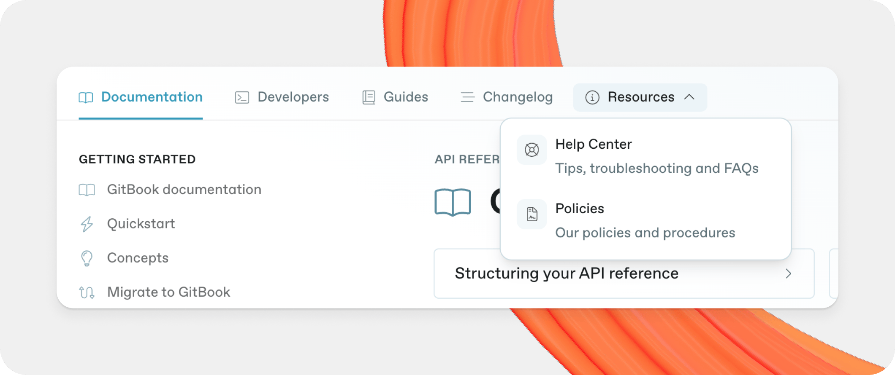
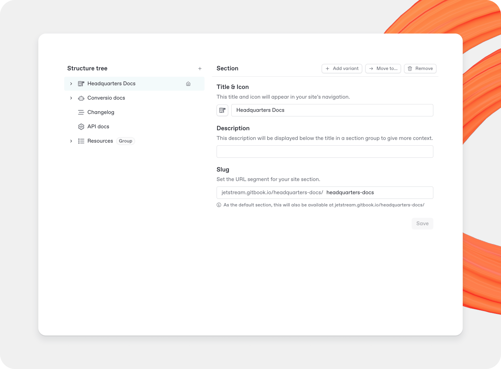

# Sections


This feature is available on the Ultimate site plan.


<figure><figcaption>
Example of a GitBook site with sections
</figcaption></figure>

Sections let you centralize your documentation in one site. Use them to organize separate products. You can also serve different audiences with tailored content.

Group sections to create a dropdown in your navigation bar. Groups add hierarchy to your site.

### Sections or variants?

Each section holds its own content. Use sections for distinct documentation areas. These can represent products, audiences, or topics.

For variations of the same content, use [content variants](variants.md). Variations include localizations and historical product versions.

### Add a section

To add a section:

1. In the site sidebar, open **Site structure**.
2. Below the table, click **New section**.
3. Select the content to add.

The section appears in the table. It also appears as a tab on your published site.

<figure><figcaption>
Add structure to your docs with sections.
</figcaption></figure>

### Create a section group

Section groups create a navigation dropdown under one heading. Grouped sections can have an optional description. The description appears below the section title.

To create a group:

1. Next to **New section**, click the arrow.
2. Select **New section group**.
3. Enter a group name.
4. Click **Add section**.
5. Add existing sections or select new content.

If your site supports multiple languages, translate group titles, section titles, and descriptions. See [Multilingual sections](multilingual-sections.md).

### Edit a section

To edit a section:

1. In the section’s table row, click **Edit**.
2. Change the name, icon, or slug.
3. Click **Save**.

To delete a section, click **Delete** in the lower-left corner.


Changing a section’s slug changes its canonical URL. GitBook creates a redirect from the old URL. You can also [create redirects manually](../../publishing-documentation/site-redirects.md).


### Reorder sections

Sections appear in the same order as the **Site structure** table. To reorder a section, drag its drag handle up or down. The section’s content moves with it. The new order appears on your site immediately.

To use a keyboard:

1. Press **Space** to select a section.
2. Press an arrow key to move the section.
3. Press **Space** to confirm.

### Set the home section

The home section appears when visitors open your site. It loads at your site’s root URL. Other sections add a slug to the root URL.

To set the home section:

1. In the section’s table row, open the **Actions** menu.
2. Click **Set as home**.

### Set the home variant

If a section has multiple variants, choose which variant visitors open first.

To set the home variant:

1. Open **Site settings**.
2. Click **Structure**.
3. Click the section to update.
4. Find the variant visitors open first.
5. Click **Set as home**.

### Remove a section

To remove a section:

1. In the site sidebar, open **Site structure**.
2. Open the section’s **Actions** menu.
3. Click **Remove**.


Removing a section unpublishes it and its variants. It doesn’t delete the content. You can still find it in [All content](../../creating-content/all-content.md).

