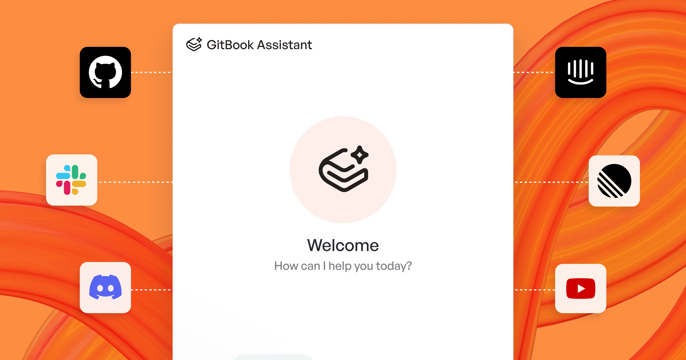

# AI Assistant

<figure><figcaption>
The GitBook Assistant
</figcaption></figure>

AI Assistant gives your users fast, accurate answers about your documentation using natural language. It's personalized to your users, can be embedded into your website or product, and can appear in the sidebar or search box of your published docs.

Think of it as a product expert available to all of your users, in the places and times they need it most.

The Assistant uses agentic retrieval to understand the context of queries based on the user's current page, previously-read pages, and previous conversations.

Try asking the Assistant a question in the box below:

<button type="button" class="button primary" data-action="ask" data-icon="gitbook-assistant">Ask a question...</button>

## Configure AI Assistant 

To configure AI Assistant, open **Customize**, under **Tools** in the site sidebar, and click **AI Assistant**. Here you can enable the Assistant and customize its instructions, welcome message, and suggested questions.

### Add custom instructions

Custom instructions adjust the Assistant's tone of voice and add product-specific knowledge or terminology, so its answers consistently match your wider style.


Custom instructions refine the Assistant's tone and knowledge. They can't override its built-in guardrails.


### Customize a welcome message

The welcome message is the first thing visitors see when they open the Assistant with no active conversation. Use it to set expectations or point users towards a specific workflow.

### Add suggested questions

Suggested questions are pre-written prompts shown when the Assistant opens with no active conversation. They help users understand what they can ask, and can help you point your users towards useful answers or workflows.

#### Best practices for suggested questions:

* Start with a real user goal (setup, troubleshoot, integrate).
* Use the words your users use (avoid internal codenames).
* Keep them specific. “How do I…?” beats “Tell me about…”.
* Cover different intents: quickstart, how-to, troubleshooting, and reference.


If you’re embedding the Assistant in your product, you can also dynamically set suggestions in your embed configuration. See [Customizing the Embed](../publish/embedding/configuration/customizing-docs-embed.md#adding-suggestions).


### Choose where the Assistant appears 

Under **Appearance**, set **Placement** to choose where readers reach the Assistant:

* **Sidebar** (default) — the full chat experience, available on Ultimate site plans
* **Search box** — inline answers alongside keyword search results, available on Premium and Ultimate site plans


The Assistant greeting applies to the sidebar placement only, so it's hidden while **Placement** is set to **Search box**.



Turning **AI Assistant** off and on again resets **Placement** to **Sidebar**. If your site uses the search box placement, set it again after re-enabling the Assistant.


## Using AI Assistant in published docs 

How readers reach the Assistant depends on its placement.

### Sidebar placement

Users can access GitBook Assistant in three ways:

* Press <kbd>⌘</kbd> + <kbd>I</kbd> on Mac or <kbd>Ctrl</kbd> + <kbd>I</kbd> on PC
* Click the **GitBook Assistant** <i class="fa-gitbook-assistant">:gitbook-assistant:</i> button next to the **Ask or search…** bar
* Type a question into the **Ask or search…** bar and choose the 'Ask…' option at the top of the menu

### Search box placement

With **Placement** set to **Search box**, users can ask a question directly in the **Ask or search…** bar at the top of the page, alongside the keyword results.

They can open this by clicking it directly, or by pressing <kbd>⌘</kbd> + <kbd>K</kbd> on a Mac or <kbd>Ctrl</kbd> + <kbd>K</kbd> on a PC.

As well as a summarized answer, below your users will also see an expandable section that shows the sources that the Assistant used to create its answer, plus related questions you can click as a follow-up.

The Assistant answers from the content of your docs site, and from any sources you've added through [connections](connections.md).


The Assistant does not answer across individual published sections on different [docs sites](../publish/publish-a-docs-site/).

Multi-section search is only available when viewing published [sections](../manage-your-site/site-structure/site-sections.md) that live within the same site.


## Searching published documentation

Keyword search is automatically enabled on every site, whether or not the Assistant is turned on.

Your users can search for keywords within your docs site and jump quickly to specific pages or page sections across your entire site.

## Embed AI Assistant in your product

You can embed GitBook Assistant directly into your product or website, giving users instant access to AI-powered help without leaving your application. The Assistant can be embedded as part of [Docs Embed](../publish/embedding/), which includes the Assistant tab for AI-powered chat, the Search tab for scoped discovery, and the Docs tab for browsing your documentation.

Choose the embedding method that fits your stack:

* [**Standalone script tag**](../publish/embedding/implementation/script.md) – Quick setup with a `<script>` tag
* [**Node.js/NPM**](../publish/embedding/implementation/nodejs.md) – Server-side or build-time integration
* [**React component**](../publish/embedding/implementation/react.md) – Prebuilt React components

### Additional Assistant embedding guides:

* [Using embedded Assistant with authenticated docs](../publish/embedding/using-with-authenticated-docs.md) – Required if your docs need sign-in
* [Customizing the Assistant embed](../publish/embedding/configuration/customizing-docs-embed.md) – Welcome messages, actions, and suggestions
* [Creating custom embed tools](../publish/embedding/configuration/creating-custom-tools.md) – Connect Assistant to your APIs
* [API reference](../publish/embedding/configuration/reference.md) – All available methods and events

## Extend AI Assistant’s knowledge

AI Assistant can use external knowledge through [connections](connections.md) and [MCP servers](mcp-servers-for-published-docs.md).

You can use connections when you want GitBook to sync records into your site, or use MCP servers when you want to hook up AI Assistant to custom tools.

<table data-card-size="large" data-view="cards"><thead><tr><th></th><th>Best for</th></tr></thead><tbody><tr><td><strong>Connections</strong></td><td>
Connections work best for content-heavy sources:
<ul><li>GitHub issues and discussions</li><li>Slack or Discord conversations</li><li>Support content</li><li>External docs, help centers, and websites</li></ul></td></tr><tr><td><strong>MCP servers</strong></td><td>
MCP servers work best for live tools and data:
<ul><li>Current account or product state</li><li>Internal systems that change often</li><li>Actions like creating tickets or filing bugs</li><li>Sources you don't want to sync into GitBook</li></ul></td></tr></tbody></table>





**Open your site's settings**

Open your site dashboard. Then choose **Settings** → **Connections**.



**Connect a source**

Choose a source type. Then authorize it, or enter the URL to import.



**Expose records to AI Assistant**

Turn on **Expose in search / assistant** for the connection.

GitBook can then use those records in search and AI Assistant.







**Open your site's settings**

Open your site dashboard. Then choose **Settings** → **AI & MCP**.



**Add a new server**

In the MCP servers table, click **Add MCP server**.



**Enter the server details**

Give the server a name. Add its URL.

Then configure any HTTP headers GitBook must send with each request.




