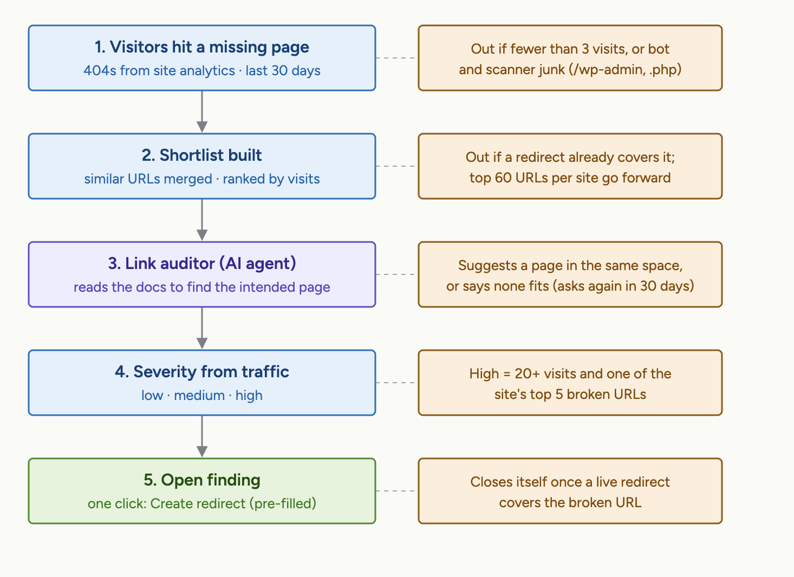

# Broken links


Broken links is in **beta** and available on the **Ultimate** site plan.


Broken links finds the URLs on your published site that visitors are reaching but that no longer exist. For each broken URL, GitBook works out which page the visitor was most likely looking for and suggests a redirect you can enable in one click, so visitors stop landing on 404 pages.

In your site’s sidebar, go to **Improve → Broken links**.

### How it works

GitBook regularly audits every published site on a plan that includes Broken links. An audit:

1. Looks at the last 30 days of traffic to your site and collects the URLs that returned a 404. A URL needs to have been hit at least three times to be considered, and noise from bots and scanners, such as requests for `/wp-admin` or `.php` files, is ignored.
2. Merges similar URLs, drops any that a live redirect already covers or that resolve again because a page now exists at that path, and ranks the rest by visits. The 60 most-visited broken URLs go forward.
3. Reads your published content to find the page each visitor was most likely looking for. If a whole section has moved, GitBook groups the broken URLs under a single wildcard suggestion such as `/v1/*`. If no page fits, GitBook says so, and checks that URL again after 30 days.
4. Creates a **suggested redirect** for each broken URL that has a clear match, with a short explanation of why that page was chosen and a severity based on how much traffic the URL receives.

<figure><figcaption>
How a Broken links audit turns 404s into suggested redirects.
</figcaption></figure>

A site is audited at most once a day. Each audit starts again from your current traffic, and resolved URLs drop out, so a site with more than 60 broken URLs works through them over successive audits, most-visited first. Broken URLs that GitBook couldn't match to any page are kept as findings too, with the reason and the pages it considered, so you can decide whether they need a new page instead of a redirect.

Broken links builds on [site-redirects.md](../publish/site-redirects.md "mention"). Read it first if you’re not familiar with redirects.

### The two views

Broken links has two views, which you can switch between from the tabs in the header:

* **Findings** lists the broken URLs GitBook found and the redirects it suggests, ready for you to review.
* **Analyze** shows the full broken URL report from your site’s analytics, including URLs that don’t have a suggestion yet.

### Reviewing findings

The **Findings** view starts with a summary of the last 30 days:

| Card                    | What it shows                                      |
| ----------------------- | -------------------------------------------------- |
| **Broken visits**       | The number of 404 responses your site returned.    |
| **Visitors affected**   | The number of unique visitors who hit a 404.       |
| **Suggested redirects** | The number of open suggestions waiting for review. |

Below the summary, each finding appears in a list with its status, its severity, and a title describing the broken URL and, when GitBook found one, the page it should lead to. Findings with a suggested fix are listed first.

#### Severity

Severity reflects how much traffic a broken URL receives, relative to the other broken URLs on your site.

* **High**: at least 20 visits in the last 30 days, and one of the five most-visited broken URLs on your site.
* **Medium**: a URL with steady traffic.
* **Low**: a URL hit only a handful of times in the last 30 days.

#### Searching, filtering, and sorting

Type a URL, or part of one, in the search box to find a specific finding. Use the filter bar above the list to narrow findings by **Status** or **Severity**. By default the list shows only **Open** findings, sorted by severity. Switch the sort to **Recently updated** to see the latest changes first. Opening a finding and going back keeps your search, filters, and sort.

### Fixing a broken URL

1. Select a finding in the list to open its details.
2. Read the **Motivation** section. It explains which page GitBook matched to the broken URL and why. The **Related pages** list links to the pages involved.
3. Click **Create redirect**.
4. The **Add redirect** dialog opens with the **Source path** and **destination** already filled in from the suggestion. Adjust anything you want, for example choose **Permanent redirect** if the old URL will never return.
5. Click **Enable redirect** to activate it immediately, or **Save as draft** to publish it later from your site’s redirect settings.

When you enable a redirect whose source matches an open finding, the finding is automatically marked as **Resolved**. Saving the redirect as a draft leaves the finding open until the redirect goes live.

The redirect is added to your site’s redirects. You can edit or delete it at any time from **Settings → Redirects**, or by clicking **Manage redirects** at the top of the screen.


Creating redirects requires admin permissions on the site, and changing a finding’s status requires edit permissions. Actions you can’t use appear disabled, with an explanation.


#### Wildcard suggestions

When several broken URLs share a prefix and all belong to the same moved section, GitBook suggests a single wildcard redirect such as `/v1/*` instead of one redirect per URL. The prefilled redirect dialog has **Replace wildcard with matched text** enabled, so `/v1/installation` is sent to the matching path under the new destination. See [site-redirects.md](../publish/site-redirects.md "mention") for how wildcard redirects behave.

### Ignoring a finding

If a suggestion is not right, or the broken URL does not need a redirect, open the finding and click **Ignore**. It moves to **Rejected** and disappears from the default list. You can find it again by filtering on **Status**, and bring it back with **Unarchive**.

You can also change the status of a finding directly from the list or the details page using the status menu:

| Status       | Meaning                                            |
| ------------ | -------------------------------------------------- |
| **Open**     | The finding is waiting for review.                 |
| **Resolved** | A redirect was created, or the URL resolves again. |
| **Rejected** | You chose to ignore the finding.                   |

Findings are also resolved automatically when the next audit finds that the broken URL now resolves, either because a page exists at that path again, including a translated page, or because a live redirect covers it.

### Analyzing broken URLs

The **Analyze** view shows every URL that returned a 404 in the selected period, whether or not GitBook has a suggestion for it. Use it to find broken URLs that need a new page rather than a redirect, or to see where broken traffic comes from.

The report includes:

* **Broken URL hits**, **Affected visitors**, and **Distinct URLs** for the selected period, with a trend over time.
* **Top broken URLs**, ranked by hits.
* **Broken URLs by dimension**, which lets you group broken traffic by **Referrer domain**, **Broken URL**, **Full referrer**, **Country**, or **Device**. Grouping by referrer domain is the quickest way to find an external site that links to an outdated URL.
* **404s caused by adaptive content**, if your site uses adaptive content. These are visitors who reached a page that exists but that a condition kept them from seeing. They are excluded from the findings, since a redirect would not help.

You can filter the report using the same filters as the rest of your [site analytics](insights.md), including section, language, country, device, and referrer.
