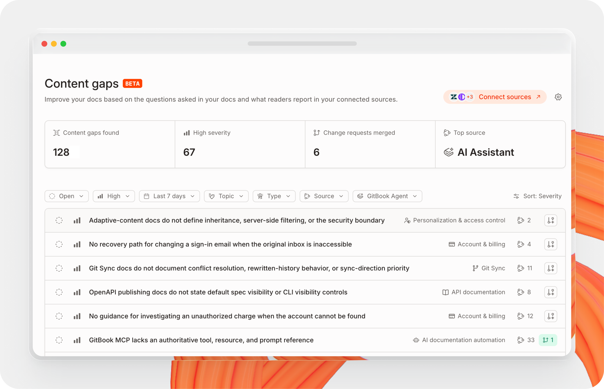

# Content gaps

Content gaps shows you what your documentation doesn’t answer. GitBook scans the questions visitors ask in your docs, along with the support tickets, emails, forums, and other records from the sources you’ve connected. Once a day it compares those questions against your content, identifies the ones your docs don’t answer, and ranks them by severity.

From any gap, GitBook Agent can open a change request that fills it.

In your site’s sidebar, go to **Improve → Content gaps**.

<figure><figcaption></figcaption></figure>

## What GitBook detects

GitBook flags four kinds of issue:

* **Content gaps** occur when GitBook sees customers asking questions about your product that the docs struggle to answer, such as:
  * A customer asking a question to your support team that they couldn’t find on the docs.
  * An API endpoint missing complete documentation.
* **Outdated content** is detected when the content on your page has been superseded by content found in an external source, such as:
  * An SDK update that changed the signature of a function.
  * A paid feature that moved to the free tier, where the docs haven’t been updated.
* **Incorrect content** is flagged when the content on the docs site is explicitly wrong, such as:
  * A guide pointing to APIs that do not exist anymore, or where the feature has been sunsetted.
  * External sources such as your marketing website disagreeing with the documentation.
* **Other** covers issues that don’t fit the categories above.

## How it works



#### Connect your sources

GitBook finds more gaps when it can compare your docs against the places your customers already ask questions — your support ticketing system, public forums, or marketing website. Some sources need an additional API key or authentication before setup is complete. [Learn more about connections.](../ai-for-your-readers/connections.md)



#### GitBook scans daily

GitBook reviews your sources once a day and compares what it finds against your published content. Each question your docs don’t answer becomes a gap.



#### Review the gaps

Each gap sets out the problem, the evidence behind it, and a recommendation for fixing it. Sort by severity to find the gaps worth fixing first.



#### Fill or reject

Fill a gap by creating a [change request](../collaborate/change-requests/) from it, or reject the ones you don’t want to act on. GitBook won’t re-open a gap you’ve rejected.



## Filtering the list

A site with a large back catalog can surface thousands of gaps at once. Filter the list to find the ones worth working on:

| Filter        | Options                                                 | Use it to                                                                                                                                               |
| ------------- | ------------------------------------------------------- | ------------------------------------------------------------------------------------------------------------------------------------------------------- |
| Status        | **Open**, **Changed**, **Rejected**, **Resolved**       | Separate untouched gaps from those a change request already covers, the suggestions your team turned down, and the ones a merged change request closed. |
| Severity      | **High**, **Medium**, **Low**                           | Work the highest-impact gaps first.                                                                                                                     |
| Date          | **Last 7 days**, **Last 30 days**                       | See what a recent release or support spike surfaced.                                                                                                    |
| Topic         | Any topic on your site                                  | Focus on one area of your documentation. Topics are grouped the same way as in AI Insights.                                                             |
| Type          | Content gap, outdated content, incorrect content, other | Separate missing documentation from documentation that has gone wrong.                                                                                  |
| Source        | Any connected source                                    | Check what a single source is reporting, such as gaps that only Intercom sees.                                                                          |
| GitBook Agent | Worked on, not worked on                                | Find gaps nobody has picked up yet.                                                                                                                     |

Rejecting a gap records that your team considered the suggestion and decided against it, which keeps it out of the open list without hiding that the decision was made. Filter by **Resolved** to find the gaps a merged change request has already closed.

## Reviewing a gap

1. On the Content gaps page, filter the list to the gaps you want to work on.
2. Click a gap to open it.
3. Read the **Problem**, **Evidence**, and **Recommendation** to judge whether the gap is real and worth filling.
4. Open the linked source records to check the evidence yourself.
5. Click **Create change request**, or **Reject** if the gap isn’t worth filling.
6. Review the change request GitBook Agent drafts, then merge it.

<figure><figcaption></figcaption></figure>

### What a gap shows

A gap opens with its name, status, severity, and type, followed by a **Motivation** section in three parts:

* **Problem** states what the documentation fails to explain, and what happens to a reader as a result.
* **Evidence** sets out what GitBook found: which pages cover the area today, what they leave out, and what the source records show people asking.
* **Recommendation** proposes what to write and where to put it, including the pages to link it from.

Below the motivation, GitBook lists the source records the finding rests on — the individual support conversations, discussions, or pages, each linked so you can open the original and read it in full.


Source records only appear for sources you have connected. A gap drawn from support conversations shows those conversations only if that support platform is connected. See [connections.md](../ai-for-your-readers/connections.md "mention") to set one up.


### Creating a change request from a gap

When a gap can be fixed automatically, a banner states that the finding can be resolved in change requests, and offers two actions.

Click **Create change request** to hand the gap to GitBook Agent. The Agent reads the finding and the pages it names, then drafts the change. One gap can produce more than one change request when the fix spans several pages.

The screen reports progress while the Agent works, then lists what it produced with a link to review each one. From there they behave like any other [change request](../collaborate/change-requests/) — you see exactly what content changed, and your usual review and merge rules apply. See [review-change-requests-with-gitbook-agent.md](../gitbook-agent/review-change-requests-with-gitbook-agent.md "mention") for how the Agent can help review it.

Merging the change request resolves the gap and removes it from the queue. Filter by **Resolved** to find it again.

### Rejecting a gap

Click **Reject** when a gap is not worth filling — the question is out of scope, the page already answers it, or the finding misread the evidence. Rejecting keeps the gap out of the open list, and GitBook won’t re-open it.

## Settings

On the Content gaps page, click **Settings** to see which sources GitBook scans and what each one contributes.

### Sources

The **Sources** list shows every connection that’s ingesting, what it has scanned, and how many gaps came from it. Each source reports in its own units: pages for a website, videos for a YouTube channel, discussions for GitHub Discussions, and conversations for a support platform.

Your docs are a source in their own right. **AI Assistant** reports both the unanswered questions visitors asked on your site and the gaps that came from them. See [ai-insights.md](ai-insights.md "mention") to review those questions in full.

Each source appears under the label you gave the connection, so two website connections show up separately rather than merging into one entry.

Click **Show content gaps** on any source to filter the list to that source’s gaps.

### Connections

The **Connections** section shows the sources you haven’t connected yet, such as Zendesk, Freshdesk, Front, HubSpot, Zoho Desk, Pylon, GitHub Issues, and an MCP server.

Click **Manage connections** to open the Connections page, where you add a source, check sync status and record counts, set search ranking, and browse the individual records GitBook has ingested. See [connections.md](../ai-for-your-readers/connections.md "mention") for what each connector indexes and how to set one up.
