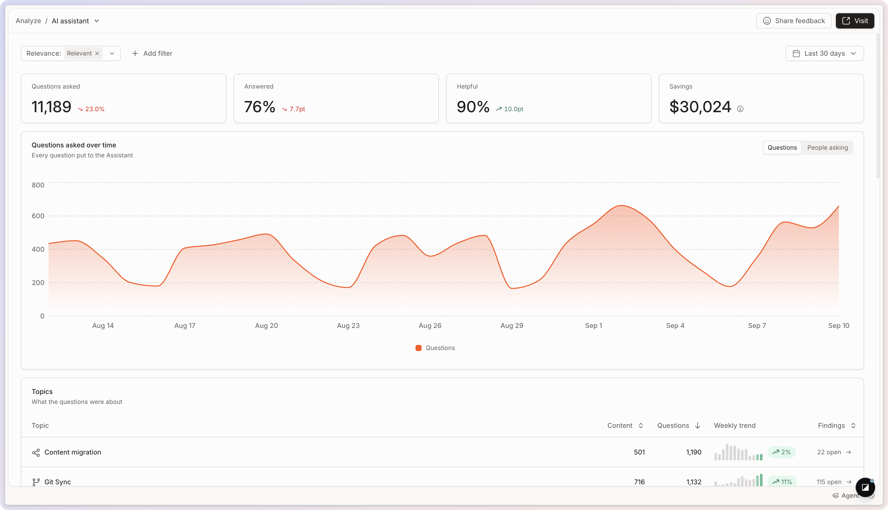

# AI Assistant

The **AI Assistant** report shows what your visitors ask and how effectively [GitBook Assistant](../../ai-for-your-readers/gitbook-ai-assistant.md) answers them using your content.

To open it, go to **Analyze → AI Assistant** in your site’s sidebar.

Four metrics summarize the period you selected:

* **Questions asked**: the questions visitors put to the Assistant.
* **Answered**: the share of questions the Assistant resolved.
* **Helpful**: how visitors rated the answers they got.
* **Savings**: the estimated support effort avoided by answering those questions.

See [.](./ "mention") for filters, time periods, and comparing periods.

<figure><figcaption>
The AI Assistant report.
</figcaption></figure>

## Topics

GitBook groups questions into **topics**, so you can read what your visitors want at the level of a subject rather than one question at a time. Each topic shows how it performs over time and how much of your traffic it represents.

Click a topic to open its detail view and see every question in it, grouped by **Type** or **Recency**. Use this to review recurring needs, spot documentation gaps, and understand whether your site answers questions in that area successfully.

## Breakdowns

Three cards break the period down by **Answered** (whether the response solved the question), **Categories** (the type of question asked), and **Channels** (where the Assistant was used: your site, the [Docs Embed](../../publish/embedding/), or a connected tool). Click any value to filter the whole report by it.

## Questions

The **Questions** card lists every question put to the Assistant. Click one to see how GitBook handled it and which content supported the response.

At the top of the detail view, you can review the question itself, how often visitors asked it, its type, and the topics it belongs to.

### Conversations and answer quality

Below the summary, you can review the conversations tied to the question and see whether GitBook answered it fully, partially, or not at all. The conversation panel also shows the full Assistant exchange, including any follow-up questions and responses.

### Sources and context

The sources section shows which pages, records, or [connected content](../../ai-for-your-readers/connections.md) GitBook used to answer the question. Use this to verify the AI drew from the right content — and to find places where relevant pages exist but weren’t surfaced.

### Export questions and answers

From the Questions card, click **Export as CSV** and choose what to download:

* **Questions summary**: one row per question, with its totals.
* **Answers detail**: one row per answer, with its topics, resolution, helpfulness, relevance, thumb feedback, channel, and language. Use it to see what the Assistant replied and whether the answer landed.

## FAQ

<strong>How do I use the AI Assistant report?</strong>

It gives your team an overview of how visitors interact with your documentation when searching for answers.

Filtering the report helps you identify content gaps. You can filter for the following:

* The questions visitors ask most often
* Questions visitors search for that don’t have answers
* Topics your documentation doesn’t cover

Addressing these gaps helps visitors find answers more quickly — and understand your product faster.


[content-gaps.md](../content-gaps.md "mention") collects these gaps into a ranked list, and GitBook Agent can open a change request to fill one.


<strong>How is “Savings” calculated?</strong>

It’s an estimate, based on the assumption that one in five answered questions would otherwise have become a support ticket. An organization admin can set the cost of a support ticket, or a support hour, through the API to make the estimate reflect your team. Treat it as an order of magnitude rather than an exact figure.

