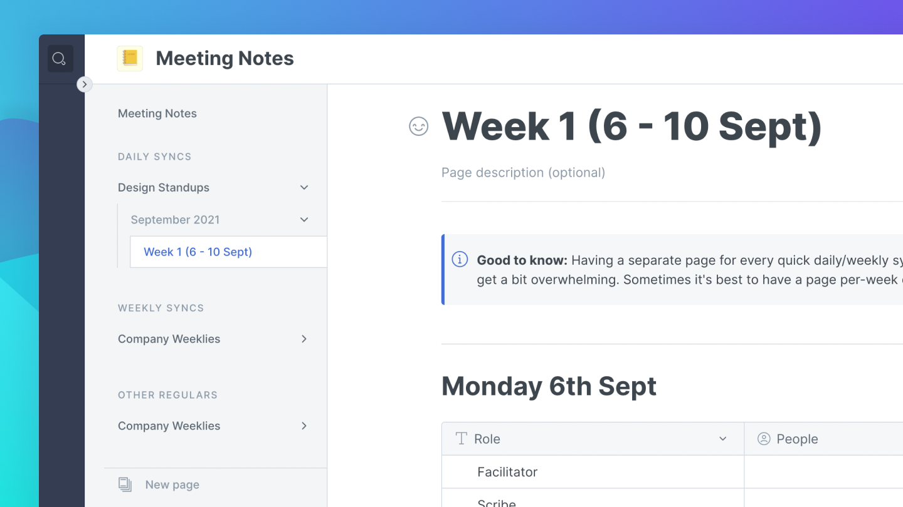

# Content structure

## Table of Content

Each space can contain as many pages as you need to write your documentation. All these pages are visible on the left side of your screen in the **table of content**.

From the Table of Content you can:

* Create new [pages](content-structure.md#pages)
* Create and manage [page groups](content-structure.md#groups)
* Add [external links](content-structure.md#external-links)
* [Import external docs](../features/import.md) like websites or Markdown files

## Structuring your content

There are 3 different types of entries for the Table of Content.

### Initial Page 

The initial page is the homepage or the root of your documentation and basically works as the main node of all the pages of your documentation.

### Pages

A page has a title, an optional description, and a content area where you can write and add any kind of content.‌

You can nest pages by dragging and dropping a page below an other in the table of contents.


**Good to know: **There is no theoretical limit to page nesting. But we advise that you avoid adding more than 3 levels of nesting to avoid overly complex structures that might be overwhelming to navigate.


When you change the title of a page, the page's **slug** (the part at the very end of the URL, e.g. `/hello-world`) will automatically update, unless you've already manually set the page's slug.

You can change the title and the slug of a page anytime by clicking on the `...` button next to the page title in the table of content.

### Page groups 

Page groups are created to bring pages together and for you to create sections of pages dealing with similar subjects.


**Good to know: **Groups can only live at the **top level of the table of content**. You cannot nest groups inside groups.


You can change the title and the slug of a group page anytime by clicking on the `...` button next to the group title in the Table of Content.

### External links 

These entries are external links and do not have any content in the editor. Their main function is to link to external sites or resources.
