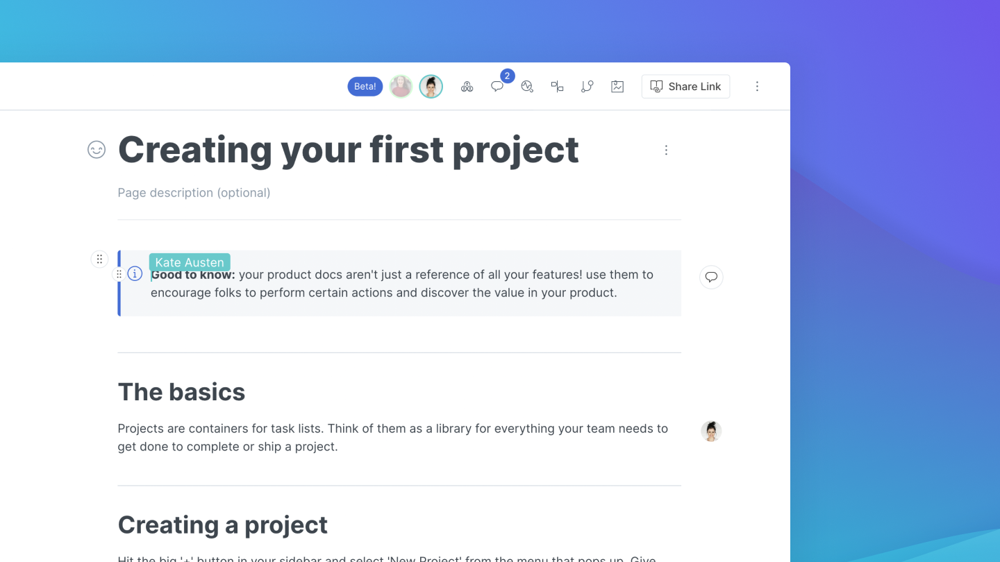

# Live edits and real-time collaboration

**Live editing** is the default mode of any newly-created GitBook space. A space in live edit mode is editable instantly by anyone with the [correct permissions](../../collaboration/team-management/).


**Good to know:** live edit mode is not available in some cases. More on that [below](live-edits-and-real-time-collaboration.md#undefined)!


## Real-time collaboration

When a space's live edits are **unlocked**, you'll be able to see your team members who are currently participating in editing the space. There are two ways you can see who is currently working on the same space as you; firstly, by the avatars shown in the space's header; and secondly, by the live, real-time cursors that show the current position and selection of team members on the same page as you.

## Toggling live edit on or off

You can lock or unlock a Space for live edits by selecting 'Unlock live edits' and 'Lock live edits' from the Space's actions menu.

### When is live editing _not_ available?

1. Live editing cannot be enabled on **public** or **unlisted** spaces. (We hope to change this in future!)
2. Live editing cannot be enabled on spaces with [Git Sync](../../integrations/git-sync/) enabled.
3. Live editing can only be enabled by users with admin or creator [permissions](../../collaboration/team-management/setting-up-permissions.md).
