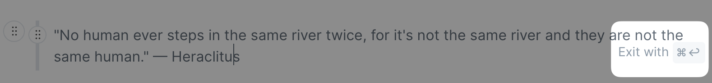
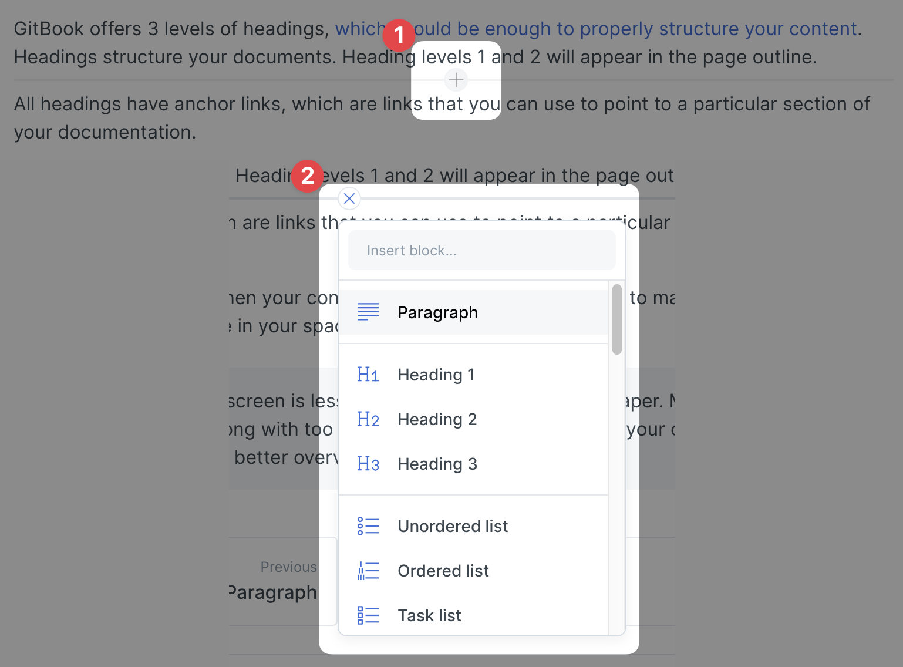

# Blocks

You can choose one of the following content blocks via the command palette:

* [Paragraph](paragraph.md)
* [Heading](heading.md)
* [Unordered list](unordered-list.md)
* [Ordered list](ordered-list.md)
* [Task list](task-list.md)
* [Hint](hint.md)
* [Quote](quote.md)
* [Code block](code-block.md)
* [Insert files...](insert-files....md)
* [Insert images...](insert-images....md)
* [Embed a url...](embed-a-url....md)
* [Table](table.md)
* [Tabs](tabs.md)
* [Expandable](expandable.md)
* [Drawing](drawing.md)
* [Math & TeX](math-and-tex.md)
* [API method](api-method.md)
* [OpenAPI](openapi.md)
* [Page link](page-link.md)

### Command palette

You can invoke the command palette for adding a block with the cursor in an empty paragraph in two ways:

1. Hitting the keyboard shortcut `command` + `/` , or
2. Clicking  using your mouse. The icon appears in the left margin of the paragraph that has the current focus.

### Exiting a block

Some content blocks capture the editing cursor to allow you to add content in the context of that block. When you are done, you can continue adding new content to the page either by inserting a new paragraph below or above the content block, or by hitting `command` + `enter`.

The example below show how to exit [a quote content block](./#quote):

<figure><figcaption>
Exit editing a content block with <code>command</code> + <code>enter</code>
</figcaption></figure>

### Inserting a new content block

You can insert a new content block below or above an existing block using your mouse:

1. Hover over the editor at the position you need the new content block
2. Click on the + icon that will appear
3. Select the block from the drop down menu to insert it at that position

<figure><figcaption>
Inserting a new block
</figcaption></figure>
