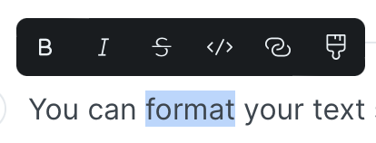

# Formatting

You can format your text selecting it and choosing one of the options that pop up:

<figure><figcaption><p>Formatting options</p></figcaption></figure>


Hovering over the options will show you a tip with the markdown markup you can use to achieve the same formatting option. And the keyboard shortcut you can use to do the same.


### Bold

Keyboard shortcut: `Command + B`


**Command** is the macOS key. Use **Windows** on Windows and **Control** on Linux.




```markdown
**Bold**
```



### Italic

Keyboard shortcut: `Command + I`



```markdown
_Italic_
```



### Strikethrough

Keyboard shortcut: `Command + Shift + S`



```markdown
_Italic_
```



### Code

Keyboard shortcut: `Command + E`



```markdown
`Code`
```



### Link

Keyboard shortcut: `Command + K`

This is [a link to an external page](https://www.gitbook.com).

This is [a link to a page in this space](./).

This is [a link to section in this page](formatting.md#color).

This is [a link that starts an email to a specific address](mailto:support@gitbook.com).

### Color

Keyboard shortcut: `Command + K`
