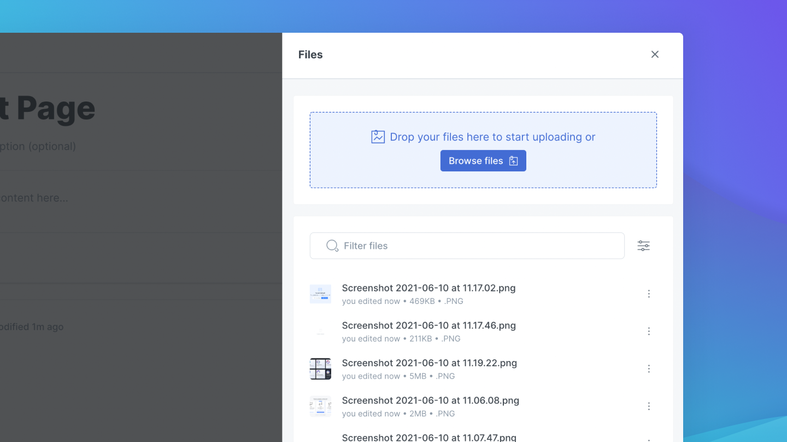

# Files

Several of GitBook's display blocks refer to files for their content. Image blocks, image galleries, and OpenAPI blocks can all pull the content that they display from files. Let's take a look at how to use this feature.

## Uploading a file

Files are managed in the Files panel of your space. To access the files panel, click on the files icon, found to the right of the space header.

To upload a file, select "Browse Files", and use your system file dialog to select the file you want to upload.

Files can also be uploaded as part of the image block setup flow, and the OpenAPI block setup flow. Upon creation, each of these blocks will open the Files panel and have you either select or upload a new file.


**Good to know:** You can drag images from your file system directly into the editor, or paste a copied image into your content, and they will also appear in the files menu for the respective space.


## Managing files

You can search for, rename, or delete files in your space in the Files panel of your space. Below the file upload section, you'll find the file listing. Each file has an action menu that lets you download, replace, rename, or delete your file. At the top of the file listing section, there is a search box, where you can search for your file by its name, and a sort toggle, which will let you sort your files by the date they were last modified, or their size.

### Renaming a file

To rename a file, open the action menu for the file, and click "edit". In the dialog prompt, enter the new name of your file.

### Deleting a file

To delete a file, open the action menu for the file and click "delete". After confirming in the dialog that you're sure you want to delete the file, your file will be deleted. Be sure to update your documents that referred to your now deleted file! Otherwise you may end up with some empty blocks.

### Replacing a file

GitBook supports replacing an existing file. This will swap out the old file and put the new file in its place - any blocks that previously referred to your old file will now refer to your new file after replacement. This can be handy if you have one file – such as a screenshot of your UI – that you use throughout your space, but need to change globally – let's say, after a major product redesign. Replacing the screenshot would replace it anywhere it's used in your documentation, so you don't have to manually update every instance of screenshot.


**Good to know: **Once you've uploaded an image or a file, you can reference it anywhere in your space by using an image or a file block. It's recommended you do this rather than drag/dropping or pasting an image into the editor every time you want to include it.


To replace a file, open the action menu for the file and click "replace". You'll be presented with a file replacement dialog - select the new file, wait for the upload indicator to complete, et voila! Your new file will be displayed wherever your previous one was.
