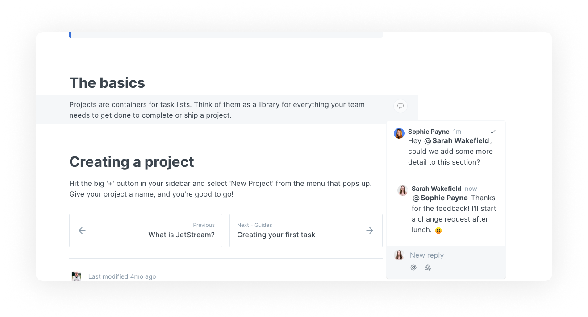
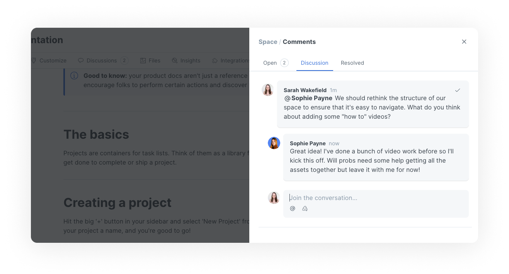

# Comments and discussions

Comments in GitBook allow you to have as much (or as little!) conversation as you like around specific pieces of content without switching over to a workplace chat tool or 'jumping on a call'!

## Comment within your content 

You can comment directly on any block within your content.

<figure><figcaption>
Users commenting on a paragraph block
</figcaption></figure>

## Direct discussion

You can also access more general discussion around a space or a change request using the comments icon in the space header. This will let you see all comments, but also gives you a place to have broader or more strategic discussions that might not make sense to associate with a specific content block.

<figure><figcaption>
Users commenting on a space
</figcaption></figure>

## Comment threads

Any top-level comment in GitBook can be replied to, turning it into a discussion thread.

## Resolving comments

Commenting and discussions can get messy, especially with larger teams! To reduce the noise, you can **resolve** a comment at any time. Resolving a comment will hide it in the interface, but still keep it accessible in the 'Resolved' tab of the space's comments sidesheet.

## Reacting to comments

Most importantly of all, you can leave an emoji reaction on any comment.

## Commenting and change requests

With commenting being integral to feedback, you might want to read more about how comments and change requests work together:


[change-requests.md](change-requests.md)

