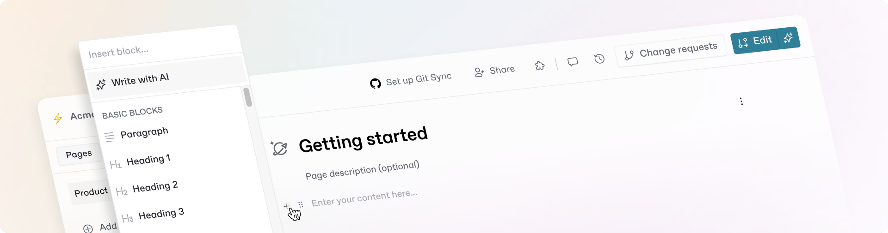

# Concepts

<figure><figcaption></figcaption></figure>

## Organizing content

### Space

A space is a project that lets you work on a collection of related pages. Within a space you can write content, organize your pages with groups and subpages, install integrations, and more.

When you want to publish a space, you can do so by adding it to a docs site. You can add as many spaces to a docs site as you like. So when you’re building out your content, you can create separate spaces for your product documentation, API reference, changelog, help center, and anything else you want to include on your documentation — and publish them all on one docs site.

You may also want to create translated versions of your primary documentation, or separate docs for different versions of your product. Each of these will also have their own space and can be added to your single docs site for users to browse.

#### Collection

Collections act like folders within the GitBook app, letting you group spaces together to make it easier to organize and store your content.&#x20;

As well as letting you keep content organized, collections also make it easier to manage content-level permissions at scale. You can override organization-level permissions across multiple spaces by adding them to a collection and setting permissions for the entire collection.

### Docs site

You can publish your content as a docs site. Your docs will be published and available to your selected audience as a website that you can customize with your own branding, analytics and custom domain.&#x20;

You can create as many docs sites as you want. They’re all listed in the sidebar and in the Docs sites section of the app, where you can change settings and customization options. You can control all of your docs site’s settings and options in the GitBook app.

The content on your site comes from spaces in your GitBook organization. When you create a new docs site, you can create a new space, or link an existing one. A docs site can contain one space, or multiple spaces containing different content — including translations and previous product versions.

## Editing content

GitBook’s visual editor lets you use a what-you-see-is-what-you-get (WYSIWYG) interface to add content to a space.&#x20;

### Pages

A page is the place where you add, edit and embed content. Pages always live inside a space, and you can add as many pages to a space as you like.

The pages in your space appear in the table of contents on the left-hand side of the editor. Here, you can add new pages, create page groups, and nest pages within other pages to create subpages.


## Can’t see how to edit or add a page?

If your site is published, you’ll need to create a change request before you can make any changes to the content of a space. [Read about change requests below](concepts.md#change-requests).


### Blocks

GitBook is a block-based editor. That means you can add different kinds of blocks to your page — from standard text and images to more advanced, interactive blocks. Your pages can include any combination of blocks you want, and there’s no limit to the number of blocks you can have on a page.

Block-based editing makes it easy to reorganize your content using drag-and-drop, or add new blocks in the middle of existing content. You can create new blocks using the editor interface, or create and format blocks using Markdown.

Discover all the blocks you can use in GitBook [in the Blocks section](../creating-content/blocks/).

#### Markdown editing

GitBook’s editor allows you to create and format content blocks using Markdown.

Markdown is a popular markup syntax that’s widely known for its simplicity. GitBook supports it as a keyboard-friendly way to write rich and structured text — all of GitBook’s blocks can be written using Markdown syntax.


You can learn more about Markdown itself by visiting [CommonMark](https://commonmark.org/help/).


### Git Sync

Git Sync allows teams to synchronize GitHub or GitLab repositories with GitBook and turn Markdown files into beautiful, user-friendly docs. Once set up, it keeps all your content synchronized between the GitBook app and your codebase.

Git Sync is bi-directional, so changes you make in GitBook’s visual editor are automatically synced — as are any commits made on GitHub or GitLab. This allows developers to commit directly from GitHub or GitLab while other team members edit and leave feedback on changes directly in GitBook.&#x20;

Git Sync also unlocks many other useful workflows in your GitBook docs, such as batch changes, linting, and more. Learn more in [our Git Sync section](git-sync/).

## The editing flow

### Change requests

A change request is a [**branch**](https://git-scm.com/book/en/v2/Git-Branching-Branches-in-a-Nutshell) of your main content that you can use to make concurrent edits, while maintaining your version history. It will feel familiar to anyone who uses pull requests in GitHub or merge requests in GitLab.

If you want to edit the content on your published docs site, you’ll first need to open a change request in your space.

In a change request, you can add, edit and delete content in a space, then request a review from your team and merge your changes into your main content to update your published docs site.


## Branching in brief

Opening a change request creates a copy of your content at that specific moment in time, sometimes called a ‘branch’. Any changes you make will not appear in your main content until you choose to merge your change request.&#x20;

The advantage of branching is that your teammates can create, edit and merge their own change requests at the same time as you without stepping on each other’s toes. And if someone edits the same content as you, GitBook will guide you through resolving any conflicts before you merge.


#### Reviews

Reviews encourage oversight and help improve the quality and accuracy of your documentation.&#x20;

You can request a review on your change request before you merge and make the changes live on your docs site. Adding a title and description to your change request gives your reviewers some context.

Reviewers can view the diff for your change request, which highlights everything that’s new, changed or deleted in your change request. They can also leave feedback right on the page using the built-in comments feature --  then approve your change request, or ask for more changes to be made.

#### Merging

Merging a change request will add all the content in your change request into the main branch of content — and those changes will also go live on your docs site.&#x20;

When you merge your change request, it also creates a new version in the space’s version history.

## Publishing documentation

When you publish your content as a [docs site](concepts.md#docs-site), you can add more content to your site, change the audience, and customize its look, feel and other settings.

### Structuring your docs site

If you want to add extra content to your site, there are two options for you to use, each designed for different use cases: site sections and variants.

#### Site section

Site sections are designed to let you add **multiple different types of documentation to a single docs site**. For example, you could use a single docs site and use it to host your product docs, API reference, help center and changelog — as we do on this docs site.

When you add new site sections, you build out the navigation bar at the top of your site, with each section getting its own entry on the bar. You can also group site sections together to create a drop-down menu in your navigation bar — ideal for adding hierarchy to your site sections.

#### Variant

Variants are designed to let you add **multiple versions of the same documentation to a single docs site**. For example, you might want to localize your entire documentation into multiple languages, or document previous versions of your product for users that haven’t updated.&#x20;

Your end users can switch between these variants on your docs site using the language picker or the variant picker at the top of the table of contents on the left-hand side of your site.

<figure><figcaption>
Site sections create a navigation bar along the top of your site, while users can switch between variants using a menu in the table of contents.
</figcaption></figure>

### Site audience

You can choose who will see your documentation when you publish it. The default for new sites is for them to be published publicly, and indexed by search engines.&#x20;

However, if you want more control over who can access your site, you can choose to limit the audience using **share links** or **authenticated access**.

With share links, you can share you content privately with customers or partners without needing to invite them to your organization by creating a private link and sharing it with them directly. Anyone with the link can access your site.

If you want even more control, authenticated access allows you to publish your content while requiring authentication from any visitors who want to view it. When enabled, GitBook lets your authentication provider handle who has access to the content. This is ideal for private content or for publishing an internal knowledge base that should only be accessible by members of your team.

You can also control who sees individual pages or blocks using a feature called adaptive content. Once set up, it will show or hide content based on user attributes that you decide upon. Read more in [the Adaptive content pages](../publishing-documentation/adaptive-content/).

### Site customization

GitBook includes built-in customization options for docs sites, helping you match the look and feel of your documentation to your product or brand.

Even if you don’t apply any customizations, your docs will look great as they are. But you have the option to customize logos, icons, and colors, add custom fonts, or choose from some built-in themes that help your docs look as great as your product.

<figure><figcaption>
You can customize your documentation to match your brand with your own logos, colors, fonts, images and much more.
</figcaption></figure>

### SEO and AI optimizations

Documentation published in GitBook is automatically optimized for search (SEO) and for AI systems like ChatGPT, Claude, and Google AI Overview (GEO). These are handled in the back end, so all you need to do is write content that includes the keywords and terms you want to target.

Pages pull metadata from each page’s title and description, and your content is formatted to be responsive. GitBook automatically creates a sitemap based on your table of contents, and pages are cached and served via our global CDN to improve performance. All of these help your documentation to rank high in search engines.

Likewise, GitBook also optimizes for AI tools following all the industry standards as they quickly evolve.

GitBook automatically creates .md versions of every page, which makes it easier for large-language models (LLMs) to parse. We also automatically expose a Model Context Protocol (MCP) server for every published site, giving AI tools a structured way to discover and retrieve your docs as resources — no scraping required. Plus, your site also generates `llms.txt` and `llms-full.txt` designed for AI ingestion.

## Team management

### Organization

A GitBook organization contains all of the content and docs sites for an individual company. With your single account, you can be a member of one or many organizations and switch between them using the dropdown menu in the top left corner of the GitBook app.

### Members

Members are individual users within your organization. You can have as many members as you like in an organization, each with permissions suited to their specific access needs.

#### Permissions

Permissions let you decide on the access level of your organization’s members. When a member joins your organization, you assign them a role — such as Editor or Viewer. These roles define their permissions for all of your organization’s content. But you can also override these permissions at a content level. For example:

* You can give someone with the Viewer role editing access to one particular piece of content
* You can limit access to specific confidential or private content and only grant access to certain members of your organization.

Read more on [the Permissions and inheritance page](../account-management/member-management/permissions-and-inheritance.md).
