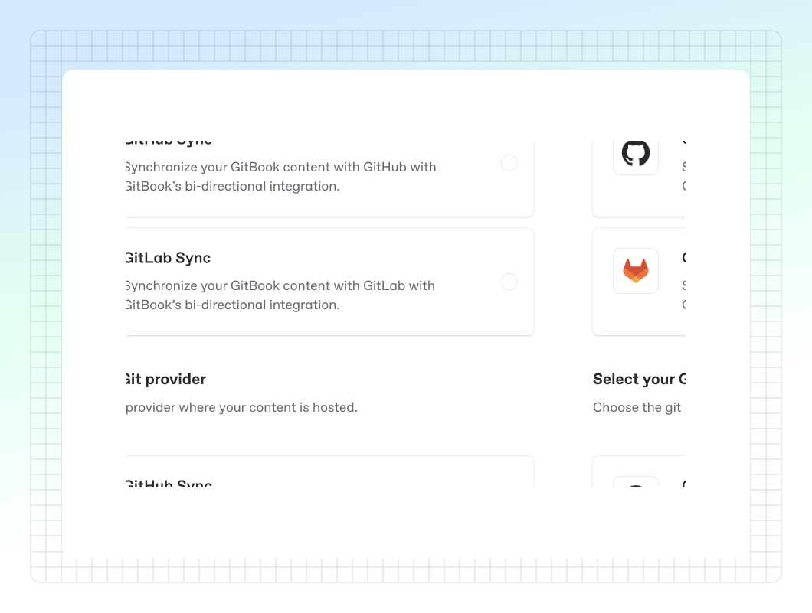

# GitHub & GitLab Sync

<figure><figcaption>
Set up Git Sync for your GitBook space.
</figcaption></figure>

### Overview

Git Sync allows technical teams to synchronize GitHub or GitLab repositories with GitBook and turn Markdown files into beautiful, user-friendly docs. Edit directly in GitBook’s powerful editor while keeping content synchronized with your codebase on GitHub or GitLab.

Git Sync is bi-directional, so changes you make directly in GitBook’s editor are automatically synced, as are any commits made on GitHub or GitLab. This allows developers to commit directly from GitHub or GitLab and technical writers, instructional designers and product managers to edit, discuss and feedback changes directly in GitBook.


Only [administrators and creators](../../account-management/member-management/roles.md) can enable and configure Git Sync.

