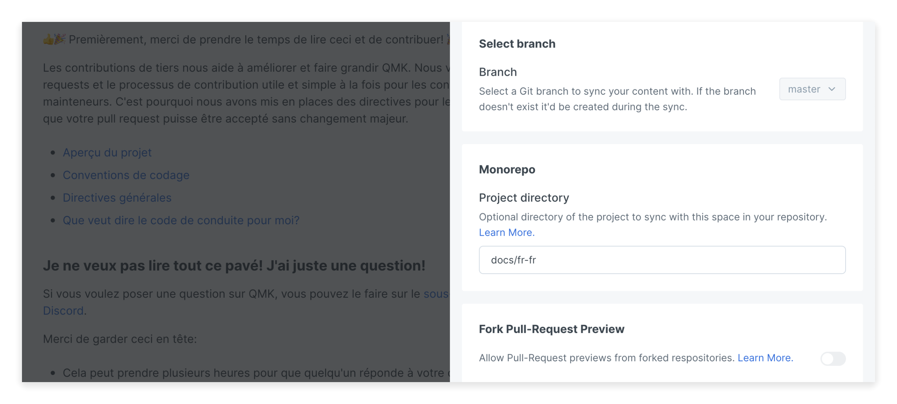

# Monorepos

GitBook supports monorepos. A monorepo is a repository that contains more than one logical project (e.g. an iOS client and a web-application).

GitBook can synchronize multiple directories from the same repository with multiple spaces. When enabling the Git Sync on a space, you can configure a "Project directory". It will be used to lookup the `.gitbook.yaml` file for the directory to synchronize with this space.

<figure><figcaption><p>Configuration for Monorepo</p></figcaption></figure>

Example of a repository structure:

```
/
  package.json
  packages/
     styleguide/
        .gitbook.yaml
        README.md
        SUMMARY.md
     app/
        README.md
        SUMMARY.md
     api/
        .gitbook.yaml
        README.md
        SUMMARY.md
```

In this example, 3 spaces can be created on GitBook and configured with different Root directories:

* `packages/styleguide`
* `packages/app`
* `packages/api`

The "Project directory" option at the Git Sync level differs from the [`root` option](content-configuration.md#root) in the `.gitbook.yaml` configuration file. The first being used to lookup  `.gitbook.yaml` itself, then both are combined to lookup the rest of the files in the directory. If no `.gitbook.yaml` exists in the "Project directory", the synchronization will use the default configuration scoped to this directory.

## Updating the Project directory <a href="#updating" id="updating"></a>


In most cases, we recommend the following step to update the Project directory:

1. Disable the existing Git Sync
2. Move the files in the Git repository to the Project directory
3. Reconfigure the Git Sync with the new Project directory


In some cases, you might have started with a typical repository synchronizing with only one space, but then decided to transition into a monorepo with multiple spaces synchronizing with it; or might have to rename the Project directory.

Changing the Project directory on an existing Git Sync can have unexpected impact on the content, the change will only be propagated during the next synchronization (edit made on GitBook or new commit in the Git repository).

#### **If the next operation is an import from the Git repository**:&#x20;

GitBook will expect to find the pages and files in the Project directory. If the files have not already been moved into the repository's Project directory, the result of the synchronization would be an empty space with no content.

We recommend having the next operation to be a commit moving all GitBook-related files (markdown files, README/SUMMARY, and assets) in the repository to their correct new location, in the Project directory.

**If the next operation is an export from GitBook to the Git repository**:

GitBook will generate or update new files in the new Project directory. Files synchronized with GitBook will be moved to the new Project directory (with the best attempt); it might cause side-effects if other parts of your system depend on these files.
