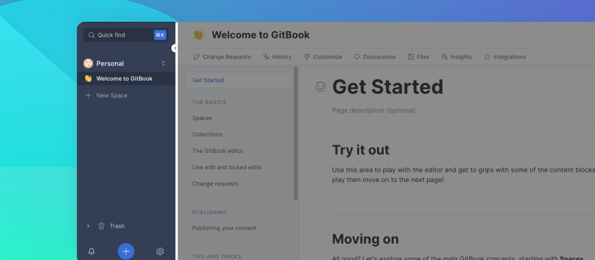
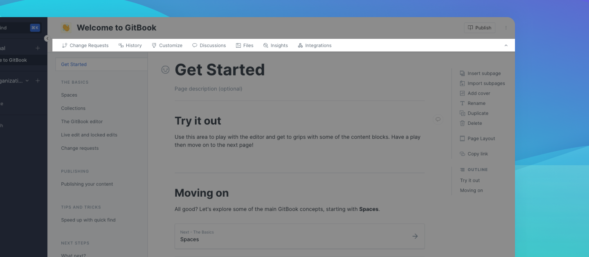
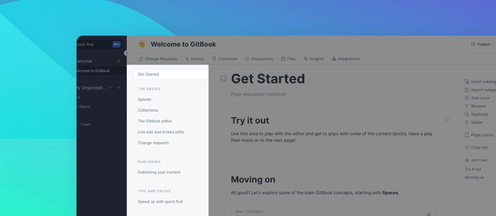
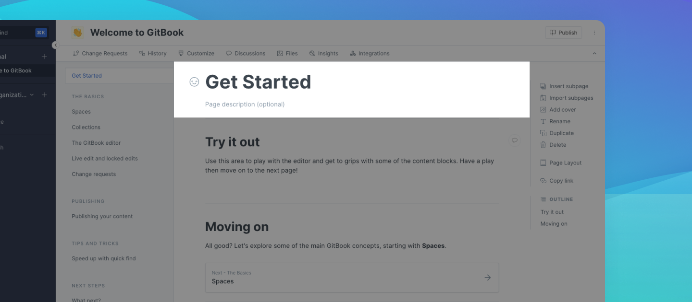
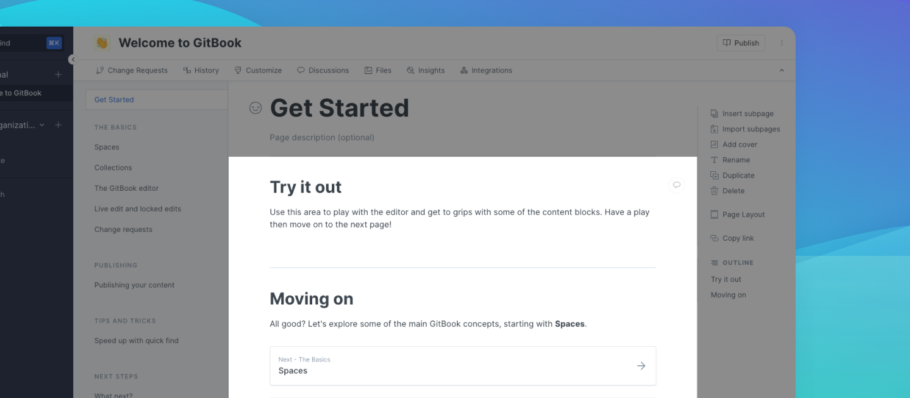
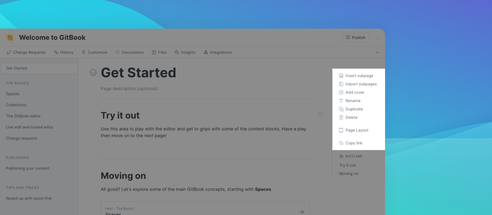
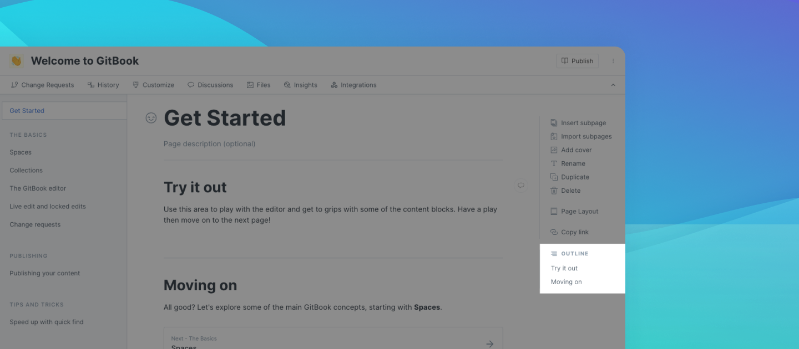

# GitBook app

This page walks you through various sections, features and menus that you'll find within the GitBook app. Start by creating or logging into your account at [app.gitbook.com](https://app.gitbook.com/).

## Sidebar

<figure><figcaption></figcaption></figure>

The sidebar is the dark blue (in light mode) or black (in dark mode) section on the left-hand side of the app.

You can use the arrow near the top to open and close the sidebar. Closing the sidebar might be helpful when you want more space to focus on the documentation you're writing.

The sidebar contains:

* **The** [**quick find**](../tour/multiple-space-search.md) **field**\
  Quick find helps you quickly navigate between your content, as well as performing common actions.
* **Your libraries**\
  Libraries contain collections and spaces. Use the switch organization toggle, found next to the name of the library, to move between libraries.
* **The** [**notifications bell**](../tour/notifications.md) **** \
  Located in the bottom-left corner of the sidebar, the notifications bell will let you know about actions that have been taken.
* **The add new button**\
  Located at the bottom in the center of the sidebar, you can use this to add a new organization or a new space.
* **The settings menu icon** \
  You'll find this menu icon in the bottom-right corner of the sidebar. Click to access personal and organization settings, switch between dark and light mode, get help from the support team, offer feedback, and sign out of the GitBook app.

## Space header

The space header is a narrow area at the very top of the GitBook app. It includes:

* **The **_**internal**_** space emoji**\
  You can choose from a large list of emojis to help you to more easily identify your space. This setting only affects what you see when logged into the GitBook app. (A public setting is located in the [space customization](../tour/customization/space-customization.md) options.)
* **The space name**\
  If you want to change the name of the space, simply click into this field and begin typing.
* **The visibility menu**\
  From here you can select a [visibility option](publishing/space-publishing.md) for your space and, once a space is published, access the link and custom domain settings for the space. The wording on the button itself states the current setting or, in the case of an unpublished space like the one in the screenshot above, says **Publish**.
* **The space actions menu**\
  The icon with three vertical dots in the very top-right corner opens up a number of actions for the space.

## Space sub-navigation

The space sub-navigation is another narrow area near the top of the GitBook app, immediately underneath the space header.

Similar to the sidebar, it has an up arrow on the right-hand side that you can click to hide this area. If you want to show it again afterwards, you'll find the down arrow to click on at the right-hand side of the space header.

The space sub-navigation includes links to:

* ****[**Change requests**](collaboration/change-requests.md)\
  From here you can create a new change request and review existing ones. There's a tab for each status: draft, in review, archived and merged.
* ****[**Version control**](../tour/activity-history.md)****\
  ****Clicking this opens up to provide details about both activity and change history for the space.
* ****[**Customize**](../tour/customization/space-customization.md)\
  These settings allow you to affect the look and feel of the space, as well as configure features.
* [**Discussions**](collaboration/comments-discussion.md)\
  You can have space-level conversations with other collaborators of organization-owned spaces here. You can use the feature in spaces that you own personally, too, but you'll have to provide both sides of the conversation!
* [**Files**](../tour/editor/blocks/insert-files....md)\
  Upload and manage files from this area.
* [**Insights**](../tour/insights.md)\
  Insights help you to understand how your public content is being viewed and searched.
* [**Integrations**](../advanced-guides/apps-and-integrations-platform/)\
  You can connect GitBook to some other collaboration tools.

## Table of contents

The table of contents is the list of **document pages, links, and groups** that make up a space. It's located to the right of the sidebar, and underneath the space sub-navigation.

* A **document page** is for content that lives within the space. You'll write that content within the GitBook app (or in a [Git repository](git-sync/), if you prefer). You can click on the name of any page to open it in the editor.
* A **link** looks a lot like any other page in the table of contents, but clicking on it opens whichever link you set. This is a good way to point your documentation readers to other websites, where that's relevant. You'll see a small icon on the right-hand side of the link, which indicates that it will open in a new tab.
* A **group** is a title for one or more pages and/or links. Groups enable you to organize your content into sections.

There are also some options available from the table of contents. Hover over any document page, link, or group for a second and you'll see an icon with three vertical dots appear on the right-hand side of the item. Click on this to reveal the menu.

The option to create a new document page, link or group can be found at the bottom of the table of contents. If [live edits](collaboration/live-edits.md) are enabled in your space, you'll see it right away. If live edits are disabled, then you will need to be working in a [change request](collaboration/change-requests.md) to be able to see this option.

## Page header

The page header is made up of:

1. An optional emoji for the page.
2. The page title, which will always match the page name in the table of contents.
3. An optional page description.

Depending on the width of your screen, you _might_ also see a menu icon with 3 vertical dots in the top-right corner of the page header section. You can expect to see this if your browser width is less than 1430 pixels wide. Clicking on this icon will reveal the [page actions](gitbook-app.md#page-actions) menu. In a wider browser window, you would see this menu in the right column, instead.

## Editor

The editor is where you create the content for your documentation. We offer lots of different content blocks — headings, lists, tables, images, code blocks, and more!

In addition, you can [embed content](../tour/editor/blocks/embed-a-url....md) from other places, and we support [markdown](../tour/editor/markdown.md) to help you create content even more quickly.

## Page actions

Page actions are located on the right-hand side of the editor. These actions will be available to you when you're in a space that has [live edits](collaboration/live-edits.md) enabled, or when you're working in a [change request](collaboration/change-requests.md).


If you can't see the right-hand column of the app, this may be because your browser window is less than 1430 pixels wide. You'll see an icon for the page actions menu in the [page header](gitbook-app.md#page-header), instead.


## Page outline

The page outline is located on the right-hand side of the editor, underneath page actions. When you have more than one on a page, every heading 1 and heading 2 content block title will be listed here, making it easier for you to jump up/down the page to the section you want to work on.


If you can't see the right-hand column of the app, this may be because your browser window is less than 1430 pixels wide. Your browser window will need to be at least 1430 pixels wide to see and use the page outline.

