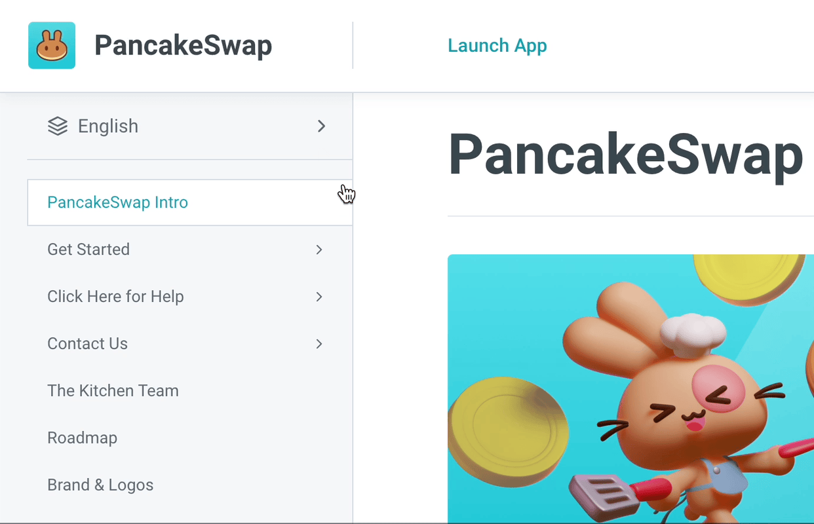
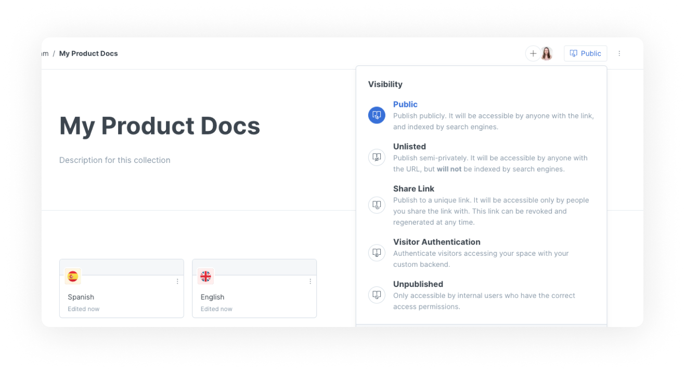
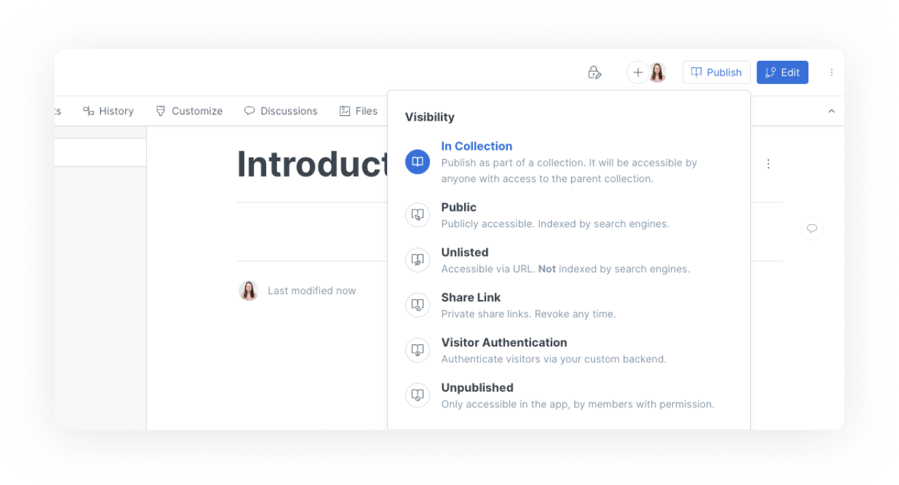

# Collection publishing

If you want to publish multiple versions of your documentation in one place, such as different languages or different versions of your product, you can use collection publishing. Keep reading to learn about how this works.


**Permissions**

Only creators and administrators can publish content.


## Why publish spaces (variants) in a collection?

When you set the [space visibility](space-publishing.md) of a space to **in collection** and publish the collection, you can wrap a number of spaces in a single published interface. We call this **publishing variants**.

When you publish a collection of variants, any child space that's published inside the collection will be quickly accessible through a dropdown in the sidebar of the published content, allowing readers to switch between variants at any time.

Variants are useful if you need to offer a grouped experience for spaces, such as documenting multiple versions of an API (v1, v2, v3, etc.) or having multiple translations of your content easily accessible.

<figure><figcaption>
Switching between variants in published documentation
</figcaption></figure>

Here's some examples of how GitBook users have published variants in collections:

* [Pancake Swap](https://docs.pancakeswap.finance/) use variants to publish their documentation in different languages
* [Forest Admin](https://docs.forestadmin.com/documentation/) use variants to publish different versions of their documentation in one place

## Spaces inside a published collection

When you publish a collection, you still need to decide which spaces should be published in that collection or not. This might be a little confusing at first, but it lets you maintain private spaces inside a published collection. Maybe you've got a collection full of useful spaces, but you're working on a completely new space to live alongside them. Rather than creating and editing that space somewhere else, you can keep it where it's supposed to live, and only publish it as part of the collection when you're ready.

To include spaces in a published collection, set the [space visibility](space-publishing.md) to **in collection** – this will include the space as part of the published collection.

## How to publish a collection of variants

We will use the example of publishing product documentation in multiple languages. The same logic applies to publishing other types of variants such as multiple versions of an API (v1, v2, v3, etc.).

### How to organise your spaces and collection&#x20;

You should create a collection to hold your spaces/variants. You can see in the screenshot below that we have a collection called My Product Docs. Inside the collection are 2 spaces: English and Spanish. As the names suggest, the English space contains our product documentation written in English, and the Spanish space contains the Spanish translation.

<figure><figcaption>
A collection with two variants
</figcaption></figure>

### How to publish the collection and spaces

#### Publish a collection

First we will publish the collection. This **does not publish the spaces inside the collection**. You need to publish each space individually.

Collection publishing works almost exactly the same as space publishing. Navigate to the the share button in the right hand corner, where you will be given a range of [visibility options](space-publishing.md#public-space) for the collection.&#x20;

<figure><figcaption>
Changing a collection's visibility
</figcaption></figure>

#### Publish spaces as variants inside a collection

For each space that you want to publish in the collection, navigate to the share button in the right hand corner and change the visibility to "In Collection".&#x20;

<figure><figcaption>
Publishing a space as a variant in a collection
</figcaption></figure>

### How to set the default space in a collection

The default space in a collection is the space that readers see first when they visit your published collection. To change the default space in a collection, navigate to the collection customization page by clicking the triple dot menu button in the top-right corner of the collection in the editor. Under General > Collection, choose the default space from the dropdown.

<figure><figcaption>
Change the default space in a published collection
</figcaption></figure>
