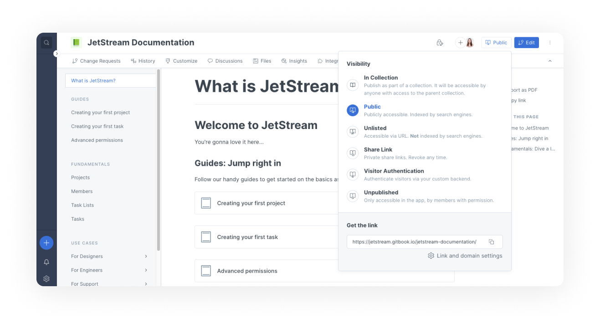

# Space publishing

## Publishing a space

<figure><figcaption>
Select an option from the visibility menu to publish a space
</figcaption></figure>

Spaces are set as unpublished by default. To publish a space, open up the visibility menu (which is located near the top-right corner of each space) and select one of the available options.

### In collection

If the space you are publishing is nested inside a collection, you'll see the option to publish the space as part of the collection. The actual visibility setting will depend on the setting that has been chosen for that collection.

### Public space

A public space is available to **anyone** on the internet. It will be indexed by search engines so that everyone can read it.

You still have control over who can edit your content, and you'll only ever be publishing your primary content branch, so all your change requests are still private!

### Unlisted space

Unlisted spaces are publicly available, but they won't be indexed by search engines such as Google. They will still be accessible to anyone who has links to your documentation.\
This setting allows you to easily share your content without it being searchable.


Unlisted spaces might not seem super useful at first glance, but they're great if you want to publish a beta of your docs, or do large-scale user-testing, without impacting your SEO with potentially duplicate content, etc.


### Share link

Publish to a unique link. It will be accessible only by people who have access to the link. This link can be revoked and regenerated at any time. While your _team members_ can be invited to a private space via an [**invite link**](../../tour/member-management/#invite-members-to-your-organization) which will add them to your org with the role you specify, a [**share link**](share-links.md) is _a secret link_ allowing non-team GitBook users (your customers or partners) to access your private content in read mode only.

**Learn more about share links** 🔗 :


[share-links.md](share-links.md)


### Visitor authentication

Authenticate visitors accessing your space with your custom backend. If your docs should be accessible to certain users only, and you have a mechanism to authenticate those users with your login system, you can use GitBook's [visitor authentication](../../advanced-guides/advanced-sharing-and-security/visitor-authentication.md) feature to make sure only the right people see your docs.

**Learn more about visitor authentication:**


[visitor-authentication.md](../../advanced-guides/advanced-sharing-and-security/visitor-authentication.md)


### Unpublished 

An unpublished space is a project that only you and the team members you invited to collaborate can access. That means it can only be read and edited by members of your organization. This is a more secure way to keep your content private to a specific group of people.


Unpublished spaces are only accessible in the GitBook app, by a logged-in, authorized user. Visiting an unpublished space will require you to be logged in and have the relevant permissions to access it.


### Changing your space visibility 

If you would like to change the visibility of your space, open the **visibility menu**. In unpublished spaces, you'll see a button labelled **publish** near the top-right corner, and for published spaces, this button will instead be labelled with the visibility option that has been selected. In any case, click this button to open the visibility menu.

### Accessing share links and custom domains

.png>)

After publishing content, open the visibility menu and click on **link and domain settings** to access your share links (if you've published with share link visibility) and [custom domain](../../advanced-guides/custom-domain/) settings.

Here, you can generate or revoke any share links, or connect a custom domain to your published content.
