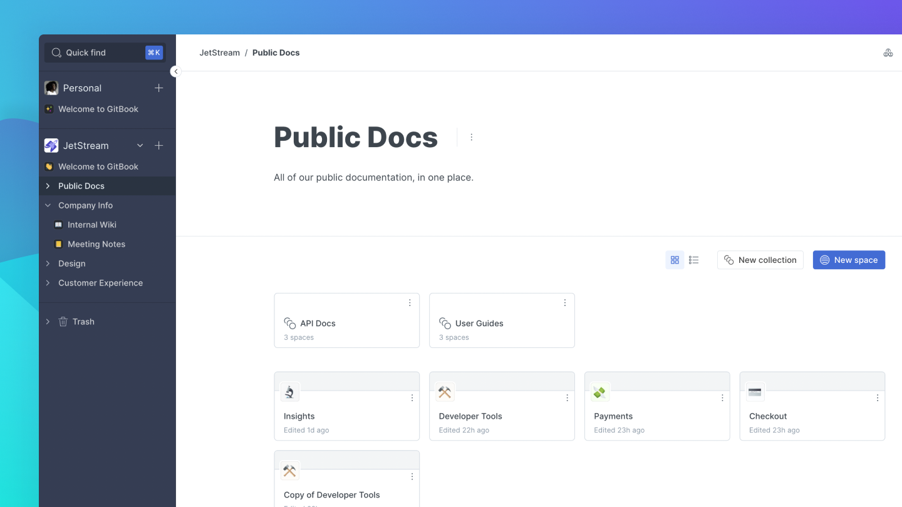

# Quick start

This page summarizes all the essentials you will need to know to start with GitBook. Here you can find all best practices and tips to set up your organizations, spaces, and content.

## Spaces

A space is a project where you can start organizing your ideas. Imagine it as a virtual book where you can start writing pages simultaneously.

**​** **Get to grips with spaces:**


[what-is-a-space.md](../spaces/what-is-a-space.md)



[space-publishing](../spaces/space-publishing/)



[space-customization.md](../spaces/space-customization.md)



[git-sync](../integrations/git-sync/)


## Collections

Collections are groups of spaces centered around a specific topics, teams or purposes. Collections aren't just for grouping, though! You can set permissions specific to a collection, overriding the organization-level defaults (read more about that in [permissions](../organizations/member-management/permissions-and-inheritance.md)) or customize and publish a collection as a group of spaces known as a **variant**.


[what-is-a-collection.md](../collections/what-is-a-collection.md)



[collection-customization.md](../collections/collection-customization.md)



[collection-publishing.md](../collections/collection-publishing.md)


## Structuring your spaces 

Once you created your space you can start writing.

### Table of Contents 

Your space's pages are listed in the table of contents to the left of your editor content. Here you can manage your space's structure by adding pages, nesting subpages inside of pages, and creating page groups to structurally and visually separate pages into logical groups.


**Good to know:** planning out your content structure in advance can be a great way to set your space up for success. Making good use of groups and the page -> subpage hierarchy can keep your content well structured throughout the writing process.


### Headings 

GitBook offers 3 levels of headings, which will help you structure your pages into blocks. These blocks are represented in the page outline to the right of your content and can be used to navigate through your pages.

## Editing your content 

Editing your content in GitBook comes in two flavours. Live edits, and change requests.

### Live, real-time edits

.png>)

Any new spaces you create in GitBook will default to having live edits unlocked. This means that anyone who has edit permissions or above can start editing the content immediately. Find out more about live edits:


[live-edits-and-real-time-collaboration.md](../editing-content/live-edits-and-real-time-collaboration.md)


### Change requests

Change requests let you keep a protected, primary branch of content, and manage any changes through change requests. Change requests are 'branches' of your space that can be submitted and merged. Anyone with edit permissions or higher on a space can submit a change request. Anyone with reviewer or higher permissions can merge one.


[change-requests.md](../editing-content/change-requests.md)


## Collaboration 

Start collaborating on GitBook by [inviting members](../organizations/member-management/) to your [organization](../organizations/what-is-an-organization.md).

### Invite members 

Once your organization has been created, you can start [inviting members](../organizations/member-management/). Define their roles by giving them [permissions](quick-start.md), create teams for different spaces and put someone in charge of the administrative policy.

### A note on roles

GitBook offers a range of [member roles](../organizations/member-management/roles.md) that govern what each member can or cannot do at a certain content level. Roles that are set when inviting are default roles, but these roles can be overridden or inherited at a collection or a space level.

### Group members into teams

[Teams](../organizations/member-management/teams.md) are a great way of grouping members within your organization. If you have a large number of members, it can help to add them to teams. Any member can be added to as many teams as you like, and teams can be used to set wider permissions for groups of people.

### **Discussion** 

Writing content is no longer a lonely experience. Members can provide valuable feedback and review each others' work. [Discussions](../spaces/comments-discussion.md) in GitBook can happen against a specific content block (or at a 'local' level) or in the context of a wider space or change request.

#### ​ Read more about GitBook's collaboration tools: 


[permissions-and-inheritance.md](../organizations/member-management/permissions-and-inheritance.md)



[member-management](../organizations/member-management/)



[activity-history.md](../spaces/activity-history.md)



[comments-discussion.md](../spaces/comments-discussion.md)


## Customize your content 

.png>)

Change fonts, colors and header themes to personalize your content.‌

#### Read more about customizing spaces and collections: 


[space-customization.md](../spaces/space-customization.md)



[collection-customization.md](../collections/collection-customization.md)

