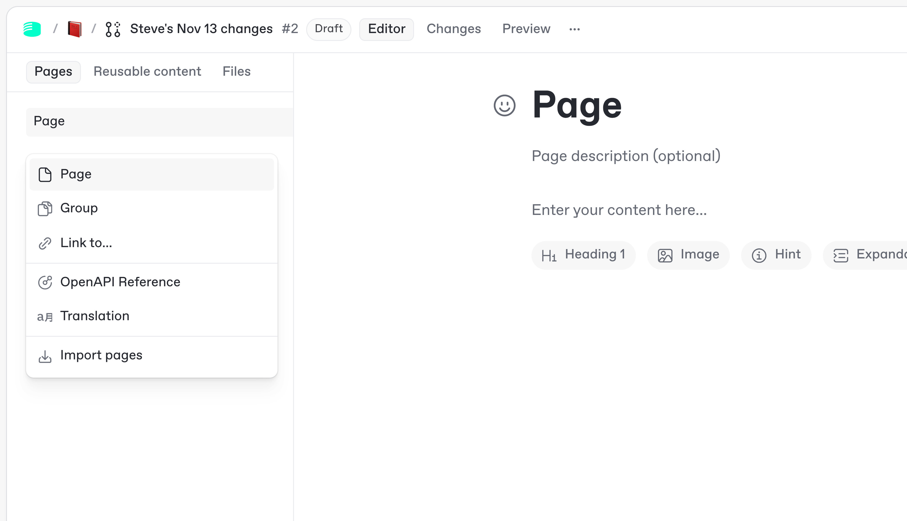
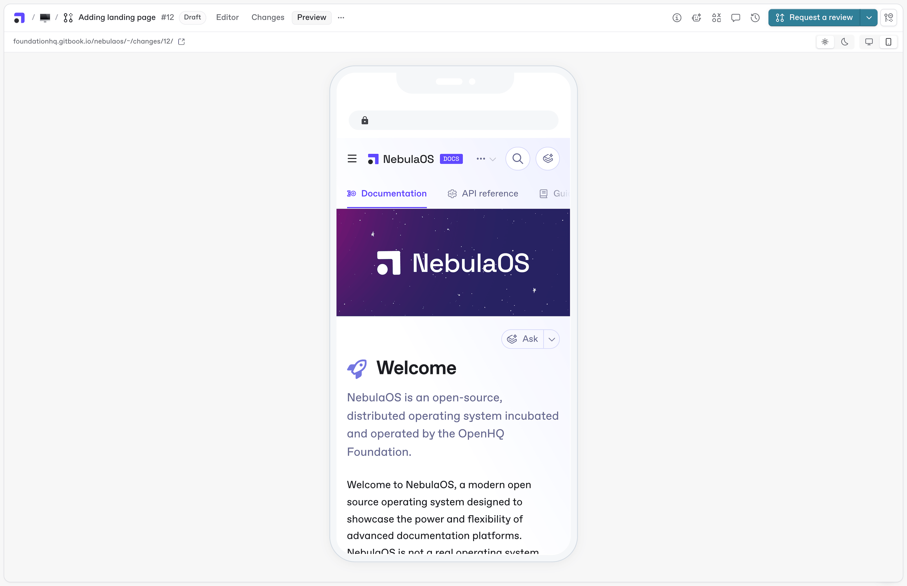

# Quickstart

This quickstart guide explains how to get set up in GitBook and publish your first docs site in minutes.

At the end of this guide, you’ll have a live documentation site, ready to expand and customize.



### Getting started

You’ll need to [create an account](https://app.gitbook.com/join) before you can get started with your first documentation site.

After creating your account, you’ll automatically see a new docs site that’s ready for you to edit and customize. Choose how you want to add content to your site before you publish from the on-screen options.


Your content isn’t published yet — so you can edit, customize and preview your docs site before making it live. Hit **Publish** to make it live immediately.&#x20;

<i class="fa-arrow-down">:arrow-down:</i> [Jump to the ‘Publishing’ section on this page](quickstart.md#publish-your-documentation)




### Edit your content

There are two ways to edit and update your content in GitBook — in our visual editor, or following a docs-as-code workflow. **You can choose one, or use a combination of both**.

Whichever workflow you prefer, you’ll edit your content using a **branch-based editing flow**. Find out more on [the Concepts page](concepts.md).&#x20;

<details>

<summary>Use the visual editor</summary>

GitBook’s what-you-see-is-what-you-get (WYSIWYG) editor lets you edit content visually, drag content blocks to reorganize them and see how your content will look as you work.

This visual editing workflow is ideal for users who don’t want to work in a code editor, or who have experience working with tools like Notion or Google Docs.

#### 1. Edit your docs in a change request

First, find your docs site in the sidebar and click the item below it. This takes you to the space where your content lives.

Click **Edit** in the top-right. This opens a change request where you can edit the content of the space.&#x20;

Click **Add new…** in the table of contents on the left-hand side to add a page, and give it a title.

<div data-with-frame="true"><figure><figcaption></figcaption></figure></div>

#### 2. Preview your changes

Along the top of the web app you’ll see tabs for **Editor**, **Changes** and **Preview**. These switch between different views for your content.

Click **Preview** to see a live preview of what your docs site will look like with all the changes in your change request, on both desktop and mobile.

<div data-with-frame="true"><figure><figcaption></figcaption></figure></div>

#### 3. Merge your changes

Once you’re happy with your changes, click the **Merge** button in the top-right corner.&#x20;

This will update the primary version of your content with all the edits from the change request. If the content is part of a live docs site, the site will be updated immediately.

</details>

<details>

<summary>Code-based editing</summary>

Sync your documentation with a GitHub or GitLab repository to enable code-based editing. Once synced, you can edit your docs in your existing developer environment.

This workflow is ideal for technical users who don’t want to switch tools and prefer to manage their documentation alongside other code.

#### 1. Set up Git Sync

If you haven’t already set up Git Sync when creating your site, first find your docs site in the sidebar and click the name of the content below it. This takes you to the space where your content lives.

Click the **Set up Git Sync** button in the top-right and follow the instructions to sync your space to your chosen Git repository.

Head to the [Git Sync pages](git-sync/) to find out more.

#### 2. Edit your docs from your developer environment

Once you’ve synced your space to your Git repository, you can update the content of your docs from that repository in your development environment.

Open the repository, create a pull request and make the changes you want.&#x20;


## Markdown editing

GitBook supports [Markdown editing](../creating-content/formatting/markdown.md), so you can create and format content using common syntax.&#x20;

Every standard block in GitBook can be written and formatted using Markdown syntax.


#### 3. Preview your changes

You can [preview your changes](git-sync/github-pull-request-preview.md) on your published docs site from the pull request in GitHub or GitLab.

In your pull request, you’ll see a status with a unique preview URL. Click **Details** on that status to open the preview URL and see how your site will look when the pull request is merged and your site is updated.

#### 4. Merge your changes

You’re good to go. Merge your pull request and your content will be updated both in the GitBook app and on your docs site, if it’s live.

In the GitBook app, every commit and your merged pull request will be synced to your space as updates in the version history.

<div data-with-frame="true"><figure><figcaption></figcaption></figure></div>

</details>



### Customize your docs

<details>

<summary>Organize your site navigation </summary>

You can add more content to your site — such as an API reference, a help center or a changelog — at any time. When you add content, you can organize your site’s navigation bar to help users easily find what they’re looking for.&#x20;

Head to [the Concepts page](concepts.md) to find out more about site navigation.

Head to [the Site structure page](../publishing-documentation/site-structure/) to find out more about adding content to your site.

<div data-with-frame="true"><figure><figcaption></figcaption></figure></div>

</details>

<details>

<summary>Customize the look and feel of your docs site</summary>

Your docs site will look great out of the box, but you can also customize many settings that change the look and feel of your published site.

You can customize your site’s [logo, colors and font](../publishing-documentation/customization/icons-colors-and-themes.md), add to your site navigation bar using [site sections](../publishing-documentation/site-structure/site-sections.md) and [variants](../publishing-documentation/site-structure/variants.md), update your [site’s visibility](../publishing-documentation/site-settings.md#audience) settings and much more.

<div data-with-frame="true"><figure><figcaption></figcaption></figure></div>

</details>



### Publish your documentation

<details>

<summary>Publish your docs</summary>

You can publish your site with a click at any time.

Open your site’s dashboard by clicking the site’s name in the sidebar. Then click **Publish** in the top-right corner to make it live.

Once your site is live, the dashboard will update with a link to the live site.

<div data-with-frame="true"><figure><figcaption></figcaption></figure></div>


Want to explore publishing in more detail? Check out [our complete guide to creating and publishing content in GitBook](https://app.gitbook.com/s/LBGJKQic7BQYBXmVSjy0/editing-and-publishing-documentation/complete-guide-to-publishing-docs-gitbook).


</details>

<details>

<summary>Add a custom domain</summary>

By default, you site will be published with a unique URL with this format:

```
https://[organization-name].gitbook.io/[site-title]
```

While this may be suitable for some teams, many choose to change their URL to [a custom domain](../publishing-documentation/custom-domain.md) or [a custom subdirectory](../publishing-documentation/setting-a-custom-subdirectory/).

To do this, open your site dashboard by clicking the site’s name in the sidebar, then open the **Settings** tab and choose **Domain and URL**.&#x20;

<figure><figcaption></figcaption></figure>

Use the buttons on the screen to choose the option you want, and follow the instructions to configure the DNS settings with your domain provider.


It can take up to 48 hours for your DNS changes to take effect — although they typically propagate much faster.


</details>



### Next steps

<table data-view="cards"><thead><tr><th></th><th></th><th></th><th data-hidden data-card-cover data-type="image">Cover image</th><th data-hidden data-card-target data-type="content-ref"></th><th data-hidden data-card-cover-dark data-type="image">Cover image (dark)</th></tr></thead><tbody><tr><td><h4><i class="fa-users-medical">:users-medical:</i></h4></td><td><strong>Invite your team to collaborate</strong></td><td>Add team members to your organization and set permissions</td><td><a href="../.gitbook/assets/10_12_25_invite_your_team_to_collaborate_1.png">10_12_25_invite_your_team_to_collaborate_1.png</a></td><td><a href="../account-management/member-management/invite-members-to-your-organization.md">invite-members-to-your-organization.md</a></td><td><a href="../.gitbook/assets/10_12_25_invite_your_team_to_collaborate.png">10_12_25_invite_your_team_to_collaborate.png</a></td></tr><tr><td><h4><i class="fa-eye-low-vision">:eye-low-vision:</i></h4></td><td><strong>Change site visibility</strong></td><td>Control who can see your content with share links and authenticated access</td><td><a href="../.gitbook/assets/10_12_25_change_site_visibility_1.png">10_12_25_change_site_visibility_1.png</a></td><td><a href="../publishing-documentation/publish-a-docs-site/#publish-a-docs-site">#publish-a-docs-site</a></td><td><a href="../.gitbook/assets/10_12_25_change_site_visibility.png">10_12_25_change_site_visibility.png</a></td></tr><tr><td><h4><i class="fa-language">:language:</i></h4></td><td><strong>Add auto-translations</strong></td><td>Create one-click translations that update automatically</td><td><a href="../.gitbook/assets/10_12_25_add_auto_translations_1.png">10_12_25_add_auto_translations_1.png</a></td><td><a href="../publishing-documentation/site-settings.md">site-settings.md</a></td><td><a href="../.gitbook/assets/10_12_25_add_auto_translations.png">10_12_25_add_auto_translations.png</a></td></tr><tr><td><h4><i class="fa-puzzle-piece">:puzzle-piece:</i></h4></td><td><strong>Install integrations</strong></td><td>Integrate with your stack and extend functionality with powerful integrations</td><td><a href="../.gitbook/assets/10_12_25_install_integrations_1.png">10_12_25_install_integrations_1.png</a></td><td><a href="/broken/pages/b29aoPwtKZKkAO7zajgr">Broken link</a></td><td><a href="../.gitbook/assets/10_12_25_install_integrations.png">10_12_25_install_integrations.png</a></td></tr><tr><td><h4><i class="fa-brackets-curly">:brackets-curly:</i></h4></td><td><strong>Add an API reference</strong></td><td>Create auto-updating, interactive API reference docs from an API spec</td><td><a href="../.gitbook/assets/10_12_25_add_an_api_reference_1.png">10_12_25_add_an_api_reference_1.png</a></td><td><a href="/broken/pages/EAZLjjyX6jX76NFnj71P">Broken link</a></td><td><a href="../.gitbook/assets/10_12_25_add_an_api_reference.png">10_12_25_add_an_api_reference.png</a></td></tr><tr><td><h4><i class="fa-chart-line-up">:chart-line-up:</i></h4></td><td><strong>Track docs analytics</strong></td><td>Use the built-in insights to measure success and understand user behavior</td><td><a href="../.gitbook/assets/10_12_25_track_docs_analytics_1.png">10_12_25_track_docs_analytics_1.png</a></td><td><a href="../publishing-documentation/insights.md">insights.md</a></td><td><a href="../.gitbook/assets/10_12_25_track_docs_analytics.png">10_12_25_track_docs_analytics.png</a></td></tr></tbody></table>

### FAQs

<details>

<summary>What is GitBook?</summary>

GitBook is a collaborative, AI-native documentation platform where teams can create, review, and publish branded docs as websites. Docs sites hosted on GitBook can offer a built-in AI Assistant and connect to other AI tools via MCP.

You can edit content using the advanced visual editor using Markdown, sync your docs with a Git repository for a docs as code workflow — or use a combination of the two. However your team chooses to use GitBook, you’ll use a Git-like branching workflow with a full version history, which protects your primary content while encouraging collaboration and feedback across your entire team.

</details>

<details>

<summary>How do you publish documentation with GitBook?</summary>

Publishing in GitBook is a simple process once your content is ready to go live:

1. Create a new docs site (or open an existing one) and choose the content you want to publish.
2. Choose your site audience. You can publish to everyone with the **public** setting, or limit the audience with **share links** or **authenticated access**.
3. (Optional) Customize the branding, domain, and theme using the built-in options.
4. Click **Publish**. Congrats — your docs are live! You can add more spaces later as site sections or variants.

To find out more, check out [our Quickstart guide](quickstart.md#getting-started) above, or read [the complete guide to creating and publishing documentation in GitBook](https://app.gitbook.com/s/LBGJKQic7BQYBXmVSjy0/editing-and-publishing-documentation/complete-guide-to-publishing-docs-gitbook).

</details>

<details>

<summary>Is GitBook open source?</summary>

GitBook itself is not open source. However, GitBook’s published docs platform — which is used to host and display documentation on a docs site — is open source. You can [visit the repository](https://github.com/GitbookIO/gitbook) to see the code and submit changes for review.

While GitBook itself isn’t open source, **open source projects can publish documentation on GitBook for free**. Teams can sign up for [the Community plan](../account-management/plans/community/) and publish content using [a Sponsored site plan](../account-management/plans/community/sponsored-site-plan.md), both of which are free to qualifying teams.

</details>

<details>

<summary>What’s the difference between a site and a space in GitBook?</summary>

In GitBook, a **docs site** is your overall documentation hub, hosting all content accessible to your audience and featuring customizable options like theme and domain.&#x20;

Each site contains one or more **spaces**, which serve as individual sections within the site, organizing related content for better modularity and ease of management. Spaces let you focus your collaboration on specific topics, and you can combine multiple spaces on a single site to build structure or enable options like translations (for localized documentation) or multi-product support.

</details>

<details>

<summary>What are the differences between GitBook’s visual editor and Git Sync?</summary>

GitBook offers two main methods for editing documentation — the visual editor and Git Sync. The **visual editor** is an advanced, block-based editor that allows you to create and modify content directly within GitBook using a traditional user interface that includes Markdown support. It's ideal for those who prefer a more intuitive, hands-on editing experience without directly dealing with code.

**Git Sync** integrates your documentation workflow with a Git repository, enabling a ‘docs as code’ approach. This option is ideal for developers and teams who prefer managing documentation alongside their codebase, using familiar Git commands and workflows.

Your team can choose one of these workflows, or use a combination of them both. And whichever method they prefer, editing follows a consistent, Git-like branching workflow with a full version history and content review process. This doesn’t just promote collaboration and quality across your docs — it also safeguards primary content from accidental edits.

</details>
