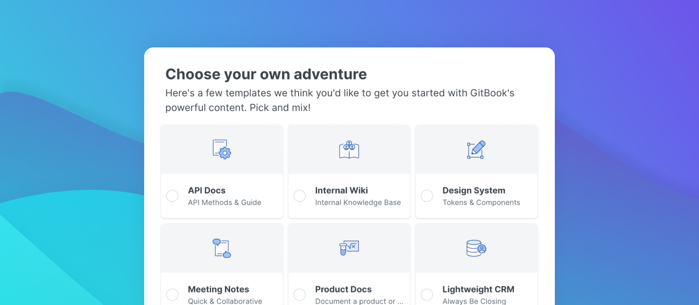

# Start exploring

Do you think GitBook is the right fit for you and your needs? Let's go through some tips to start your onboarding.

## ​**Create an account and start exploring GitBook** 

GitBook is full of possibilities. To start exploring[, **sign up**](https://app.gitbook.com/join) and choose who you'll be using GitBook with. We'll use this plan to get you started on the right trial or plan for you.

We'll create a space in your Personal library straight away, it's a good place to fiddle with the editor without worrying about breaking 'real' content.

## Create an organization 

GitBook is best with friends. Create an organization, then [invite some members](../collaboration/team-management/#invite-new-members) to start experiencing all the possibilities of GitBook like [realtime collaborative editing](../editing-content/editing-pages/live-edits-and-real-time-collaboration.md#real-time-collaboration) (beta), [comments](../collaboration/comments.md), [activities](../collaboration/activity.md), and [collaborative change requests](../editing-content/editing-pages/change-requests.md).

If you've selected one of the trial plans during sign up, you'll be prompted to create an organization straight away, if you've already created a personal account and want to create an org to see what all the fuss is about, hit the big blue '+' button in the sidebar and select 'Create organization'.

### Select a plan

You might be prompted to select a plan for your organization. If you're not sure whether you should select Business or Community, give the community plan docs a read and see if you qualify. Alternatively, you can always start your business trial as normal and contact us manually later to convert to a community plan if you feel you qualify.


<mark style="color:blue;">**Good to know:**</mark> Our community plan is currently in beta and is being split test, some folks won't see the option to create a community organization and will instead jump straight to…


### Creating your organization

Give your organization a name, upload a logo, set your use case and choose whether or not to enable email domain SSO (you can always enable or disable this later) and you're good to go!

### Starter templates

Once you've created your organization, you'll be prompted to select any starter content you want to add. These are simple templates designed to get you up-and-running quickly without staring at a blank space wondering what to do with your life.


<mark style="color:blue;">**Good to know:**</mark> You'll have access to all these templates any time you create an empty space, so don't worry if you're not ready to check them out just yet – add a space and you'll have these right at your fingertips!


### Bring your team

You'll be prompted to invite members, too. You can either generate invite links, or add members' emails directly – up to you! If you add members directly, they'll receive an email invite and can join the organization straight away. If you generate invite links, you can send them directly however you like and your collaborators will be guided through the account creation process and dropped off in your shiny new org.

#### **For more information on member management:**


[team-management](../collaboration/team-management/)


## **You've been invited to join a project?** 

If you were given an invite link to join someone's organization, you can start collaborating with the team you've just been invited to.


<mark style="color:orange;">**Check it!**</mark> Make sure you are signed in with the correct account before joining the organization! If you use multiple GitBook accounts, you can sign out and sign back in to the invited account to accept the invitation.


## **Import your content** 

You can start testing GitBook by [importing content](../features/import.md) from other solutions like websites or files that are Markdown (.md or .markdown), HTML (.html), Microsoft Word (.docx), or .zip.‌

**Get more information the import feature:**


[import.md](../features/import.md)


## **​Synchronize a Git repository** 

You can also start testing GitBook by synchronizing a GitHub or GitLab repository to one of your spaces.‌

#### Get more information on the Git Sync feature: 


[git-sync](../integrations/git-sync/)

