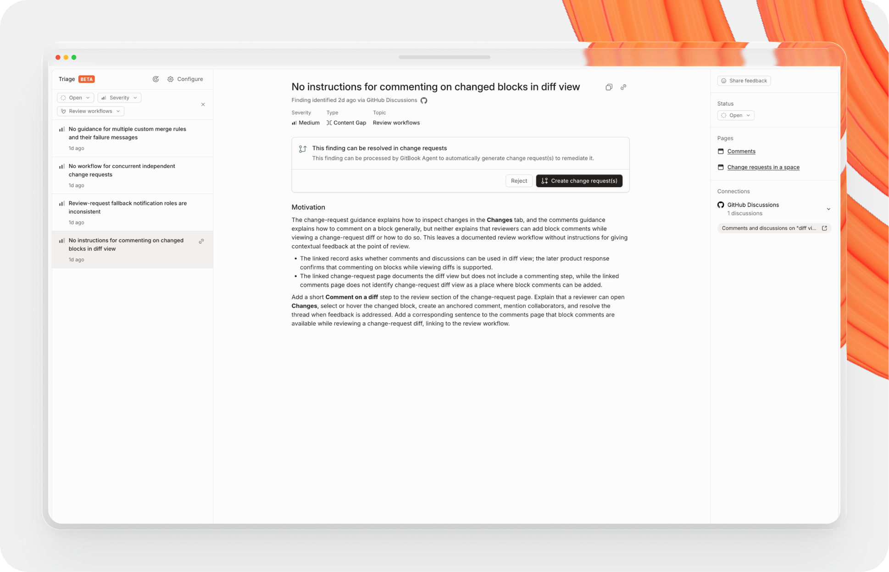

# Automatic docs improvements


**This feature is currently in early access.**

We’re slowly rolling out access. Stay tuned for more progress on the features below.


GitBook Agent can identify issues in your documentation — such as content gaps, outdated pages, and incorrect information — and suggest and implement improvements.

## What can GitBook Agent detect?

* **Content gaps** occur when GitBook sees users asking questions about your product that the docs struggle to answer, such as:
  * a customer asking a question to your support team that they couldn’t find on the docs.
  * an API endpoint missing complete documentation.
* **Outdated content** is detected when the content on your page has been superseded by content found in an external source, such as:
  * an SDK update that changed the signature of a function.
  * a paid feature that moved to the free tier, where the docs haven’t been updated.
* **Incorrect content** is flagged when the content on the docs site is explicitly wrong, such as:
  * a guide pointing to APIs that do not exist anymore, or where the feature has been sunsetted.
  * external sources such as your marketing website disagreeing with the documentation.

## How identification works



#### Connect sources

GitBook Agent works best when it’s connected to external sources like your support ticketing system, public forums, or marketing website. Some sources require an additional API key or authentication before setup is complete. [Learn more about our connections.](../ai-and-search/connections/)



#### GitBook Agent generates findings

GitBook regularly reviews your sources and generates findings based on the results. GitBook collects these findings for your team to review. [Learn more about how we ingest data.](../ai-and-search/connections/)



#### Review your findings

Review your findings to start fixing issues. Each finding includes a summary of the issue, the topic it belongs to, supporting evidence, and links to the pages GitBook used as context.



#### Fix or archive

Some findings can be fixed automatically by GitBook Agent. When that option is available, you can create [change requests](../collaboration/change-requests/) directly from the finding. You can also archive findings you don’t want to keep in your active list.



To request access to GitBook Agent’s automatic documentation improvement features, open your site’s **Settings**.

<figure><figcaption></figcaption></figure>

## Automatic fixes

When a finding supports automatic fixes, GitBook shows a **Create change request** action so the GitBook Agent can generate a proposed fix for your team to review. To skip the suggestion, archive the finding instead. GitBook won’t re-open findings that you’ve archived.
