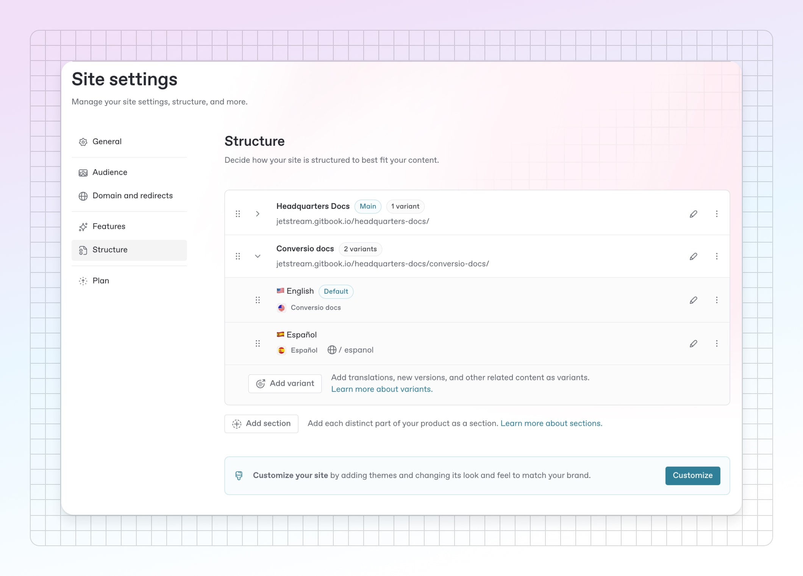
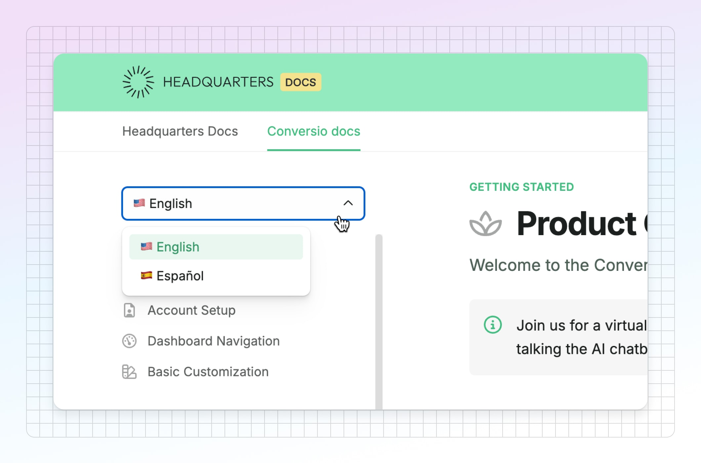

# Localize your docs with variants in GitBook


#### GitBook now supports built-in translations through the UI

Head to [Translations](https://app.gitbook.com/s/NkEGS7hzeqa35sMXQZ4X/gitbook-agent/translations) to learn more about setting up AI translated content for your docs site.


This guide will walk you through the process of setting up variants, organizing your content, and ensuring your readers can access the right version of your documentation, in the language they want.

First, you need to create your content and localize it to the various languages you need — and there are a few ways to do it. You can translate part of your content using [GitBook AI](https://app.gitbook.com/s/NkEGS7hzeqa35sMXQZ4X/create-content/searching-your-content/gitbook-ai), or other AI services such as [DeepL](https://www.deepl.com/en/translator), ChatGPT or Claude.


N**ote:** You will need to create a [space](https://app.gitbook.com/s/NkEGS7hzeqa35sMXQZ4X/create-content/content-structure/space) for each translated version of your docs in GitBook. You can then link all your translated spaces to a single docs site.


### Organizing your localizations

Each localized version of your documentation will need to be in its own dedicated space. There’s no single right way to create your localized content, and how you do it will depend on the localization process you choose.&#x20;

However, here’s a quick idea of how the process could look in GitBook:



### Duplicate your space

Find the space in GitBook that contains the documentation you want to localize. Hover over it in the sidebar and open the **Actions menu** <picture><source srcset="../.gitbook/assets/actions - dark.svg" media="(prefers-color-scheme: dark)"></picture>, then choose **Duplicate**. This will create a copy of your space with all of its content, formatting and files included.



### Name your space well

Make sure you give your space a clear name that’s easy to find and understand — ideally refrencing the name of your primary content and the language you’ve localized for. It’ll make it easier to manage your published spaces later.


**Tip:** You might consider adding a flag as the space emoji to make it easy to identify and reorganized your spaces at a glance.




### Translate the content

Use whichever process you like to translate the content of your space. Be careful about translating code, menu commands and other parts of your docs that may need to remain in your primary language in order to remain useable and correct.

Any formatting (such as cards and tables) will remain as they are in your primary content, so all you should need to worry about is the text itself.



### Follow the process again

If you have multiple site sections on a single site and want to translate them all, you’ll need to follow the process again for each space that’s published as a site section.

You can also follow the steps again to create more localizaions in other languages.



### Set up your localized docs site

Once you have created all the spaces you need and localized your content, it’s time to set up your docs site in GitBook.&#x20;

If you have an existing site and are just adding new translations, you can head to your site’s dashboard, click **Settings** > **Structure**, and start reading at Step 4.



### Create a site

Click on the **Docs sites** option in your sidebar and choose **New Site**, then follow the set-up process.



### Go to your site’s settings

Once you’ve completed the site creation process, click on **Settings** in the top right-hand corner of your site’s dashboard, then choose the **Structure** tab on the left-hand side.



### Add your documentation space

Your newly-created site will be empty, with no linked content. To add your documentation, click **Link and existing space** and choose the primary space you want to publish.

This will be the default space when people visit your docs, so make sure to select the space in your primary language.



### Add your variants

Click the arrow next to your chosen space to expand it, then click the **Add variant** button. You can scroll or search through all your spaces — select the space that contains a translated version of your docs to add it as a variant.

Repeat this process for each of the languages you wish to publish. You can reorder your spaces at any time by clicking and dragging the **drag handle** <picture><source srcset="../.gitbook/assets/options - dark.svg" media="(prefers-color-scheme: dark)"></picture> on the left-hand side of a variant, and set a default by clicking the **Actions menu** <picture><source srcset="../.gitbook/assets/actions - dark.svg" media="(prefers-color-scheme: dark)"></picture> on the right-hand side of the variant.



### Rename your variants

Now click the **Edit variant** <picture><source srcset="../.gitbook/assets/edit - dark.svg" media="(prefers-color-scheme: dark)"></picture> button. In the Edit menu you can rename your variant — and this name is what will appear in the drop-down menu on your site when users select a language.&#x20;


**Tip:** We recommend naming each variant with the language its in, so users can see a list of all the available at a glance. You might also want to rename your default content in the same way.


The structure will look something like this:

<figure><figcaption>
Site settings structure with multiple variants.
</figcaption></figure>



### Publish your site

Now it’s time to get your docs online! Go back to your site main page and hit **Publish** to push it live.

You can then visit your published site to take a look at your work. You should see a dropdown menu on your site that lets users select the language they want to read your docs in, like this:

<figure><figcaption>
Different localized variants on a published site.
</figcaption></figure>


