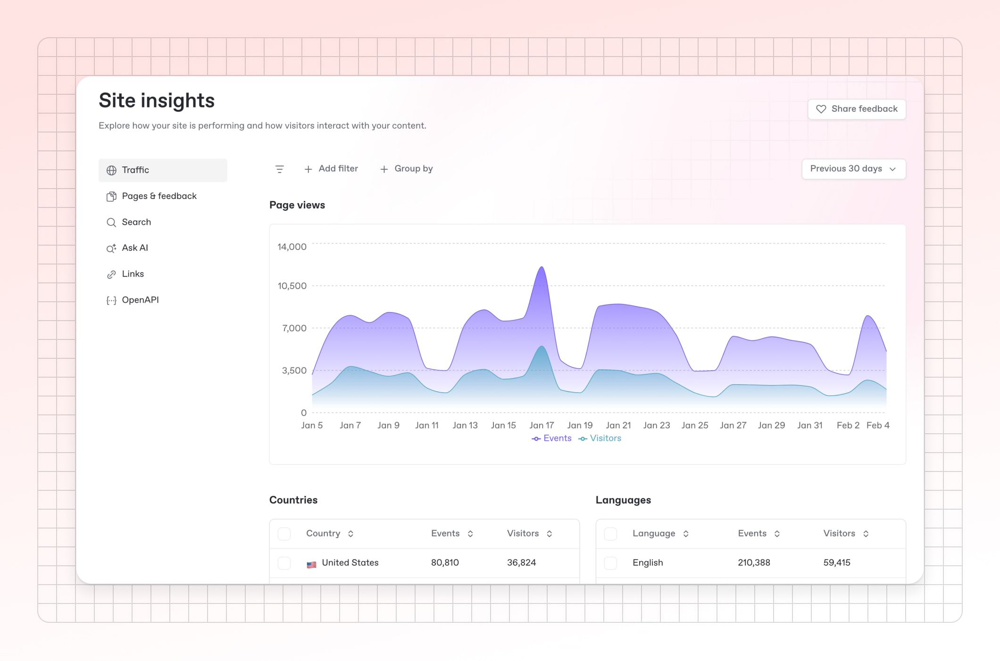
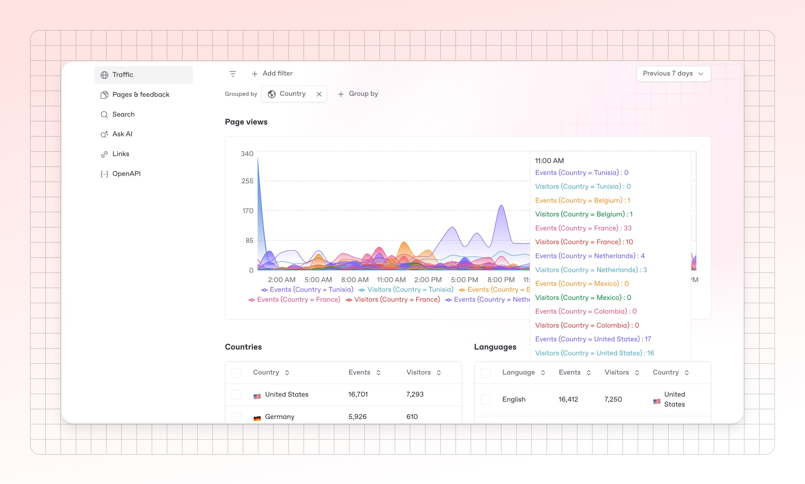

# Documentation analytics: which metrics to track and how to measure success

“How do you know if your documentation is successful?”

When we ask documentation teams this question, we often hear responses like “That's a good question…” or “We're still figuring that out.”&#x20;

And if you’re reading this, maybe you’re in the same boat.

Unlike sales or marketing teams, with their clear-cut metrics, documentation can be tricky to measure. Many teams create great content but have no real way to know if it's actually helping users or making an impact on the business.

The truth is, without some form of measurement, you're essentially working in the dark — writing content based on what you think users need rather than what they actually use. And when budget discussions come around, it can be difficult to demonstrate the value of all that work.

But just like the rest of the user experience, there are ways we can measure the impact and value of documentation. Some impacts are easy to track and others might take a little more creativity.

Let’s start by looking at the quick wins of documentation metrics.

### Documentation analytics: quick wins

Let's start with the basics. Before diving into advanced analysis, focus on answering two fundamental questions:

* Are people reading my docs?
* Do people find my docs useful?

If you don't know the answers to these questions, you're essentially writing in a vacuum. The documentation you’ve created might be missing something that your readers really need.

The good news is that you can start to answer these questions with tools that are either free or built into your documentation platform. But before you dive in, it’s worth taking a moment to think about how these different numbers fit together.&#x20;

For example, page view data for a single page isn’t a useful metric in isolation. Is the page popular because it covers something your users need to read during onboarding, or is it because the UX is so badly implemented that users keep returning to figure out how something works? High traffic might indicate valuable content — or a confusing feature that requires multiple consultations.

So, part of this process is working out how to combine these numbers to tell a richer story. We’ll get into that below.

#### Page views

Page views might be a bit of a blunt instrument, but they are a great starting point. Not only are they tracked automatically by just about every tool you might use to host your docs, but they represent real-world user demand.

The trick is in how you interpret this data. Start with the basics:

* Page popularity: The relative popularity of individual documents and sections can tell you quite a lot about how well your documentation is structured, if your navigation works, and your users’ priorities.
* Content gaps: Comparing page views across your documentation can show you where there’s something missing from your docs. For example, if you have a hugely popular feature but the documentation gets no traffic then that might be because that feature is so easy to use that no one needs the docs. Alternatively, it might be because your docs aren’t easy to find or don’t provide the right answers.

With the basics covered, you can use page views to dive deeper:

* Hidden friction points: Consistently high traffic to troubleshooting pages might point to a particular topic where users struggle with your product.
* The vocabulary gap: Pages with unexpected traffic patterns can highlight mismatches between your terminology and how users actually search for help. For example, if you use the term 'asynchronous operations,' but the 'background tasks' pages get most traffic then perhaps your audience prefers the 'background tasks' phrasing.
* Changes over time: By comparing page view trends, you can see how user behavior changes. You'll need to do some extra work, though. So, if you spot that a previously popular FAQ page now gets little to no traffic, you'll need to look into why. Maybe the link to the FAQs was taken off the dashboard, or perhaps a new guide covered the main questions that used to send people to the FAQs.

If you do nothing else, keeping an eye on page views can give you an idea of how your users are interacting with your docs.

#### Dwell time

You might also want to consider how long people spend on individual pages.&#x20;

Very short dwell times could suggest that there’s a mismatch between what people expect from the page and what they actually find there. Or it could just mean that the page answers their questions very efficiently.&#x20;

Either way, dwell time is more of a question (“why are people spending a long time or a short time on this page?”) rather than an answer by itself.

#### Internal link clicks

Are people following the pathways you've created through your documentation? Tracking which internal links get clicked helps you understand if your docs are guiding users through the learning journey as intended. Low click-through rates might indicate disconnected content or navigation that doesn't match users' mental models.

#### Search terms

What are people looking for when they use your documentation search? This might be the most valuable quick-win metric available. Search terms reveal:

* Topics you haven't covered but should
* Topics that exist but are hard to find
* The actual language your users use (which might differ from your product terminology)

This is also a good one to combine with page views and, in particular, the vocabulary gap problem. Tracking search terms will give you a sense of how people think and speak about your product.&#x20;

When you notice users consistently searching with terms that don't match your documentation's language, consider updating your content to include these terms or creating links in your search system to bridge the gap.

#### Direct feedback

Simple thumbs up/down buttons on each page provide immediate user feedback with minimal friction. Many docs platforms, including GitBook, offer this functionality out of the box. While it won't tell you specifically what's wrong with a page, it quickly identifies content that needs attention.

Platforms like GitBook also let users leave written feedback on individual pages. That way, you can see both the broad-brush “thumb-up/thumbs-down” data along with qualitative information about what works and what doesn't.

### How to collect analytics data from your documentation

Collecting this data doesn’t have to be hard or expensive. Free and open source tools can help and so can your documentation platform.

If you’re using GitBook, that’s a great place to start. GitBook gathers data on page views, feedback ratings, search terms, AI queries, and more. This data is available directly in the GitBook app, where you can filter results to dig deeper. And when you’re ready, you can download the data for further analysis.

<figure><figcaption></figcaption></figure>

If you want to complement GitBook's analytics or you're hosting your docs elsewhere, consider asking your marketing colleagues for their analytics advice. They typically have experience tracking similar metrics and may give you access to additional tools that can help give you more insights.

For example, Google Analytics (comprehensive but a bit of a monster to set up and understand), Plausible (privacy focused and easy to use), or PostHog (focused more on product metrics but can still help understand docs usage).

### Measuring effectiveness: are your docs actually helping users?

Once you've got the basics sorted, the next step is making sure your documentation is actually solving user problems. Are people finding the answers they need? And are they finding them as quickly and clearly as possible?

Metrics like page visits and dwell time give some indication, but relying on them alone is like counting how many people enter a restaurant without knowing if they enjoyed their meal or left hungry. You can see they came in, but you have no idea if they were satisfied with what they found.

So, how do you go beyond surface-level engagement and measure whether your documentation is truly effective?

#### Task completion&#x20;

Documentation’s job is to help people get things done. But how can you make a link between documentation stats and people’s success? You’ll need to combine several types of data gathering and then do some analysis. Sure, it will take some effort but the payoff is a clear view of your documentation’s strengths and weaknesses.

Here are some of the techniques you can use:

* Session duration analysis: This takes dwell time to the next stage. Work out the average time to complete a tutorial and then check whether the time people spend on tutorial pages matches up. Too short might mean the tutorial is too hard to even start; too long could indicate it’s not explaining something well. You won’t know without the rest of the data-gathering steps.
* Multi-page completion: For step-by-step guides spanning multiple pages, track how many users make it from page one to the final page.
* Completion indicators: Consider adding optional "Did you complete this task?" buttons at the end of tutorials.
* User testing: Find developers who match your target personas and observe them working through your guides. Do they complete the tasks without getting stuck? Match what you observe with other data such as session duration analysis.

#### Support ticket analysis

Your product’s support tickets and other support interactions give you a raw feed of exactly where people are having trouble and that makes them a great source of inspiration for what documentation is missing. In particular, you should look at:

* Topic clustering: Group support tickets by topic to identify where your documentation might be falling short.
* Documentation referrals: Track how often support agents link to specific documentation pages. You might find that there are ways to improve the documentation more generally to prevent the support request or you might be able to feed back useful input to your product colleagues.

#### Support ticket deflection rate

While support ticket analysis can be a good source of inspiration for where to improve and add to your documentation, it’s also an indicator of how well your documentation performs.

As you make changes to your documentation, you should track whether there is any impact on support requests. And if there isn’t, you might want to consider why.

Start out by gathering data to show the link between your docs and support:

* Pre/post-publishing comparisons: After publishing new or improved documentation on a specific topic, measure whether related support tickets decrease.
* Ticket to docs view ratio: The raw numbers probably won’t mean much here but the trend over time could be one indicator of how well your documentation does its job. If the ratio of documentation views compared to support tickets increases, then that could show that your documentation is doing a better job of helping people. Of course, there might be other factors involved but all of these data points are useful when viewed in the broader context of your product and the other data you’re gathering.

#### User journey analysis

Documentation is just one part of how people interact with your product. If you can get a picture of the broader journey people take then you’ll be better prepared to know what brings people to your documentation and what they’re looking for.

Combine your analytics, observing real people using the product, and walking through the product yourself to get a better understanding of:

* Entry points: Where are users coming from when they land on your docs? Is it your product’s UI, search engines, support referrals, or somewhere else?
* Next actions: After consulting documentation, do users return to the product, contact support, or leave entirely?
* Documentation as part of onboarding: For new users, track whether those who engage with documentation in their first days show higher activation and retention rates.

### Creating a system for measuring your docs

You've now got a range of metrics to track, from basic page views to more sophisticated effectiveness measures. But sporadic measurement can only get you so far. To do this properly you need to create a system that collects data and then helps you take the right action.&#x20;

To be clear, such a system doesn’t have to be complex. It could be as simple as a reminder in your calendar once a month to run some checks and then a set of written processes that help you take the right action depending on what you find.&#x20;

#### Who are you measuring for?

As we’ve seen, different metrics play different roles. But they’re also best consumed by different audiences.

Many teams think in terms of two different types of metrics depending on the audience:

* Internal tracking metrics: Some metrics help you and your colleagues better understand the performance of your documentation but they might not be interesting or useful to other people. For example, the number of failed searches will help you identify content gaps but is too detailed to report to your CTO or CPO.
* Reporting metrics: Other metrics show the performance of your documentation, you, and your team. These are all about telling a story that connects documentation performance to the goals your company has. So, here we’re talking about reduced support costs, improved user retention, and faster onboarding. These metrics tell the story of how documentation impacts the bottom line.

#### Set meaningful targets

Once you know your audience, connect each metric to a specific goal. Your metrics should serve both business objectives and help you improve the user experience by guiding what to document and when.

For each metric, establish realistic targets that drive the improvements you’ve identified.

1. Determine your baseline: You can't set targets without knowing where you stand. Draw a line in the sand by gathering your current state for each of the metrics you care about. This isn’t just about static numbers, though. You’ll need to understand the current trend, so take snapshots over a meaningful period of time.
2. Set incremental goals: Progress is better than perfection. If your documentation currently has a 65% positive feedback rate, aim for 70% in the next quarter rather than an unrealistic 95%.
3. Define measurement frequency: Some metrics need weekly monitoring (like search failure rates), while others make more sense quarterly (like support ticket deflection trends). This depends in part on who the audience is and how those metrics will be used.
4. Document your methodology: Make sure everyone understands how each metric is calculated, ensuring consistency when team members change.

#### Create consistent review cycles

Once you’ve established that baseline and you know what measurement frequency makes sense for each number, you need to establish a cycle.

As we touched on earlier, the real value often comes in seeing the trend. That means the rhythm of your reviews can matter as much as what you're measuring.

Based on the frequencies you chose in the previous step, set up a review cycle that takes into account the work required versus how you’ll use those metrics:

* Weekly check-ins: Quick reviews of basic metrics to spot any sudden changes that might need attention.
* Monthly deep dives: Look at trends, investigate anomalies, and connect metrics to recent documentation changes. This is where you ask "why" when you see shifts in user behavior.
* Quarterly strategic reviews: Zoom out to see how documentation metrics align with broader business goals and product changes. Use this time to reassess your metrics and adjust as needed.

Of course, the broader rhythms of your company will affect your own cycles. Aligning with sales quarters, the financial year, and internal reviews will help you better demonstrate documentation’s value.

#### Set up accountability loops

It’s important to formalise how you take action based on what the metrics tell you. As you get used to the type of information you’ll learn in each review cycle, you should create lightweight processes that make sure the issues you find are fixed and the data that puts you in a good light gets reported.

So, for each metric create:

* Create triggers: At what point does a metric require you to take action? If the number of search failures doubles from one review cycle to the next, is that the point at which you investigate? Or is a 10% increase enough?
* Develop a response plan: What should happen and who should be involved?
* How will you stop it happening again? If you uncover a problem, can you change your processes or better collaborate with other teams in order to prevent it occurring in future?

#### Build a dashboard — even if it’s simple

Finally, create a simple dashboard that puts your key metrics in one place. This doesn't have to be fancy. Even a shared spreadsheet that is updated regularly can work. The important thing is making your metrics visible, accessible, and centrally tracked.

Whether it’s in Google Sheets or a custom tool you’ve built, set out to:

* Display trends over time rather than just current numbers.
* Include both quantitative metrics and qualitative insights.
* Reflect your review cycles, so you have reminders of what to do and when.
* Track who is responsible for what.
* Highlight progress toward your goals.
* Focus on the metrics that actually drive decisions.

But be careful not to let the dashboard become too much of a project in its own right, though. It can be fun to build shiny tools but if it ends up taking more work than the value it delivers then it might be time to switch to a simple Google Sheet with a few formulas.

### Documentation metrics don’t have to be hard

Providing documentation without measuring its impact is a bit like writing in the dark. You might be creating great content, but without data to back that up, it's hard to know for sure or to prove your value to the rest of the organization.

The good news is that covering the basics is relatively easy. Even simple metrics like page views, search terms, and direct feedback can give you useful insights into how your docs are performing. And if you go deeper, the time you invest will almost certainly be repaid in the form of better user experiences and greater recognition of your team's work.

If you want to get solid foundational metrics for your documentation without a lot of setup, one way is to use a documentation platform that includes analytics built-in.&#x20;

<figure><figcaption></figcaption></figure>

At GitBook, we've integrated metrics directly into our documentation platform, giving you both a high-level overview and the ability to dive into the details whenever needed. Which means you can stay focused on creating great documentation while staying informed by:

* Traffic analytics: Track page views across countries, languages, and browsers to understand your content's reach and popularity.
* Page feedback: See ratings and comments from users to identify what's working and what needs improvement.
* Broken URL detection: Identify and fix dead links from external sources to maintain seamless user experiences.
* Search insights: Discover what users are looking for to optimize content and improve findability.
* AI query analysis: Learn what your users ask GitBook AI to uncover documentation gaps and frequently asked questions.
* Link tracking: Understand how users interact with external resources in your documentation.
* OpenAPI usage: Monitor how developers engage with your API documentation to enhance the developer experience.

Plus, GitBook helps you make sense of all that data with:

* Built-in analytics dashboard: Access all metrics in one place with no third-party tools required.
* CSV export functionality: Download all your metrics data for custom reporting and deeper analysis.
* Site section analytics: Track performance across different documentation sections to understand usage patterns.
* Global search tracking: See how users navigate across multiple documentation sites in your organization.

With GitBook, you get the insights and the tooling to serve your documentation readers in the best way possible. As well as documentation metrics, GitBook lets you collaborate in real-time with your colleagues, give your users AI-driven conversational interface so your users can get precisely the answers they need, and offers integrations with all your favourite tooling.

[→ Get started for free today](https://app.gitbook.com/join)

 
