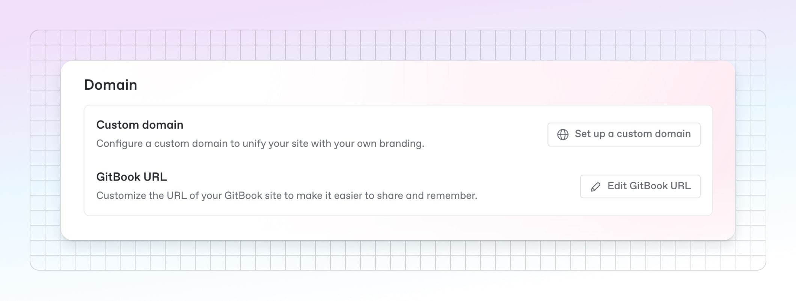
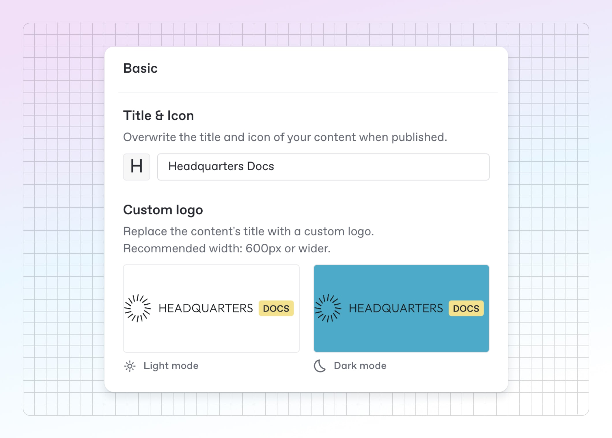
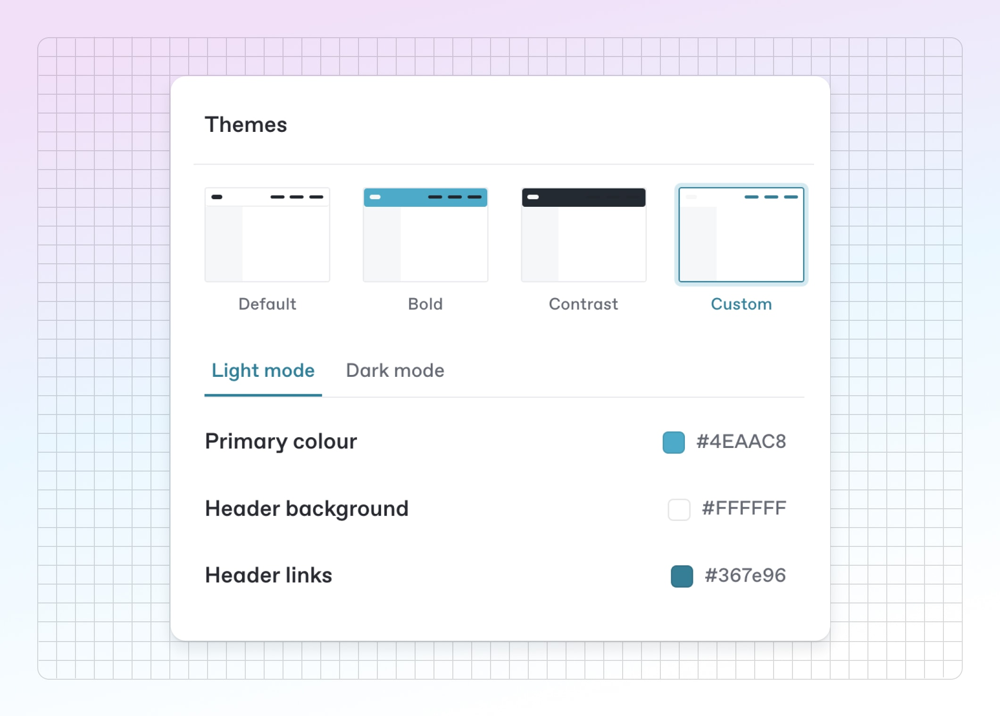
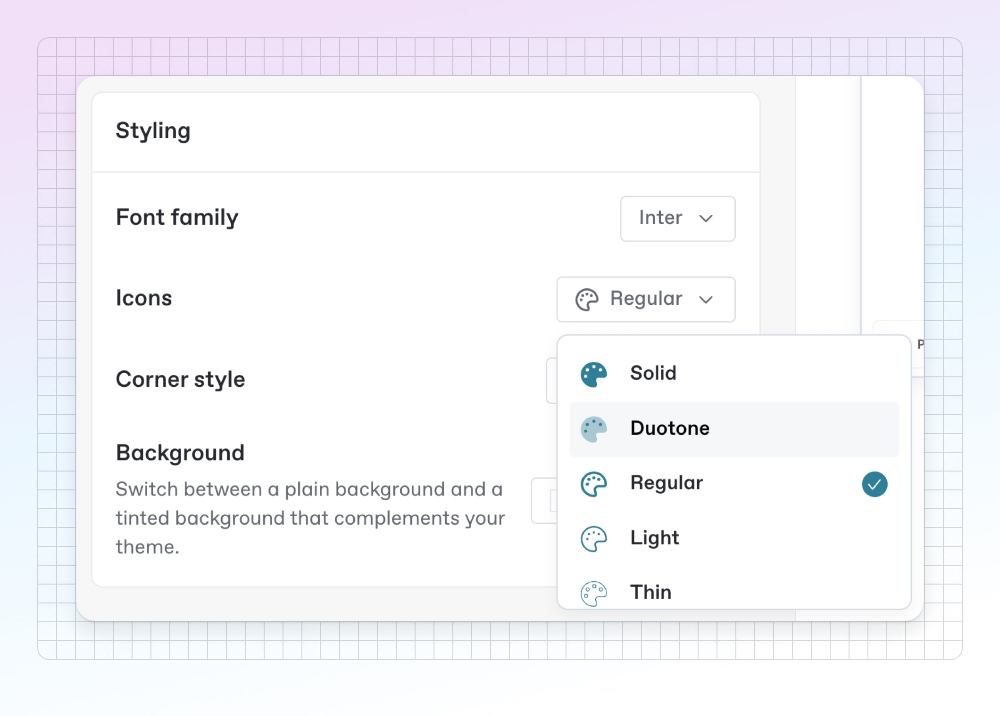
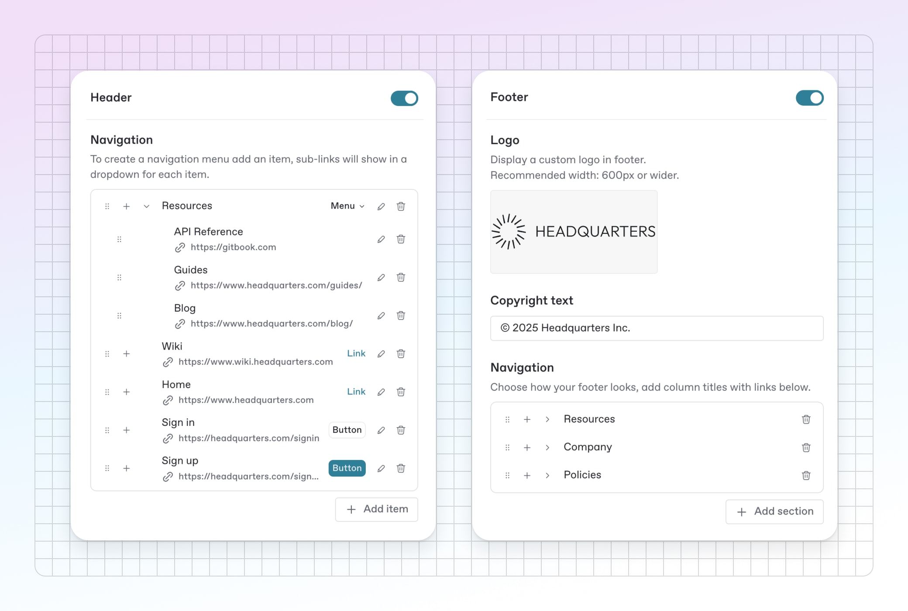

# How to create branded documentation

Adding your brand’s identity to documentation is a great way to make your docs site feel like part of your product. And GitBook has plenty of tools to help you do just that.&#x20;

Here’s how to utilize a few of them to build a docs site that looks great and fits with your brand.

<figure><figcaption>
Creating customized docs that match your brand is easy with GitBook.
</figcaption></figure>

### Set a custom domain for your docs

You can [add a custom domain to your site](https://app.gitbook.com/s/NkEGS7hzeqa35sMXQZ4X/publish/custom-domain) to make it part of your brand property online.&#x20;



### Open site settings

Navigate to your docs site in GitBook, then click **Settings** in the top-right corner.



### Add a custom domain

Choose the **Domain and redirects** tab. Here, you’ll see an option to **set up a custom domain**. Click it and it'll start the process.

<figure><figcaption>
Set up a custom domain.
</figcaption></figure>



### Follow the setup process

The menu will guide you through the setup process — if you need help, [our documentation](https://app.gitbook.com/s/NkEGS7hzeqa35sMXQZ4X/publish/custom-domain) will walk you through the entire process.



### Customize logo, colors, links and more

Set up your documentation to match your brand by [customizing](how-to-create-branded-documentation.md#customize-logo-colors-links-and-more) colors, uploading a logo, adding links to your site and much more. Here are a few options to try:

#### Add a custom logo

You can add your company logo to your site — it will sit in the top-left of your site, replacing the site title and icon.

To do this, head to your site dashboard and click **Customization** in the top bar. In the **General** tab you’ll see the option to add a custom logo — click the image preview to upload an image for light mode and dark mode.

<figure><figcaption>
You can add custom logos for both light and dark mode, so your docs look great however they’re viewed.
</figcaption></figure>

#### Set a theme and choose colors

Under the same customization panel, scroll down to the **Themes** section. Here, you’ll find settings for changing your site’s colors to match your brand:

<figure><figcaption>
You can set a theme and choose color options from the <strong>Themes</strong> section — including the Custom theme, which offers more control.
</figcaption></figure>

The first three options let you set a primary color only. Select the **Custom** theme and you’ll also be able to set specific colors for **Header links** and **Header background**, giving you extra control.

Make sure to check your dark mode colors here too, so you can be sure you docs look great in either mode.

#### Change your font and icon style

We have a number of font options you can choose from under the **Styling** section of the **General** tab. Choose from the drop-down.&#x20;

In your GitBook space, you can also [add an icon to each page](https://app.gitbook.com/s/NkEGS7hzeqa35sMXQZ4X/create-content/content-structure/page#add-an-icon-or-emoji-to-your-page) of your documentation, to add some visual flair and signpost to your readers what you page is about. In your site’s **Customization** menu, you can then tweak the icons’ style using the **Icons** menu. You can make them solid, duotone and more — the choice is yours!

<figure><figcaption>
Change your font and icon styles in the <strong>Styling</strong> section.
</figcaption></figure>

#### Add header links and a footer

Want to add some links to other places — such as your product, a sign-up page or an external source? In the **Layout** tab you can add [header links and buttons](https://app.gitbook.com/s/NkEGS7hzeqa35sMXQZ4X/manage-your-site/customization#layout-manage-navigation-options-for-your-content) that will appear at the top of your page, and a footer with a logo, copyright notice and other links, such as a to terms of service page.

You can nest header links if you want to create a drop-down menu in your header, or assign primary and secondary button styling if you want a link to be more prominent.

<figure><figcaption>
In the Layout tab, you can add links and buttons to your header, and create a footer with your company logo, copyright information, and links.
</figcaption></figure>

***

[**→ Get started with GitBook for free**](https://app.gitbook.com/join)

[**→ Read more about customization in our docs**](https://app.gitbook.com/s/NkEGS7hzeqa35sMXQZ4X/manage-your-site/customization)

[**→ The complete guide to publishing documentation in GitBook**](../editing-and-publishing-documentation/complete-guide-to-publishing-docs-gitbook.md)
