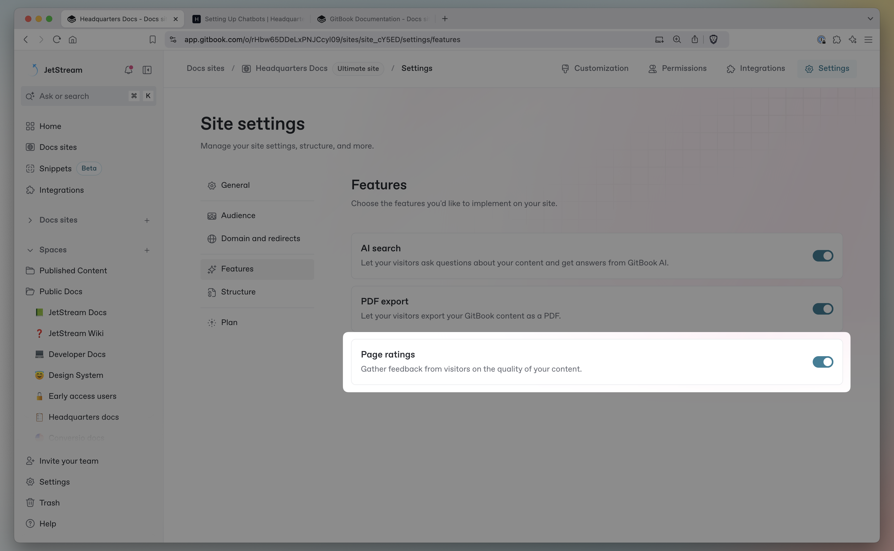
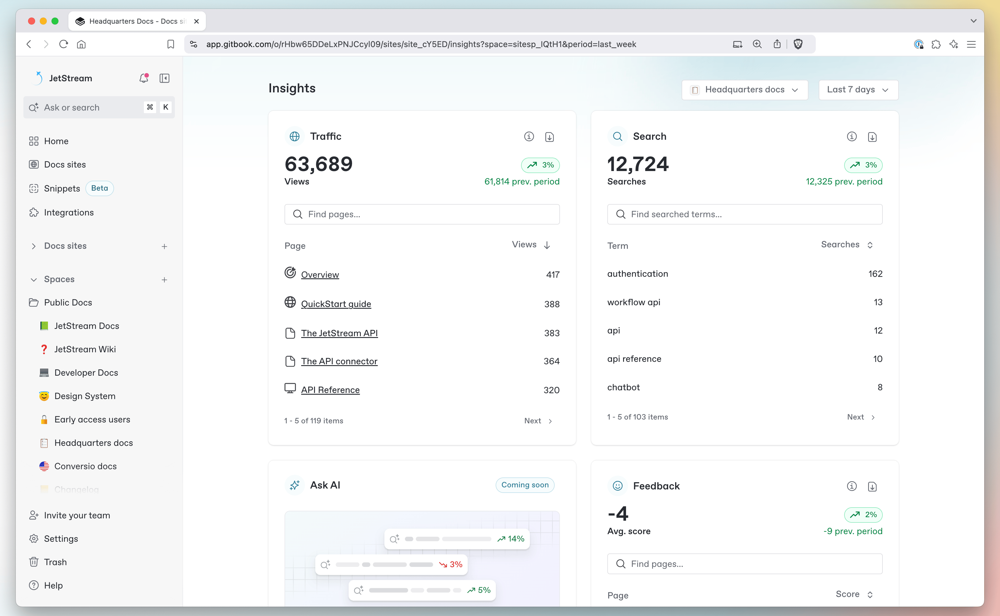

# 7 ways to make your public documentation more useful for users

Documentation is only useful if it’s up to date and people can find it. And when it comes specifically to public user documentation, this is even more essential. Missing or hidden information will frustrate your users, pushing them to contact your support channels or — even worse — complain on social media.

Worst of all, public docs aren’t easy. Getting them right is tough — but GitBook can help.

When you create your documentation with GitBook, readers can tell you how useful they’ve found a page using the page rating system. And with [our built-in Insights panel](https://app.gitbook.com/s/NkEGS7hzeqa35sMXQZ4X/analytics/insights), you can quickly see the most and least popular pages in any published docs site.

But once you’ve identified your problematic pages, how can you improve that user score? Read on to get our top tips on upgrading your content and increasing user satisfaction.

### How to measure success in your docs 

While the advice below should help improve your content in general, it’s a good idea to pinpoint the pages that need attention before you get started. So first, let’s [switch on page ratings](https://app.gitbook.com/s/NkEGS7hzeqa35sMXQZ4X/manage-your-site/site-settings#page-ratings-pro-and-enterprise-plans) for your docs site.

To do this, head to your docs site and open **Site settings**. Then open the **Features** tab and enable the **Page ratings** option.

<figure><figcaption>
You can enable page ratings for your docs site by opening <strong>Site settings</strong>, selecting the <strong>Features</strong> tab, and toggling the setting on.
</figcaption></figure>

Once it’s enabled, users will be able to rate the published page good, neutral or bad by scrolling to the bottom. You can see the results of these votes by opening your docs site’s dashboard and scrolling down to [the **Insights** section](https://app.gitbook.com/s/NkEGS7hzeqa35sMXQZ4X/analytics/insights) to view the **Feedback** section.

[Head to our documentation](https://app.gitbook.com/s/NkEGS7hzeqa35sMXQZ4X/analytics/insights) to read more about insights and page ratings.

### 7 tips for improving your product documentation 

#### 1. Consider your content structure 

Well-organized content is easier to find, read and understand. So here are some quick tips to help improve your page organization:

* **Break up long pages** – Pages with a ton of information are harder to scan, and make it tough for people to find the information they need. Instead, consider splitting information up into multiple pages, each with a dedicated focus. You can use [relative links](https://app.gitbook.com/s/NkEGS7hzeqa35sMXQZ4X/create-content/formatting/inline#relative-links) to refer between them, if needed.
* **Use subpages for related content** – Subpages are great when you want to nest information inside another overarching page.
* **Put pages into groups** – Once you’ve broken longer pages up into smaller pages and subpages, you can use page groups to collect them together and give them a title.
* **Use H1 and H2 headings** – Break up content on your page by adding a H1 or H2 headings. These will appear in [the page outline](https://app.gitbook.com/s/NkEGS7hzeqa35sMXQZ4X/reference/gitbook-ui#page-outline) on the right of the screen, so users can click a title to jump straight to the information they want. You can also use H1, H2 and H3 titles as [anchor links](https://app.gitbook.com/s/NkEGS7hzeqa35sMXQZ4X/create-content/blocks/heading#anchor-links) to direct people to a specific section on your page.

#### 2. Edit and re-edit your text 

[Studies have shown](https://www.ncbi.nlm.nih.gov/pmc/articles/PMC9955962/) that short sentences are easier to read and understand. And removing unnecessary details helps keep your writing focused. So revisit your content with a strong focus on your goals — and cut unnecessary information. Be ruthless, and do whatever you can to make your pages simple and pertinent.

Once you’ve done that, read it all back through and add important information that was missing in the first place. You could insert code blocks, diagrams, or any other elements that might aid understanding. But do it all with that same level of focus in mind — so even the new content you add is applicable and useful.

#### 3. Add interactive content 

Making your content more engaging can also help users — and improve their perception of your documentation.

GitBook supports all kinds of dynamic elements in its block-based editor. So you can embed [interactive OpenAPI blocks](https://app.gitbook.com/s/NkEGS7hzeqa35sMXQZ4X/create-content/openapi) that let your users run tests right in your docs, as well as videos, drawings and more. You can even embed [integration](https://www.gitbook.com/integrations#explore-integrations) blocks right into the page, such as [an interactive Node.js notebook](https://www.gitbook.com/integrations/runkit), or [a clickable walkthrough demo](https://www.gitbook.com/integrations/supademo) to show off a specific flow.

{% embed url="https://files.gitbook.com/v0/b/gitbook-x-prod.appspot.com/o/spaces%2FLBGJKQic7BQYBXmVSjy0%2Fuploads%2Faa5EolLuD5sAiWLCl9fR%2Fapi-test-it.mp4?alt=media&token=3a87fcb9-b79c-4f40-b917-67fb07920d41?autoplay=1&_loop=1" %}
OpenAPI blocks in GitBook show users all the information they need — plus, they can test out endpoints without leaving your docs.


GitBook comes with a bunch of integrations built-in. And you can easily [add more](https://www.gitbook.com/integrations) — or even [build your own](/broken/spaces/2SyQSbIa1iYS7z6Dx5di/pages/NOEnejpO7KQZo2RcdYWI), if you have something specific in mind.

#### 4. Use successful pages as inspiration 

The **Insights** panel does more than showing pages that need attention. They can also show you the pages your readers ranked highest. Take a look at those pages, analyze their layout and content, and try to work out what makes them work so well for your users. This may give you a valuable insight into what’s missing in your less-popular pages.

#### 5. Analyze search queries 

You can also see popular search queries in the **Insights** section of your site’s dashboard. Select the space you want from the drop-down in the top-right, then check the **Search** card to see popular searches — and how many results they had. You can also download the data as a CSV to get more detail.

<figure><figcaption>
In the Insights area you can view the most popular searches in your space, and how many results each one returned.
</figcaption></figure>

You can use these search terms to understand what your users are looking for the most, or check a specific keyword using the bar at the top of the card. If a popular keyword doesn’t have much relevant content in your docs, add references to it in relevant places. And make sure you answer the kinds of questions people may ask about it.

#### 6. Talk to the support team to get more details 

Your support team know better than anyone what your users are struggling with — they hear about it every day! Speak to them about the most common questions they get. Then use that information to update your documentation and address those pain points.

This might highlight pages that need extra work. Maybe you just need to add or update an FAQs section that can address common queries. Either way, the insight is super valuable.

And if you’re both the documentation writer and the support team? Use the information you get from users to constantly tweak and improve your docs — then let them know you’ve done it. Maybe they’ll give the page a positive rating!

#### 7. Set up deeper analytics 

This one is by no means essential, but can offer you a lot more information about your pages and how they perform, from traffic to bounce rate and more. You can use [a GitBook integration](https://www.gitbook.com/integrations#explore-integrations) such as Google Analytics or Heap to connect an analytics platform to your docs in seconds.

***

[**→ Read the insights documentation**](https://app.gitbook.com/s/NkEGS7hzeqa35sMXQZ4X/analytics/insights)

[**→ Get more technical writing tips**](quick-tips-to-improve-your-technical-writing-workflow-in-gitbook.md)

[**→ Sign up to GitBook**](https://app.gitbook.com/join)
