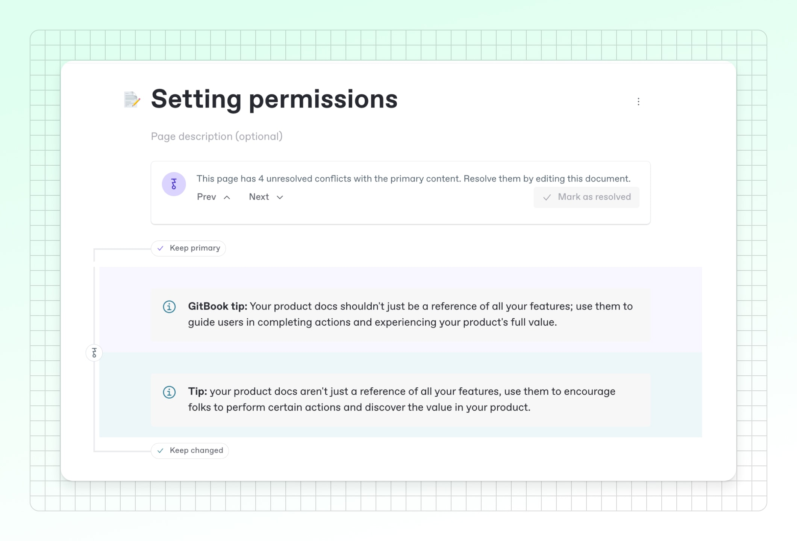
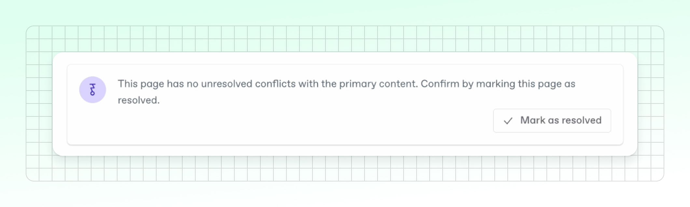

# How to handle merge conflicts in GitBook

Merge conflicts in GitBook occur when changes in a [change request](https://app.gitbook.com/s/NkEGS7hzeqa35sMXQZ4X/collaborate/change-requests) conflict with primary content. Here’s how to resolve them to maintain the best version of your documentation:



### Understand the conflic

Conflicts can happen when a merge introduces incompatible changes, such as when you edit a content block that has been changed, or you remove files that GitBook is trying to update.&#x20;

For example, if someone else on your team opens a change request at the same time you do, edits a few blocks and merges it, this will update the primary content. Your branch will be outdated, and you’ll be prompted to update your change request to bring in their changes.&#x20;

However, if you’ve edited the same blocks as your teammate, you’ll need to decide which version you want to keep, and GitBook will flag it as a conflict.

<figure><figcaption>
If you try to update or merge a change request with conflicts, you’ll see a prompt and can follow the flow to resolve them.
</figcaption></figure>



### Review and resolve conflicts

If there’s a conflict in your change request, you’ll see a notification when you try to merge. GitBook will show how many conflicts there are, and guide you through reviewing the two versions:

* <mark style="color:purple;">**Primary (Purple)**</mark> – The content currently in your GitBook space.
* <mark style="color:green;">**Changed (Green)**</mark> – The changes proposed in this change request.

You can use the **Keep primary** or **Keep changed** buttons to decide which version to keep.

<figure><figcaption>
GitBook will show you both the primary and the changed version of each block, so you can compare the two and choose which one to keep.
</figcaption></figure>



### **Mark as resolved and merge**

Once you’ve resolved all the conflicts in your change request, you can hit **Mark as resolved** to confirm that you’ve updated all the issues. You can then merge your change request as normal by hitting the **Merge** button in the top-right corner of the screen.

<figure><figcaption>
Once you’ve solved all of your merge conflicts, mark the whole page as resolved to finish the process. Now your content is ready to merge!
</figcaption></figure>


