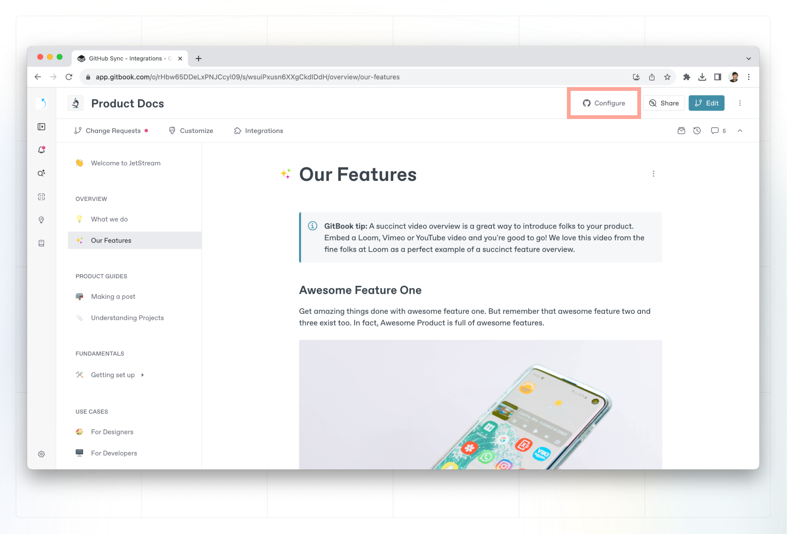

# Enabling GitHub Sync


The GitHub app that powers our GitHub integration is currently not available to customers on GitHub Enterprise Server instances.


### 1. Get started

In the space you want to sync with your GitHub repo, head to the space menu in the top right, and select **Configure**. From the provider list, select **GitHub Sync**.

<figure><figcaption>
Configure GitHub Sync.
</figcaption></figure>

### 2. Authenticate with GitHub

If you’re setting up GitHub Sync for the first time and haven’t already linked a GitHub account, you’ll be prompted to do that when you begin configuring Git Sync. If you’ve already linked your account, you might still need to authenticate via GitHub.


If you see a **'Potential duplicated accounts'** error message at this step, this means your GitHub account is already linked with another GitBook user account.&#x20;

To help you identify which accounts are linked, you will have to log out from this session and log in using the sign-in with GitHub method. If you already know your GitBook account associated with GitHub you can log into that user account and unlink your GitHub account (done in settings) before logging back in and linking your current account.\
\
Read more on our [troubleshooting page](troubleshooting.md#potential-duplicated-accounts-when-signing-in).


### 3. Install the GitBook app to your GitHub account

<figure><figcaption>
Install the GitHub app to your repository.
</figcaption></figure>

If you’ve not already done so, you’ll see a prompt to add the [GitBook app](https://github.com/apps/gitbook-com) to your GitHub account. Follow the instructions in the GitHub popover and either give GitBook specific repository permissions, or allow access to all repositories, depending on your needs.

### 4. Select a repository and branch

Select the account and repository you want to keep in sync with your GitBook content.


**Can’t see your repository?** If you can't find your repository in the list, make sure that you've installed the [GitBook GitHub app](https://github.com/apps/gitbook-com) in the right scope (i.e. your personal account or the GitHub org where the repository lives). You should also check that you’ve configured the correct repository access in the GitBook GitHub app.


Once you’ve selected the correct repository, choose which branch you want commits to be pushed to and synced from.

### 5. Perform an initial sync

When syncing for the first time, you’ll have the option to sync in one of two directions:

1. Git<mark style="color:red;">**Book**</mark> -> Git**Hub** will sync your space’s content **to** the selected branch. This is great if you’re starting from an empty repository and want to get your GitBook content in quickly.
2. Git**Hub** -> Git<mark style="color:red;">**Book**</mark> will sync your space’s content **from** the selected branch. This is great if you have existing Markdown content in a repository and want to bring it into GitBook.

### 6. Write and commit!

You’re good to go. You’ll notice that if your space was in [live edit](../../content-editor/editor/live-edits.md) mode, live edits are now locked. This allows us to reliably sync content to your repository when someone in your team merges a[ change request](../../content-editor/editor/change-requests.md) in GitBook.

When you edit on GitBook, every change request merge will result in a commit to your selected GitHub branch.

When you commit to GitHub, every commit will be synced to your GitBook space as a history commit.
