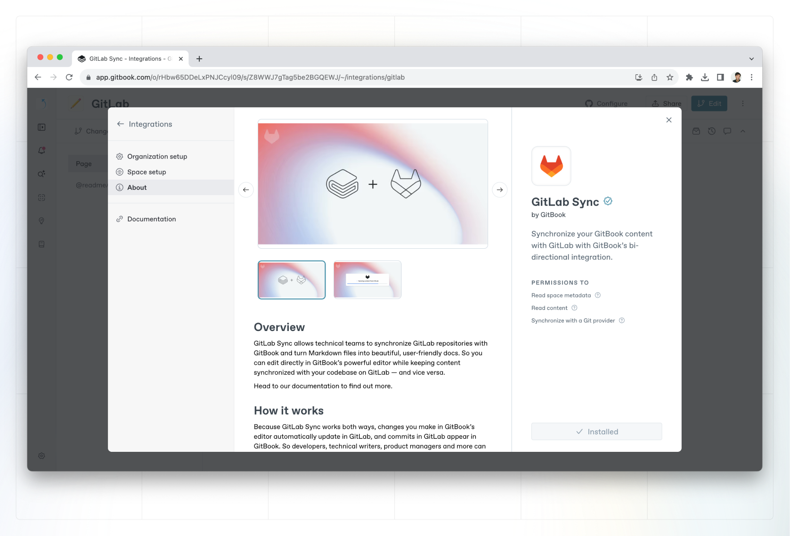
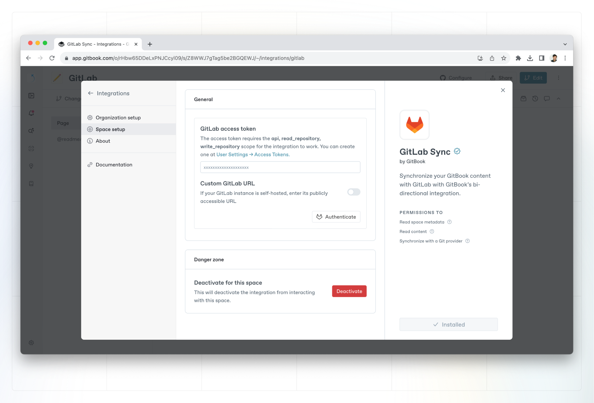

# Enabling GitLab Sync

### 1. Get started

In the space you want to sync with your GitLab repo, head to the space menu in the top right, and select **Synchronize with Git**. From the provider list, select **GitLab**, and click **Configure**.

<figure><figcaption>
Git Sync setup screen
</figcaption></figure>

### 2. Generate and enter your API token

You can generate an API token in your GitLab user settings.

Ensure that you enable the following access for your token:

* `api`
* `read_repository`
* `write_repository`

<figure><figcaption>
GitLab setup screen
</figcaption></figure>

Then you can paste the token into the API access token field when configuring your GitLab integration.

### 3. Select a repository and branch

Select the repository you want to keep in sync with your GitBook content.


**Can’t see your repository?** Ensure you’ve set the correct permissions when creating your API token.


Once you’ve selected the correct repository, choose which branch you want commits to be pushed to and synced from.


For many GitLab repositories, the `main` branch might be automatically set to protected. If this is the case, we recommend adding a specific branch to sync your content between. You can then merge this into `main` and keep the protection in place.


### 4. Perform an initial sync

When syncing for the first time, you’ll have the option to sync in one of two directions:

1. Git**Book** -> Git**Lab** will sync your space’s content **to** the selected branch. This is great if you’re starting from an empty repository and want to get your GitBook content in quickly.
2. Git**Lab** -> Git**Book** will sync your space’s content **from** the selected branch. This is great if you have existing markdown content in a repository and want to bring it into GitBook.

### 5. Write and commit!

You’re good to go. You’ll notice that if your space was in [live edit](../../content-editor/editor/live-edits.md) mode, live edits are now locked. This allows GitBook to reliably sync content to your repository when someone in your team merges a[ change request](../../content-editor/editor/change-requests.md) in GitBook, rather than the constant noise of trying to sync live edits!

When you edit on GitBook, every change request merge will result in a commit to your selected GitLab branch.

When you commit to GitLab, every commit will be synced to your GitBook space as a history commit.
