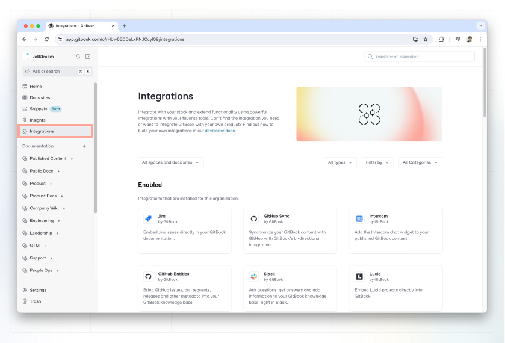
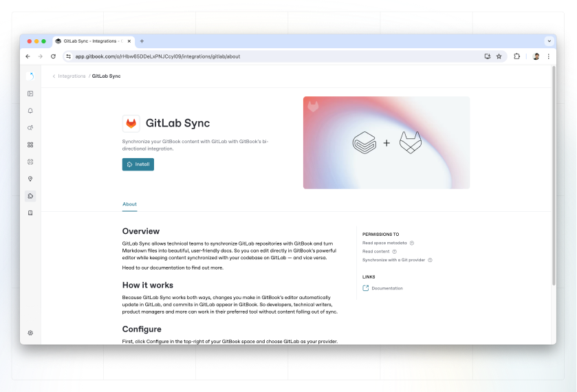
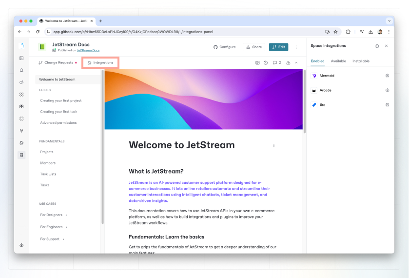

# Install and manage integrations

You can install an integration in a single space, multiple spaces, or all the spaces across your organization.

If you install an integration in a single space, it will only work in that specific space. By installing an integration in multiple spaces, you’ll be able to perform actions across all those spaces.

### Install an integration in your organization

#### 1. Open the Integrations menu

Before enabling an integration into a space or site, you'll need to install it in your organization. Start by clicking **Integrations** in the sidebar on the left.

<figure><figcaption>
Integrations tab
</figcaption></figure>

#### 2. Select the integration and install

Next, click on the integration you want to install on the space (e.g Plausible).

This will open up the integration’s installation screen. Click **Install** to connect it to your organization.

<figure><figcaption>
Integration installation page
</figcaption></figure>

From here, the integration will be available to enable in any space or site in your organization.

### Install an integration in a space or site

To install an integration ins a space or site, you can do so from the **integration** menu in the [sub-navigation](../content-editor/editor/navigation.md#space-header-and-sub-navigation) within a space, or the header in a [docs-site](../published-documentation/publish-your-content-as-a-docs-site/).

#### 1. Open the Integrations menu

Start by opening the integration menu by clicking "Integrations" in the sub-navigation within a space.

<figure><figcaption>
Integrations from within a space
</figcaption></figure>

#### 2. Install or configure an integration

If you haven't installed any integrations into your organization, head to the "Installable" tab from the integration menu, and click the settings cog to install it to your organization.

If you already have integrations available to your organization, you'll find them in the "Available" tab from the integrations menu. Click into the settings cog to configure the integration for your space or site.

#### 3. Complete the configuration

Finally, complete the installation by following the instructions and select the options you need.

You can do this in the integration’s **Spaces** or **Docs sites** tabs within the integration's settings page.
