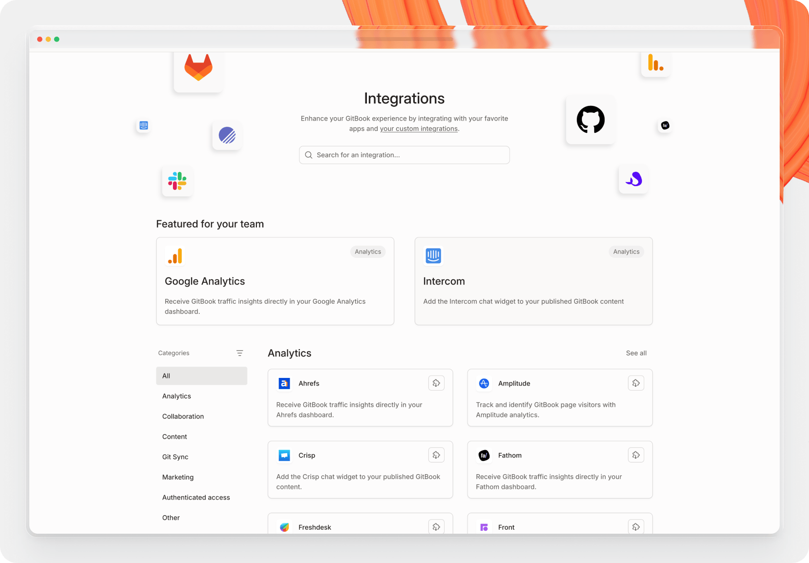
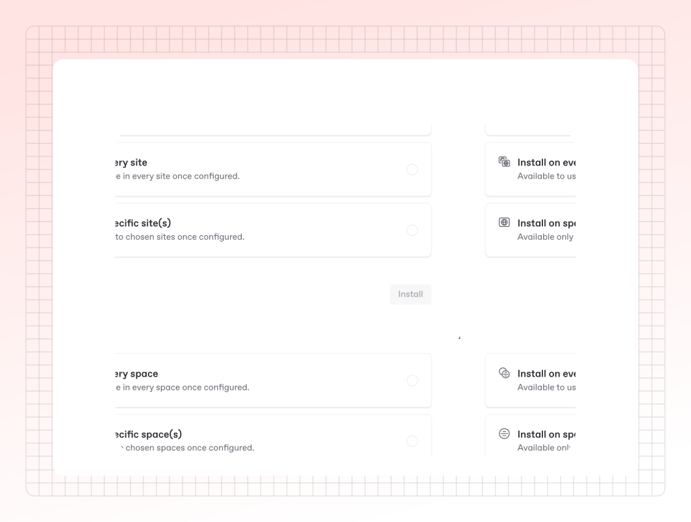

# Install and manage integrations

There are [many different integrations](https://www.gitbook.com/integrations#custom-experiences) available in GitBook. From interactive content blocks to advanced analytics tools, your favorite tools are only a click away from integrating with GitBook.

You can install an integration in a single section, multiple sections, or all the sections across your organization.

If you install an integration in a single section, it will only work in that specific section. By installing an integration in multiple sections, you’ll be able to perform actions across all those sections.

<figure><figcaption>
Browse GitBook's built in integration library.
</figcaption></figure>

### Install an integration

#### 1. Open the integrations screen

Before enabling an integration in a section or site, you'll need to install it in your organization. Go back to your organization **Home** and click **Settings**, under **Admin** in the sidebar, then click **Integrations** under the **Organization** group. Browse integrations by category, or search for the one you need.

Once an integration is installed in your organization, you can also work with it at the site level — click **Integrations**, under **Extend** in the site sidebar. Integrations already added to the site appear under **Installed integrations**.

#### 2. Select the integration and install

Next, click on the integration you want to install. Certain integrations can be installed for your sections, and others for your published documentation.

On this screen you can select the areas you would like to install your integration in.

<figure><figcaption>
Choose an area to install an integration in.
</figcaption></figure>

#### 3. Configure your integration

You can now use your integration. Certain integrations may require extra configuration. If so, you’ll see a message asking you to configure your integration in your section or site.

View the integration’s instructions to learn more about configuring it for your team.
