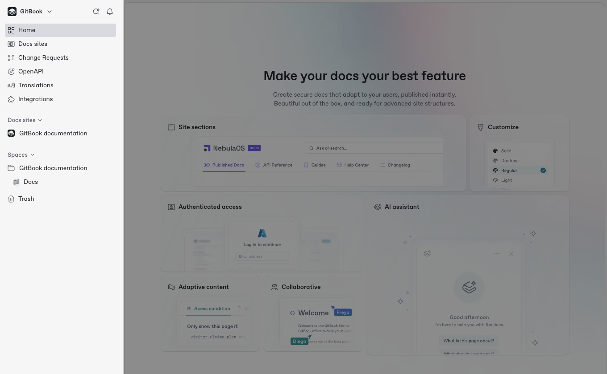
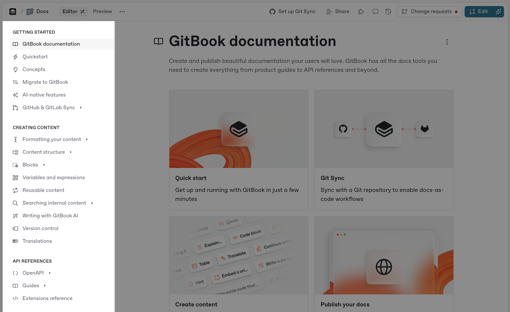
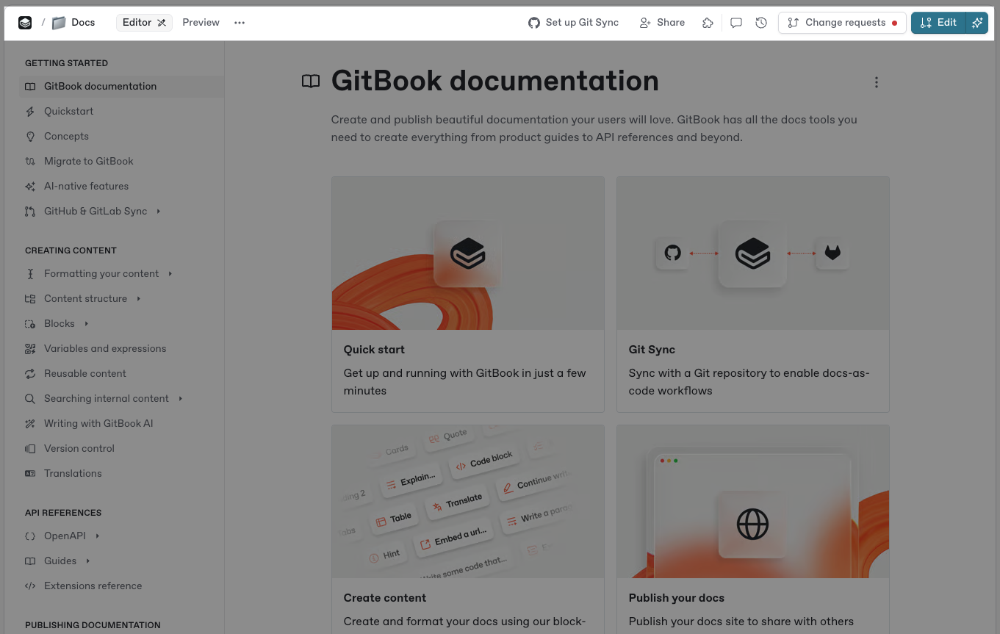
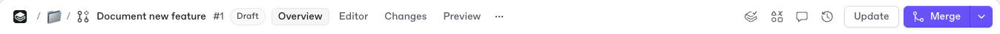
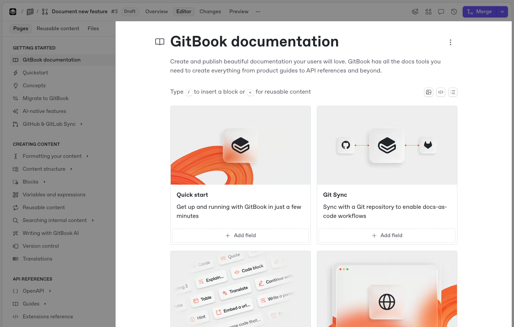
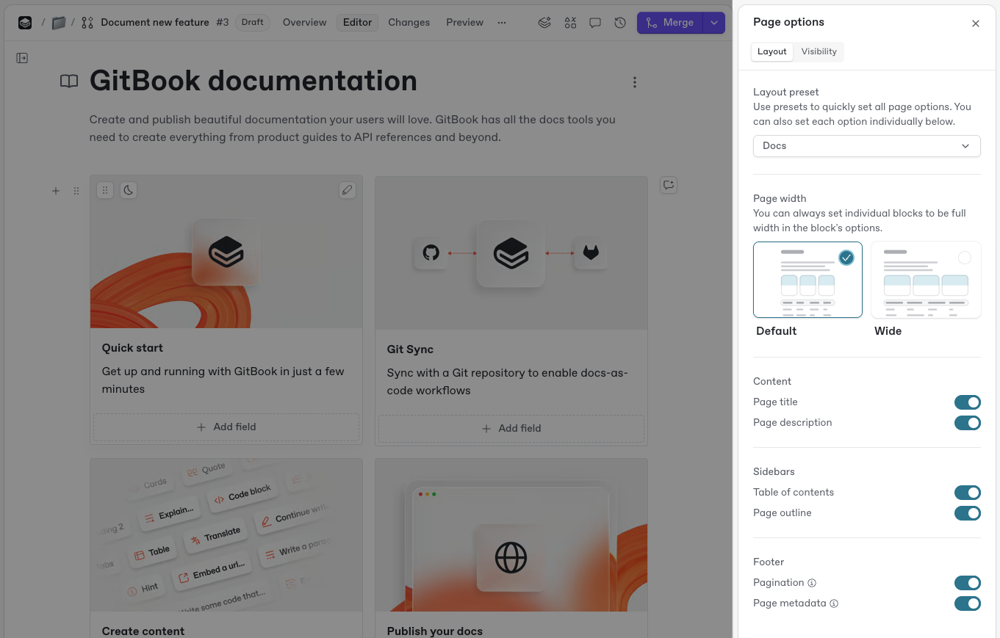
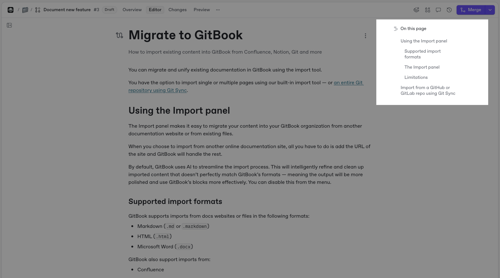

# GitBook UI

GitBook is organized around your docs sites. You start at your organization **Home**, open a site to work on its content, and edit pages inside sections. This page walks through each part of the interface.

### Home

<figure><figcaption>
Your organization Home gives you access to sites, content, and organization controls.
</figcaption></figure>

When you open GitBook, you land on your organization **Home**: every docs site in your organization, in one place. From here you can open a site, create a new one, or adjust organization-wide settings. Home contains:

* **Switcher**\
  Get back to **Home** from anywhere using the switcher at the top of the sidebar. If you're part of multiple organizations, see and switch between them here, or create a new organization.
* **Notifications**\
  When you're tagged in a comment or conversation, or when there is important activity in a section you're working in, you get a [notification](../../collaboration/notifications.md) to show you what's new.
* **Ask or search**\
  Powered by [GitBook Agent](../../creating-content/searching-your-content/gitbook-ai.md), ask questions in natural language, or search through the sites and content in your organization.
* **Sites list**\
  View every docs site in your organization. Click a site to open it.
* **All content**\
  If your organization has content that isn't part of any site, it appears in an **All content** section alongside your sites, in a tree view. If every piece of content belongs to a site, this section doesn't appear.
*   **Settings**\
    [Organization settings](../../account-management/organization-settings.md) and [account settings](../../account-management/account-settings.md) share one dedicated screen. It groups settings by **Account** and **Organization**.

    **Account** includes **General**, **Notifications**, **Organizations**, and **Developer tools**. **Organization** includes **General**, **Members**, **Merge rules**, **GitBook Agent**, **Integrations**, **OpenAPI**, **Translations**, **Invite links**, **Teams**, **SSO**, and **Billing**. Click **Back to app** to return to your work.
* **Styleguides**\
  View every [style guide](../../docs-site/site-structure/) in your organization and the sites that use it.
* **Trash**\
  Deleted sections appear in **Trash**. You can restore them for up to seven days — after that, they're permanently deleted.

### Site sidebar

Opening a site replaces the sidebar with that site's content and tools: the same structure visitors see on your published site. The site sidebar contains:

* **Site header**\
  Your site's name and publish status, along with **Preview** and **Publish** buttons.
* **General**\
  **Overview**, **Change requests**, **Site structure**, and **Settings**.
* **Tools**\
  **Styleguide**, **Customize**, **Analyze**, and **Extend**. Each opens in the main view.
*   **Content**\
    Your site's [sections](../../docs-site/site-structure/site-sections.md) and groups, in published order. Click a section to edit it.

    The tree is read-only. Reorganize it in the [structure editor](../../docs-site/site-structure/). Use the search, edit, and **+** icons on the **Content** header to find, rename, and add sections.

### Table of contents 

<figure><figcaption>
The table of contents lists all the pages and links in your selected section.
</figcaption></figure>

By default, the table of contents lists [pages, links, and page groups](../../creating-content/content-structure/page/#organizing-your-content) in your selected section. It sits to the right of the sidebar.

You can also manage [reusable content](../../creating-content/reusable-content.md) and [files](../../creating-content/blocks/insert-files.md) for the section.

From the **Pages** tab in the table of contents you can:

* Create new [pages](./#pages) and subpages.
* Create [page groups](./#groups).
* Add [external links](./#external-links).
* Access [the Action menu](./#the-actions-menu) <picture><source srcset="../../.gitbook/assets/25_01_10_actions_icon_dark.svg" media="(prefers-color-scheme: dark)"></picture> for individual pages.

In the **Library** tab, you can:

* View and search reusable content, variables, images, and files in the section.
* View and insert reusable content from other sections.
* Create or import new Library items.
* Drag and drop Library items onto the page.
* Double-click a Library item to rename it.
* Preview images.
* Manage and download images and files.

Here’s a short video showing what you can do with the table of contents, particularly the Library tab:



To focus on page content, hover next to the table of contents and click **Hide** <picture><source srcset="../../.gitbook/assets/25_10_08_panel_left.svg" media="(prefers-color-scheme: dark)"></picture>. To show it again, hover near the page edge and click **Show** <picture><source srcset="../../.gitbook/assets/25_10_08_panel_right.svg" media="(prefers-color-scheme: dark)"></picture>.

### Section header 

<figure><figcaption>
The section header sits at the top of the editor, and offers options that apply to the whole section.
</figcaption></figure>

The section header contains information about the section you're currently viewing. It lets you view comments and history, configure [GitHub or GitLab Sync](../../getting-started/git-sync/), and more.


**The section header is adaptable**, and changes depending on the section and mode you're currently in.

For example, if you're editing a [change request](../../collaboration/change-requests/), you see an overview of the change request, alongside options to open the editor, view changes, and merge your change request.

If you're viewing a read-only section, you need to open a new change request to edit the page, as live edits are locked.


<figure><figcaption>
The section header in a change request.
</figcaption></figure>

The section header includes:

* **The section emoji or icon**\
  Choose an emoji or icon for your section to identify it in the sidebar.
* **The section name**\
  This name appears in the sidebar and on your published site.
* **The section's breadcrumbs**\
  The site — and group, if any — the section lives in.
* **Action menu**\
  Offers actions for your section. Similar to [page actions](./#the-actions-menu), available actions differ by editing mode.
* **Overview**\
  In a change request, view its title, description, participants, reviewers, changes, and comments.
* **Editor view**\
  Edit content with GitBook’s block-based editor.
* **Changes view**\
  This view [highlights changes](../../collaboration/change-requests/#diff-mode) in a change request using diff view. Review changes before merging.
* **Preview**\
  Preview content before merging a change request.
* **Collaborators**\
  View avatars for people reading pages in the section. Click an avatar to open the page they are viewing.
* **Git Sync configuration**\
  Configure GitHub and GitLab [Sync](../../getting-started/git-sync/) for the section.
* **The Share menu**\
  Publish and share your section, or invite others to collaborate.
* **Variables**\
  Create reusable [variables](../../creating-content/variables-and-expressions.md) for the section.
* **GitBook Agent**\
  Collaborate on section changes with [GitBook Agent](https://app.gitbook.com/s/NkEGS7hzeqa35sMXQZ4X/gitbook-agent).
* **Comments**\
  View [comments and discussions](../../collaboration/comments.md) about section content.
* **Change requests**\
  Create, update, and delete [change requests](../../collaboration/change-requests/).
* **Section history**\
  View [version history](../../creating-content/version-control.md) for the section or change request.
* **The Edit button**\
  If a section is published or [live edits](../../collaboration/live-edits.md) are locked, **Edit** creates a [change request](../../collaboration/change-requests/).

### Site tools 

Site tools open from the site sidebar in the main view. The site header keeps **Preview** and **Publish**.

Under **General**:

* **Overview**\
  Essential site information, including its URL, publish status, audience, content, and top-level insights. Once your site is live, **Overview** links to it.
* **Change requests**\
  Change requests across your site's sections.
* **Site structure**\
  Use the [structure editor](../../docs-site/site-structure/) to add, reorder, publish, and remove sections and groups.
* **Settings**\
  [Site settings](../../docs-site/site-settings.md) include **General**, **Members**, **Agents**, **Audience**, **Domain and URL**, **Redirects**, and **Plan**.

Under **Tools**:

* **Styleguide**\
  Your site’s [style guide](../../docs-site/site-structure/) defines writing rules and conventions. GitBook Agent follows it when writing, editing, or reviewing content.
* **Customize**\
  [Customize your site](../../docs-site/customization/) with **Theme**, **Layout**, **AI Assistant**, and **Configure** options.
* **Analyze**\
  **AI Insights** and **Analytics** provide [detailed analytics](../../docs-site/insights.md) about your site and its performance.
* **Extend**\
  **Connections**, **Channels**, **Docs Embed**, **MCP access**, and [**Integrations**](../../integrations/install-an-integration.md).

### Content editor

<figure><figcaption>
Write content and add blocks in the GitBook editor.
</figcaption></figure>

The editor is the main part of your section. Write and insert content, then collaborate with your team in real time.

Insert [content blocks](../../creating-content/blocks/), write [Markdown](../../creating-content/formatting/markdown.md), [embed content](../../creating-content/blocks/embed-a-url.md), and collaborate with [GitBook Agent](https://app.gitbook.com/s/NkEGS7hzeqa35sMXQZ4X/gitbook-agent).

You can also comment on blocks and tag teammates.

### Page title and description 

At the top of each page, set a title, add an optional emoji, and write a description. The title appears in the table of contents and forms the published URL slug.

Your page description can contain up to 200 characters. It appears as preview text in search engines.


To change a page URL slug, open the page’s [Action menu](./#the-actions-menu) and click **Edit title & slug**.


### Page actions menu 

The page’s **Action menu** <picture><source srcset="../../.gitbook/assets/25_01_10_actions_icon_dark.svg" media="(prefers-color-scheme: dark)"></picture> lets you duplicate, rename, or delete a page.

In the table of contents, hover over a page and click the <picture><source srcset="../../.gitbook/assets/25_01_10_actions_icon_dark.svg" media="(prefers-color-scheme: dark)"></picture> icon. You can also click the icon next to the page title.


Available actions depend on whether you use [live editing](../../collaboration/live-edits.md) or a [change request](../../collaboration/change-requests/).


### Page options 

<figure><figcaption>
The <strong>Page options</strong> side panel offers customization options for your documentation and navigation.
</figcaption></figure>

Use page options to customize documentation layout and navigation. Page options are available only while editing.

Open **Page options** from the page’s **Action menu** <picture><source srcset="../../.gitbook/assets/25_01_10_actions_icon_dark.svg" media="(prefers-color-scheme: dark)"></picture> by selecting **Options**. You can also hover over the page title and click **Page options**.


Some changes, such as disabling the table of contents, appear only on published documentation.


### Page outline

<figure><figcaption>
The page outline shows H1 and H2 headings, allowing you to quickly jump to a specific section on an individual page.
</figcaption></figure>

The page outline sits on the editor’s right side. It lets you jump to a page section.

The outline lists the H1 and H2 [headings](../../creating-content/blocks/heading.md) on the page.

The page outline also appears on your published site. Toggle it in the [Page options](./#page-options) side panel.


If the right-hand column isn't visible, your browser window might be under 1430 pixels wide. Use a window at least 1430 pixels wide to view and use the page outline.

