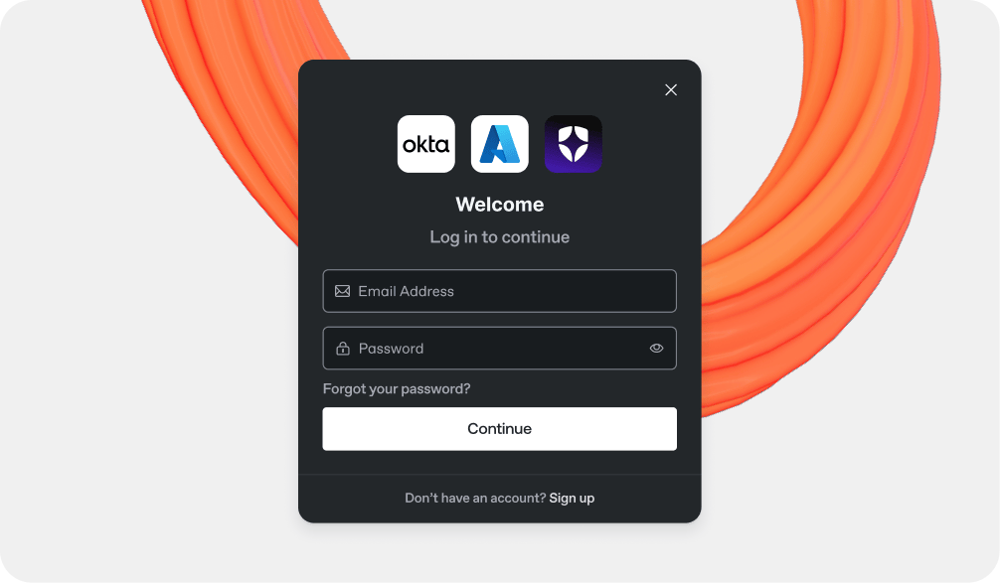

# Authenticated access



Authenticated access allows you to publish your content while requiring authentication from any visitors who want to view it. When enabled, GitBook lets your authentication provider handle who has access to the content.

<figure><figcaption>
Add a sign in to your published documentation.
</figcaption></figure>

### Use cases

Common use cases for authenticated access include:

* Publishing sensitive product documentation that should only be accessible to paying customers, sales prospects or partners.
* Publishing internal knowledge base content that should only be accessible to employees of your company.

### How it works

There are two methods you can choose from when setting up authenticated access:

1. Installing one of our authentication integrations — we currently support Okta, Azure, and Auth0. We **highly recommend** this option if you’re using an authentication provider we support.
2. Create and host your own server to handle the authentication. Many different technologies can be used, but it’s up to you to code and maintain the solution you choose.

### Built-in login and logout URLs

GitBook gives you built-in URLs for sign-in and sign-out on your published site:

* `<publishedSiteURL>/~gitbook/auth/login`
* `<publishedSiteURL>/~gitbook/auth/logout`

Use the login URL anywhere you want a sign-in link, such as a header link on your site.

When a visitor opens the login URL, GitBook redirects them to the authentication backend configured for that site. This works with integration backends and custom backends.

GitBook also adds a `location` query parameter that matches the page the visitor started from. Your backend can use that value to send them back to the same page after sign-in.

Use the logout URL to sign a visitor out of their GitBook session.

Head to [Enabling authenticated access](enabling-authenticated-access.md) to start setting up protected access for your site.
