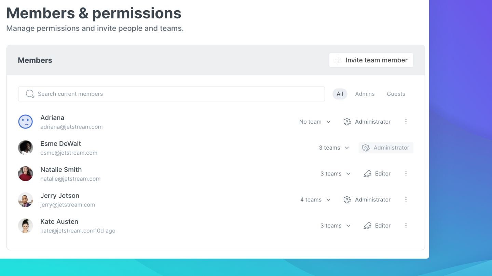

# Organization settings

## Adding a logo and naming your organization 

When creating an organization you will be asked to name it and to select a logo. You can also add one later on or change it by:

* Going into your organization and clicking settings on top right hand side of the screen
* Clicking on the ⚙ symbol at the bottom of your control panel

Once you are in the tab `general` you will be able to adjust those settings accordingly.

This is also how you can update your organization's name.

## Members

Members tab allows you to add contributors to your team and manage their [permissions level](https://app.gitbook.com/s/-Mb26BMpld-VdvMRsm4j/collaboration/permissions-and-inheritance). You can also remove them.

Teams allows you to create specific teams to manage permissions on more granular level in each space. For example creating an engineering team and giving them exclusive access to engineering spaces. Read more about them in [teams](https://app.gitbook.com/s/-Mb26BMpld-VdvMRsm4j/collaboration/team-management/teams).

Click on below to read detailed information on member management.


[team-management](../collaboration/team-management/)


## Single Sign On (SSO) 

.png>)

You can configure your SSO with any [SAML](../features/saml.md) solution from your settings, to give your members access to GitBook through an identity provider (IdP) of your choice.

You can also enable simple email domain SSO.


**Note:** You need to upgrade to the [**Business plan**](https://app.gitbook.com/s/-Mb26BMpld-VdvMRsm4j/pricing/plans) **** for email domain SSO and the [**Enterprise plan**](https://app.gitbook.com/s/-Mb26BMpld-VdvMRsm4j/pricing/plans) to enable SAML SSO.


## Plans

You can view your current plan and upgrade your subscription in the plans tab.

When you sign up to GitBook and create organization you automatically start a 14 day business trial. Read more about it in [trial](https://app.gitbook.com/s/-Mb26BMpld-VdvMRsm4j/pricing/free-trial).

To find out more about our plans and the features they offer go to:


[plans](../pricing/plans/)


### Upgrading or downgrading your plan

To upgrade or downgrade the plan simply select the plan you are looking to switch to and click on the `upgrade`or `downgrade` button. If you are upgrading you will be then redirected to a billing page to complete the payment.


**Note:** the plans are as default presented as annual which comes with the added benefit of a 20% discount. If you prefer to pay full price monthly you can toggle the switch.


## Delete your organization 

You can delete your organization but make sure that you are certain and have saved any documentation you would like to keep, as this action is non reversible.


Deleting your organization is non reversible, once deleted your information is **permanently removed**.

