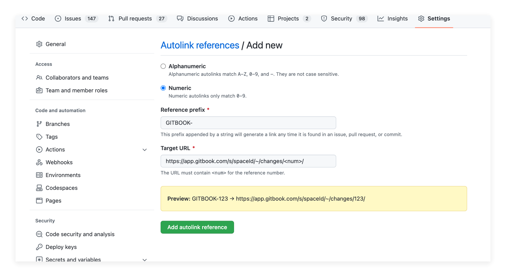

# Commit messages & Autolink

By default, when exporting content from GitBook to the Git repository, GitBook will generate a commit message based on the merged change request:

```
GITBOOK-14: Improve documentation about users management
```

## Autolink `GITBOOK-<num>` in GitHub and GitLab

If you want to automatically resolve your GitBook change request IDs (e.g. _GITBOOK-123_) in commits to links, you can enable this using GitHub's _Autolink references_ feature. See instructions on [GitHub](https://help.github.com/en/github/administering-a-repository/configuring-autolinks-to-reference-external-resources).

Use the following URL format, where `space` corresponds to your space's URL:

`<https://app.gitbook.com/s/space/~/changes/<num>/`

<figure><figcaption></figcaption></figure>

## Customize the commit message template

When using GitBook with a [monorepo](monorepos.md), or when you have specific guidelines for commit messages; you might want to customize the message used by GitBook when pushing a commit to Git.

<figure><figcaption></figcaption></figure>

The template can contain the following placeholders:

* `{change_request_number}` unique numeric ID for the change request
* `{change_request_subject}` the subject of the change request when merged, or `No subject` if none has been provided.

The default template is:

```
GITBOOK-{change_request_number}: {change_request_subject}
```
