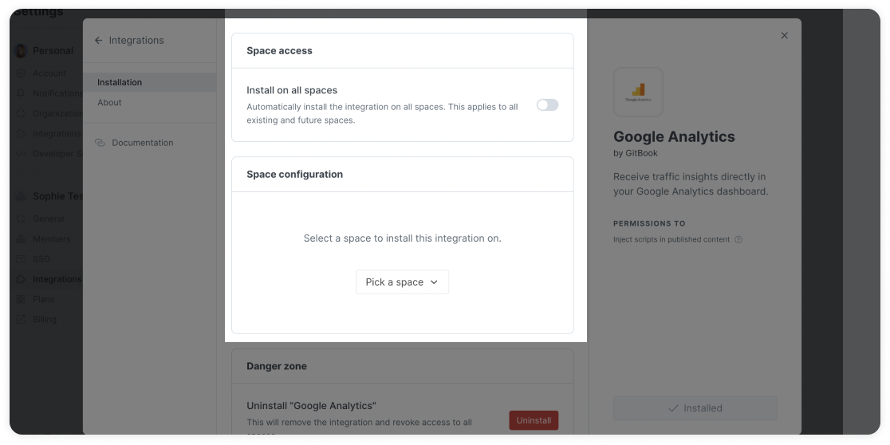
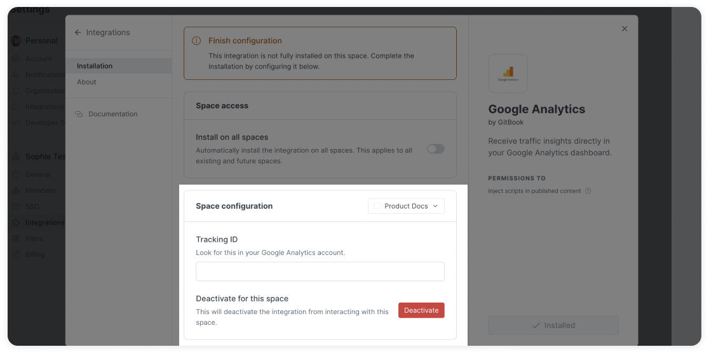

# Configure the Google Analytics integration

## Install the integration

To start using the Google Analytics integration, you will need to install it in your GitBook library or just on a single space. To do this, follow the steps described in the [install an integration](../install-an-integration.md) section.

Once it is installed, you will need to enter your Google tag ID **to complete the installation.**

## Configure the integration

After installing the integration to your space or GitBook library, you will need to choose which spaces it is installed on, and then enter your Google tag ID.

How to find your Google tag ID:



Step 1: Configure which spaces the integration is installed on

You can choose to install the integration on all spaces by enabling the toggle in **space access**, or choose specific spaces in **space configuration**.

<figure><figcaption></figcaption></figure>

Step 2: Enter your Google tag ID

In the space configuration section, enter your Google tag ID on each space that you want to collect analytics for.

You can switch between the spaces by opening the space drop-down menu to the right of **space configuration**.

<figure><figcaption></figcaption></figure>
